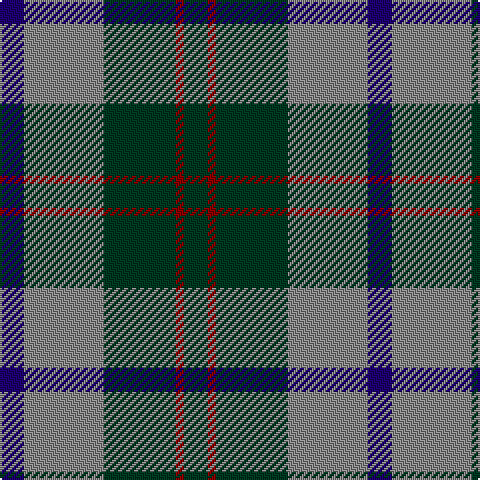

**Bands:** [BRGRG](/stripes/brgrg/) · **Stripes:** [DB O DG R DG](/stripes/stripes5/) DB O DG R DG

This was sourced from register-of-tartans.  It is a [5 band tartan](/bands/bands5/).

Original link https://www.tartanregister.gov.uk/tartanDetails.aspx?ref=4988

## Register references

External register numbers recorded for this tartan.

- Scottish Register of Tartans: [4988](https://www.tartanregister.gov.uk/tartanDetails.aspx?ref=4988)
- Scottish Tartans Authority (ITI): 3263

## Thread count
DB/12 N40 DG36 DR4 DG/12

## Palette
Each colour and its ΔE from the base-6 reference it is a variant of.

| Colour | Shade | Base | ΔE (OKLab) |
|---|---|---|---|
| DB | <code style="background-color:#1C0070;">#1C0070</code> `#1C0070` | B <code style="background-color:#2A418A;">#2A418A</code> | 0.14 |
| DG | <code style="background-color:#003820;">#003820</code> `#003820` | G <code style="background-color:#006100;">#006100</code> | 0.15 |
| DR | <code style="background-color:#880000;">#880000</code> `#880000` | R <code style="background-color:#CC0000;">#CC0000</code> | 0.15 |
| N | <code style="background-color:#888888;">#888888</code> `#888888` | R <code style="background-color:#CC0000;">#CC0000</code> | 0.24 |

# Sample pattern

## Nearest tartans

The nearest existing variants by ΔTartan distance.

1. [MacNab WI2](/setts/s4/dg15r3dp11lb2/) — ΔT 0.82
1. [Trafalgar (Fashion)](/setts/s6/g3db1g8db7k3ly1~x2/) — ΔT 0.85
1. [Unidentified #28](/setts/s6/dg2b4k6t1dg9k2~x2/) — ΔT 1.02
1. [Skibo](/setts/s5/r2g23db11db22r2~x2/) — ΔT 1.05
1. [U.S. Border Patrol (Corporate)](/setts/s5/g40k15b10k10ly3~x2/) — ΔT 1.08
1. [MacArthur of Milton (Clan)](/setts/s6/g7db1g1k4dp4k1~x4/) — ΔT 1.08
1. [MacArthur of Milton Hunting Clan Tartan Tartan Number: 700. Earliest known date: 1823 This is the older of the two MacArthur setts, which links the clan with the Campbells. See products available Copyright © Blair Urquhart, Comrie, 2015](/setts/s6/g14db2g2k8dp9k2~x2/) — ΔT 1.09
1. [Thayer USA (Name)](/setts/s6/r5db25w5db3g25db3~x2/) — ΔT 1.10
1. [Menteith](/setts/s6/g9lb1g6k7db7k1~x4/) — ΔT 1.13
1. [Redland](/setts/s6/g52lb7g9k35db35k7/) — ΔT 1.14

## Neighbour map

Every grey dot is one of 14313 variants placed by the first two principal components of the ΔTartan feature space (44% of its variance). Red is this tartan; blue dots are its nearest — click one to open its page.

<svg viewBox="0 0 640 380" role="img" style="max-width:100%;height:auto;border:1px solid #e0e0e0;border-radius:4px;display:block" xmlns="http://www.w3.org/2000/svg"><image href="/nn/cloud.v1.png" width="640" height="380"/><a href="/setts/s4/dg15r3dp11lb2/"><circle cx="253.3" cy="254.8" r="4" fill="#3465a4"><title>MacNab WI2</title></circle></a><a href="/setts/s6/g3db1g8db7k3ly1~x2/"><circle cx="248.8" cy="247.5" r="4" fill="#3465a4"><title>Trafalgar (Fashion)</title></circle></a><a href="/setts/s6/dg2b4k6t1dg9k2~x2/"><circle cx="229.1" cy="242.7" r="4" fill="#3465a4"><title>Unidentified #28</title></circle></a><a href="/setts/s5/r2g23db11db22r2~x2/"><circle cx="216.3" cy="231.8" r="4" fill="#3465a4"><title>Skibo</title></circle></a><a href="/setts/s5/g40k15b10k10ly3~x2/"><circle cx="280.0" cy="216.5" r="4" fill="#3465a4"><title>U.S. Border Patrol (Corporate)</title></circle></a><a href="/setts/s6/g7db1g1k4dp4k1~x4/"><circle cx="233.2" cy="248.6" r="4" fill="#3465a4"><title>MacArthur of Milton (Clan)</title></circle></a><a href="/setts/s6/g14db2g2k8dp9k2~x2/"><circle cx="221.2" cy="245.2" r="4" fill="#3465a4"><title>MacArthur of Milton Hunting Clan Tartan Tartan Number: 700. Earliest known date: 1823 This is the older of the two MacArthur setts, which links the clan with the Campbells. See products available Copyright © Blair Urquhart, Comrie, 2015</title></circle></a><a href="/setts/s6/r5db25w5db3g25db3~x2/"><circle cx="251.8" cy="216.1" r="4" fill="#3465a4"><title>Thayer USA (Name)</title></circle></a><a href="/setts/s6/g9lb1g6k7db7k1~x4/"><circle cx="232.7" cy="254.7" r="4" fill="#3465a4"><title>Menteith</title></circle></a><a href="/setts/s6/g52lb7g9k35db35k7/"><circle cx="207.4" cy="246.6" r="4" fill="#3465a4"><title>Redland</title></circle></a><circle cx="256.4" cy="242.9" r="5" fill="#c00000"/></svg>

ID: /setts/s5/db3o10dg9r1dg3~x4/
