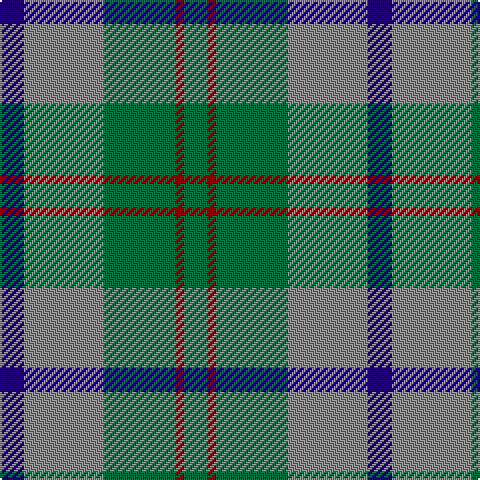

This page is one **sett** — a single exact thread-count. It belongs to the [tartan](/tartans/db3o10g9r1g3/)
(the same proportion at any scale), whose colour order is pattern [BRGRG](/stripes/brgrg/).

Sourced from tartans-authority.  It is a [5 stripe tartan](/stripes/stripes5/).

Original link http://www.tartansauthority.com/tartan-ferret/display/3263/

## Thread count
DB/12 N40 G36 DR4 G/12

## Palette

Palette: <strong>Tartan Register</strong> <small style="color:#888">(3 of 4 colours)</small>
<table><thead><tr><th>Colour</th><th>Threads</th><th>Shade</th><th>Base</th><th>OKLCh</th></tr></thead><tbody><tr><td>DB/</td><td style="text-align:right;font-variant-numeric:tabular-nums">12</td><td><code style="background-color:#1C0070;">#1C0070</code> <small style="color:#888">#1C0070</small></td><td>B <code style="background-color:#2A418A;">#2A418A</code></td><td><small style="color:#888">oklch(26.3% 0.162 277.1)</small></td></tr><tr><td>N</td><td style="text-align:right;font-variant-numeric:tabular-nums">40</td><td><code style="background-color:#888888;">#888888</code> <small style="color:#888">#888888</small></td><td>R <code style="background-color:#CC0000;">#CC0000</code></td><td><small style="color:#888">oklch(62.7% 0.000 89.9)</small></td></tr><tr><td>G</td><td style="text-align:right;font-variant-numeric:tabular-nums">36</td><td><code style="background-color:#006C3C;">#006C3C</code> <small style="color:#888">#006C3C</small></td><td>G <code style="background-color:#006100;">#006100</code></td><td><small style="color:#888">oklch(46.7% 0.115 155.1)</small></td></tr><tr><td>DR</td><td style="text-align:right;font-variant-numeric:tabular-nums">4</td><td><code style="background-color:#880000;">#880000</code> <small style="color:#888">#880000</small></td><td>R <code style="background-color:#CC0000;">#CC0000</code></td><td><small style="color:#888">oklch(39.4% 0.162 29.2)</small></td></tr><tr><td>G/</td><td style="text-align:right;font-variant-numeric:tabular-nums">12</td><td><code style="background-color:#006C3C;">#006C3C</code> <small style="color:#888">#006C3C</small></td><td>G <code style="background-color:#006100;">#006100</code></td><td><small style="color:#888">oklch(46.7% 0.115 155.1)</small></td></tr></tbody></table>

# Sample pattern

## Nearest tartans

The nearest existing variants by ΔTartan distance, with this tartan at the top so the swatches line up against it.

ΔTartan

Tartan

Sett

—

<a href="/ttd/edit/#slug=db3o10g9r1g3~x4">Bethlehem, City of (District)</a> <a class="nn-out" href="/setts/s5/db3o10g9r1g3~x4/" title="open its dictionary page">↗</a>

1.03

<a href="/ttd/edit/#slug=g14r3db9t2~x2">Unidentified 10</a> <a class="nn-out" href="/setts/s4/g14r3db9t2~x2/" title="open its dictionary page">↗</a>

1.13

<a href="/ttd/edit/#slug=dg14r3db9t2~x2">Unidentified #4</a> <a class="nn-out" href="/setts/s4/dg14r3db9t2~x2/" title="open its dictionary page">↗</a>

1.24

<a href="/ttd/edit/#slug=g32o7g7o16db32ly3o8~x2">Strange Of Balcaskie</a> <a class="nn-out" href="/setts/s7/g32o7g7o16db32ly3o8~x2/" title="open its dictionary page">↗</a>

1.26

<a href="/ttd/edit/#slug=o1b7k4b1g7b1~x4">Flower of Scotland Commemorative Tartan Tartan Number: 2059. Earliest known date: September 1990 Designed as a tribute to Roy Williamson, writer of the words and music of 'The Flower of Scotland'. Roy wore the Gunn tartan which has been used as the framework of the new tartan. Cornflower blue and Zephyr green have been used to suggest the bluebell and the thistle. Worn by the Seafield and District pipe band, Strathallan Games, 1994 (UK Reg. Design No.600421) See products available Copyright © Blair Urquhart, Comrie, 2015</a> <a class="nn-out" href="/setts/s6/o1b7k4b1g7b1~x4/" title="open its dictionary page">↗</a>

1.26

<a href="/ttd/edit/#slug=o1b7k4b1g7b1~x2">Flower of Scotland MINI Tartan Tartan Number: 20599. Earliest known date: Dupion Silk. Generated only for display purposes. reduced copy of the original 2059 Flower of Scotland. See products available Copyright © Blair Urquhart, Comrie, 2015</a> <a class="nn-out" href="/setts/s6/o1b7k4b1g7b1~x2/" title="open its dictionary page">↗</a>

1.29

<a href="/setts/s4/g13r2t13~x2/">Wilson's No.161</a>

1.31

<a href="/ttd/edit/#slug=t4dy28dg6t12k12t3~x2">Thompson/Thomson/MacTavish Hunting</a> <a class="nn-out" href="/setts/s6/t4dy28dg6t12k12t3~x2/" title="open its dictionary page">↗</a>

1.32

<a href="/ttd/edit/#slug=dg3r1dg9o10db3~x4">Bethlehem, City of</a> <a class="nn-out" href="/setts/s5/dg3r1dg9o10db3~x4/" title="open its dictionary page">↗</a>

1.32

<a href="/ttd/edit/#slug=t3dg1t10dg4dy10t2~x4">Rob Roy (Film) (Corporate)</a> <a class="nn-out" href="/setts/s6/t3dg1t10dg4dy10t2~x4/" title="open its dictionary page">↗</a>

1.34

<a href="/ttd/edit/#slug=k9lr6n22g28ly2~x2">Wellington (Lochcarron)</a> <a class="nn-out" href="/setts/s5/k9lr6n22g28ly2~x2/" title="open its dictionary page">↗</a>

## Neighbour map

Every grey dot is one of 14299 variants placed by the first two principal components of the ΔTartan feature space (44% of its variance). Red is this tartan; blue dots are its nearest — click one to open its page.

<svg viewBox="0 0 640 380" role="img" style="max-width:100%;height:auto;border:1px solid #e0e0e0;border-radius:4px;display:block" xmlns="http://www.w3.org/2000/svg"><image href="/nn/cloud.v1.png" width="640" height="380"/><a href="/setts/s4/g14r3db9t2~x2/"><circle cx="267.6" cy="271.4" r="4" fill="#3465a4"><title>Unidentified 10</title></circle></a><a href="/setts/s4/dg14r3db9t2~x2/"><circle cx="292.1" cy="284.5" r="4" fill="#3465a4"><title>Unidentified #4</title></circle></a><a href="/setts/s7/g32o7g7o16db32ly3o8~x2/"><circle cx="238.0" cy="235.5" r="4" fill="#3465a4"><title>Strange Of Balcaskie</title></circle></a><a href="/setts/s6/o1b7k4b1g7b1~x4/"><circle cx="238.7" cy="252.6" r="4" fill="#3465a4"><title>Flower of Scotland Commemorative Tartan Tartan Number: 2059. Earliest known date: September 1990 Designed as a tribute to Roy Williamson, writer of the words and music of 'The Flower of Scotland'. Roy wore the Gunn tartan which has been used as the framework of the new tartan. Cornflower blue and Zephyr green have been used to suggest the bluebell and the thistle. Worn by the Seafield and District pipe band, Strathallan Games, 1994 (UK Reg. Design No.600421) See products available Copyright © Blair Urquhart, Comrie, 2015</title></circle></a><a href="/setts/s6/o1b7k4b1g7b1~x2/"><circle cx="238.7" cy="252.6" r="4" fill="#3465a4"><title>Flower of Scotland MINI Tartan Tartan Number: 20599. Earliest known date: Dupion Silk. Generated only for display purposes. reduced copy of the original 2059 Flower of Scotland. See products available Copyright © Blair Urquhart, Comrie, 2015</title></circle></a><a href="/setts/s4/g13r2t13~x2/"><circle cx="289.8" cy="290.6" r="4" fill="#3465a4"><title>Wilson's No.161</title></circle></a><a href="/setts/s6/t4dy28dg6t12k12t3~x2/"><circle cx="249.9" cy="241.5" r="4" fill="#3465a4"><title>Thompson/Thomson/MacTavish Hunting</title></circle></a><a href="/setts/s5/dg3r1dg9o10db3~x4/"><circle cx="256.4" cy="242.7" r="4" fill="#3465a4"><title>Bethlehem, City of</title></circle></a><a href="/setts/s6/t3dg1t10dg4dy10t2~x4/"><circle cx="334.4" cy="265.5" r="4" fill="#3465a4"><title>Rob Roy (Film) (Corporate)</title></circle></a><a href="/setts/s5/k9lr6n22g28ly2~x2/"><circle cx="230.5" cy="221.1" r="4" fill="#3465a4"><title>Wellington (Lochcarron)</title></circle></a><circle cx="279.6" cy="255.3" r="5" fill="#c00000"/></svg>

ID: /setts/s5/db3o10g9r1g3~x4/
