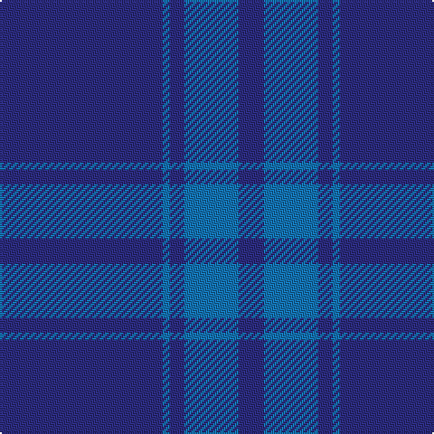

In pattern [BBBBB](/stripes/bbbbb/).

This was sourced from tartans-authority.  It is a [5 stripe tartan](/stripes/stripes5/).

Original link http://www.tartansauthority.com/tartan-ferret/display/6677/

## Thread count
DB/90 B4 DB8 B30 DB/14

## Palette
Each colour and the base-6 reference it is a variant of.

| Colour | Shade | Base |
|---|---|---|
| B | <code style="background-color:#1474B4;">#1474B4</code> `oklch(54.0% 0.129 245.1)` <small>#1474B4</small> | B <code style="background-color:#2A418A;">#2A418A</code> |
| DB | <code style="background-color:#2C2C80;">#2C2C80</code> `oklch(35.0% 0.138 276.6)` <small>#2C2C80</small> | B <code style="background-color:#2A418A;">#2A418A</code> |
| LN | <code style="background-color:#E0E0E0;">#E0E0E0</code> `oklch(90.7% 0.000 89.9)` <small>#E0E0E0</small> | W <code style="background-color:#F7F7F7;">#F7F7F7</code> |

# Sample pattern

## Nearest tartans

The nearest existing variants by ΔTartan distance, with this tartan at the top so the swatches line up against it.

ΔTartan

Tartan

Sett

—

<a href="/ttd/edit/#slug=db45b2db4b15db7~x2">Asahi (Corporate)</a> <a class="nn-out" href="/setts/s5/db45b2db4b15db7~x2/" title="open its dictionary page">↗</a>

1.70

<a href="/ttd/edit/#slug=db16m4db3r1~x2">Elliot</a> <a class="nn-out" href="/setts/s4/db16m4db3r1~x2/" title="open its dictionary page">↗</a>

1.72

<a href="/ttd/edit/#slug=db44dy12db9r3~x2">Elliot (Clan)</a> <a class="nn-out" href="/setts/s4/db44dy12db9r3~x2/" title="open its dictionary page">↗</a>

2.28

<a href="/ttd/edit/#slug=db9dy12db44dy12db9r3~x2">Elliot</a> <a class="nn-out" href="/setts/s6/db9dy12db44dy12db9r3~x2/" title="open its dictionary page">↗</a>

2.34

<a href="/ttd/edit/#slug=do14db14do14db40do3db2~x2">Atlin</a> <a class="nn-out" href="/setts/s6/do14db14do14db40do3db2~x2/" title="open its dictionary page">↗</a>

2.36

<a href="/ttd/edit/#slug=db16dr4db3r1~x6">Elliot Clan Tartan Tartan Number: 596. Earliest known date: pre 1906 The Elliot tartan was first recorded by H. Whyte in his book, 'The Tartans of the Clans and Septs of Scotland' (1906), along with many others in use at the time. The colouring is unique among traditional tartans, being described as maroon and blue. The Elliots are a 'Border Clan', founders of the Minto family. The Chiefship once belonged to to the Elliots of Redheugh but passed to the Elliots of Stobs near Hawick in Roxburghshire. The present Chief is Mrs Margaret Elliot of that Ilk. See products available Copyright © Blair Urquhart, Comrie, 2015</a> <a class="nn-out" href="/setts/s4/db16dr4db3r1~x6/" title="open its dictionary page">↗</a>

2.60

<a href="/ttd/edit/#slug=db16dr4db3r1~x2">Elliott</a> <a class="nn-out" href="/setts/s4/db16dr4db3r1~x2/" title="open its dictionary page">↗</a>

2.67

<a href="/ttd/edit/#slug=db42db10db2db2r2db2db10r6db2r3db2~x2">Loch Monar (Fashion)</a> <a class="nn-out" href="/setts/s11/db42db10db2db2r2db2db10r6db2r3db2~x2/" title="open its dictionary page">↗</a>

2.80

<a href="/setts/s6/db33g3r1~x2/">Norwich No.030</a>

2.88

<a href="/ttd/edit/#slug=db1t1db8r1~x2">Lochaber #3</a> <a class="nn-out" href="/setts/s4/db1t1db8r1~x2/" title="open its dictionary page">↗</a>

2.89

<a href="/ttd/edit/#slug=dt68b7dt16k16lo4~x2">Burnett's &amp; Struth (Corporate)</a> <a class="nn-out" href="/setts/s5/dt68b7dt16k16lo4~x2/" title="open its dictionary page">↗</a>

## Neighbour map

Every grey dot is one of 14299 variants placed by the first two principal components of the ΔTartan feature space (44% of its variance). Red is this tartan; blue dots are its nearest — click one to open its page.

<svg viewBox="0 0 640 380" role="img" style="max-width:100%;height:auto;border:1px solid #e0e0e0;border-radius:4px;display:block" xmlns="http://www.w3.org/2000/svg"><image href="/nn/cloud.v1.png" width="640" height="380"/><a href="/setts/s4/db16m4db3r1~x2/"><circle cx="626.0" cy="291.2" r="4" fill="#3465a4"><title>Elliot</title></circle></a><a href="/setts/s4/db44dy12db9r3~x2/"><circle cx="612.0" cy="290.5" r="4" fill="#3465a4"><title>Elliot (Clan)</title></circle></a><a href="/setts/s6/db9dy12db44dy12db9r3~x2/"><circle cx="532.3" cy="267.3" r="4" fill="#3465a4"><title>Elliot</title></circle></a><a href="/setts/s6/do14db14do14db40do3db2~x2/"><circle cx="552.3" cy="294.4" r="4" fill="#3465a4"><title>Atlin</title></circle></a><a href="/setts/s4/db16dr4db3r1~x6/"><circle cx="626.0" cy="305.3" r="4" fill="#3465a4"><title>Elliot Clan Tartan Tartan Number: 596. Earliest known date: pre 1906 The Elliot tartan was first recorded by H. Whyte in his book, 'The Tartans of the Clans and Septs of Scotland' (1906), along with many others in use at the time. The colouring is unique among traditional tartans, being described as maroon and blue. The Elliots are a 'Border Clan', founders of the Minto family. The Chiefship once belonged to to the Elliots of Redheugh but passed to the Elliots of Stobs near Hawick in Roxburghshire. The present Chief is Mrs Margaret Elliot of that Ilk. See products available Copyright © Blair Urquhart, Comrie, 2015</title></circle></a><a href="/setts/s4/db16dr4db3r1~x2/"><circle cx="603.0" cy="279.8" r="4" fill="#3465a4"><title>Elliott</title></circle></a><a href="/setts/s11/db42db10db2db2r2db2db10r6db2r3db2~x2/"><circle cx="626.0" cy="213.3" r="4" fill="#3465a4"><title>Loch Monar (Fashion)</title></circle></a><a href="/setts/s6/db33g3r1~x2/"><circle cx="626.0" cy="225.9" r="4" fill="#3465a4"><title>Norwich No.030</title></circle></a><a href="/setts/s4/db1t1db8r1~x2/"><circle cx="590.7" cy="279.5" r="4" fill="#3465a4"><title>Lochaber #3</title></circle></a><a href="/setts/s5/dt68b7dt16k16lo4~x2/"><circle cx="548.1" cy="240.6" r="4" fill="#3465a4"><title>Burnett's &amp; Struth (Corporate)</title></circle></a><circle cx="626.0" cy="282.8" r="5" fill="#c00000"/></svg>

ID: /setts/s5/db45b2db4b15db7~x2/
