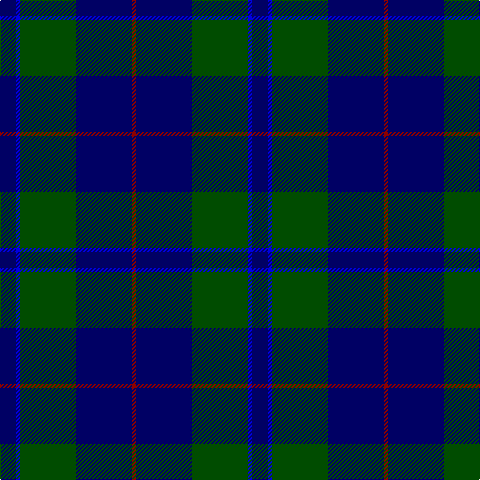

**Bands:** [RBGBB](/stripes/rbgbb/) · **Stripes:** [R DB DG DB DB](/stripes/stripes5/) R DB DG DB DB

This was sourced from register-of-tartans.  It is a [5 band tartan](/bands/bands5/).

Original link https://www.tartanregister.gov.uk/tartanDetails.aspx?ref=4517

## Register references

External register numbers recorded for this tartan.

- Scottish Register of Tartans: [4517](https://www.tartanregister.gov.uk/tartanDetails.aspx?ref=4517)
- Scottish Tartans Authority (ITI): 4313

## Thread count
DB/16 B4 G56 DB56 DR/4

## Palette
Each colour and its ΔE from the base-6 reference it is a variant of.

| Colour | Shade | Base | ΔE (OKLab) |
|---|---|---|---|
| B | <code style="background-color:#0000E0;">#0000E0</code> `#0000E0` | B <code style="background-color:#2A418A;">#2A418A</code> | 0.16 |
| DB | <code style="background-color:#000064;">#000064</code> `#000064` | B <code style="background-color:#2A418A;">#2A418A</code> | 0.18 |
| DR | <code style="background-color:#8C0000;">#8C0000</code> `#8C0000` | R <code style="background-color:#CC0000;">#CC0000</code> | 0.14 |
| G | <code style="background-color:#004C00;">#004C00</code> `#004C00` | G <code style="background-color:#006100;">#006100</code> | 0.07 |

# Sample pattern

## Nearest tartans

The nearest existing variants by ΔTartan distance.

1. [Hutton](/setts/s6/k2dg7db2dg7db16r1~x6/) — ΔT 0.73
1. [Barclay Hunting](/setts/s4/dg1db16dg16r1/) — ΔT 1.16
1. [St. Andrews Old Course Hotel (Corp)](/setts/s6/g26db10k3db2dy2db10~x4/) — ΔT 1.21
1. [Barclay Hunting](/setts/s4/dg1db16dg16r1~x2/) — ΔT 1.27
1. [MacIntyre LC](/setts/s6/dg4db12r3db12dg32lr4~x2/) — ΔT 1.32
1. [MacIntyre LC](/setts/s6/dg4db12r3db12dg32lr4/) — ΔT 1.32
1. [Pinehurst Resort](/setts/s7/k4r1k4r1dg14n1dg1~x4/) — ΔT 1.40
1. [Gallaecia - Galicia National](/setts/s5/db24n13db4n4w2~x2/) — ΔT 1.40
1. [Kinross (Fashion)](/setts/s8/dg20db2g6db2dg4db27lo2db8~x2/) — ΔT 1.43
1. [Connaught Green](/setts/s6/r1db12y5db2y4lb1~x2/) — ΔT 1.52

## Neighbour map

Every grey dot is one of 14299 variants placed by the first two principal components of the ΔTartan feature space (44% of its variance). Red is this tartan; blue dots are its nearest — click one to open its page.

<svg viewBox="0 0 640 380" role="img" style="max-width:100%;height:auto;border:1px solid #e0e0e0;border-radius:4px;display:block" xmlns="http://www.w3.org/2000/svg"><image href="/nn/cloud.v1.png" width="640" height="380"/><a href="/setts/s6/k2dg7db2dg7db16r1~x6/"><circle cx="360.6" cy="234.7" r="4" fill="#3465a4"><title>Hutton</title></circle></a><a href="/setts/s4/dg1db16dg16r1/"><circle cx="381.9" cy="260.3" r="4" fill="#3465a4"><title>Barclay Hunting</title></circle></a><a href="/setts/s6/g26db10k3db2dy2db10~x4/"><circle cx="315.7" cy="217.5" r="4" fill="#3465a4"><title>St. Andrews Old Course Hotel (Corp)</title></circle></a><a href="/setts/s4/dg1db16dg16r1~x2/"><circle cx="400.5" cy="269.2" r="4" fill="#3465a4"><title>Barclay Hunting</title></circle></a><a href="/setts/s6/dg4db12r3db12dg32lr4~x2/"><circle cx="322.2" cy="228.7" r="4" fill="#3465a4"><title>MacIntyre LC</title></circle></a><a href="/setts/s6/dg4db12r3db12dg32lr4/"><circle cx="322.2" cy="228.7" r="4" fill="#3465a4"><title>MacIntyre LC</title></circle></a><a href="/setts/s7/k4r1k4r1dg14n1dg1~x4/"><circle cx="393.3" cy="207.2" r="4" fill="#3465a4"><title>Pinehurst Resort</title></circle></a><a href="/setts/s5/db24n13db4n4w2~x2/"><circle cx="397.4" cy="254.0" r="4" fill="#3465a4"><title>Gallaecia - Galicia National</title></circle></a><a href="/setts/s8/dg20db2g6db2dg4db27lo2db8~x2/"><circle cx="334.1" cy="197.7" r="4" fill="#3465a4"><title>Kinross (Fashion)</title></circle></a><a href="/setts/s6/r1db12y5db2y4lb1~x2/"><circle cx="353.7" cy="219.6" r="4" fill="#3465a4"><title>Connaught Green</title></circle></a><circle cx="360.2" cy="242.5" r="5" fill="#c00000"/></svg>

ID: /setts/s5/db4db1dg14db14r1~x4/
