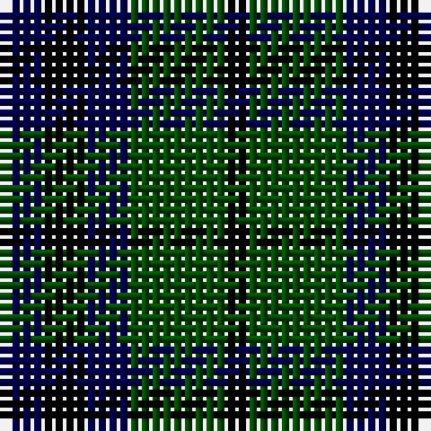

**Bands:** [KGBKB](/stripes/kgbkb/) · **Stripes:** [K DG DB K DB](/stripes/stripes5/) K DG DB K DB

This was sourced from weddslist.  It is a [5 band tartan](/bands/bands5/).

Original link http://www.weddslist.com/cgi-bin/tartans/pg.pl?source=rb

## Also known as

This cloth is also recorded under:

- Austin Clan
- Austin or Keith/Marshall
- Austin, or Keith
- Keith Austin and Marshall
- Keith and Austin

## Attestations

This cloth appears in 4 source records; the oldest owns this page.

- undated — Austin (weddslist, [record](http://www.weddslist.com/cgi-bin/tartans/pg.pl?source=rb))
- undated — Keith and Austin (weddslist, [record](http://www.weddslist.com/cgi-bin/tartans/pg.pl?source=rb))
- undated — Austin (weddslist, [record](http://www.weddslist.com/cgi-bin/tartans/pg.pl?source=x))
- undated — Keith and Austin (weddslist, [record](http://www.weddslist.com/cgi-bin/tartans/pg.pl?source=x))

## Register references

External register numbers recorded for this tartan.

- Scottish Register of Tartans: [1166](https://www.tartanregister.gov.uk/tartanDetails.aspx?ref=1166)
- Scottish Register of Tartans: [1758](https://www.tartanregister.gov.uk/tartanDetails.aspx?ref=1758)
- Scottish Register of Tartans: [2307](https://www.tartanregister.gov.uk/tartanDetails.aspx?ref=2307)
- Scottish Register of Tartans: [2540](https://www.tartanregister.gov.uk/tartanDetails.aspx?ref=2540)
- Scottish Register of Tartans: [2625](https://www.tartanregister.gov.uk/tartanDetails.aspx?ref=2625)
- Scottish Register of Tartans: [2666](https://www.tartanregister.gov.uk/tartanDetails.aspx?ref=2666)
- Scottish Register of Tartans: [2862](https://www.tartanregister.gov.uk/tartanDetails.aspx?ref=2862)
- Scottish Register of Tartans: [3808](https://www.tartanregister.gov.uk/tartanDetails.aspx?ref=3808)
- Scottish Register of Tartans: [982](https://www.tartanregister.gov.uk/tartanDetails.aspx?ref=982)
- Scottish Tartans Authority (ITI): 1429
- Scottish Tartans Authority (ITI): 218
- Scottish Tartans World Register: 1010
- Scottish Tartans World Register: 1042
- Scottish Tartans World Register: 127
- Scottish Tartans World Register: 1429
- Scottish Tartans World Register: 1585
- Scottish Tartans World Register: 218
- Scottish Tartans World Register: 2218
- Scottish Tartans World Register: 737
- Scottish Tartans World Register: 897

## Variants

Other setts woven to the same stripe pattern.

- [Austin](/setts/s5/db4k4db4dg9k2~x2/)

## Thread count
DB/4 K4 DB4 G9 K/2

## Palette
Each colour and its ΔE from the base-6 reference it is a variant of.

| Colour | Shade | Base | ΔE (OKLab) |
|---|---|---|---|
| DB | <code style="background-color:#00004C;">#00004C</code> `#00004C` | B <code style="background-color:#2A418A;">#2A418A</code> | 0.21 |
| G | <code style="background-color:#004C00;">#004C00</code> `#004C00` | G <code style="background-color:#006100;">#006100</code> | 0.07 |
| K | <code style="background-color:#000000;">#000000</code> `#000000` | K <code style="background-color:#000000;">#000000</code> | 0.00 |

# Sample pattern

## Nearest tartans

The nearest existing variants by ΔTartan distance.

1. [Austin](/setts/s5/db4k4db4dg9k2~x2/) — ΔT 0.35
1. [MacKay](/setts/s6/k3dg14k14dg2db14dg3~x2/) — ΔT 1.13
1. [MacKay](/setts/s6/k3dg14k14dg2db14dg3/) — ΔT 1.14
1. [Black Watch (smallest sett)](/setts/s6/k1dg6k6db6k1db1~x4/) — ΔT 1.26
1. [Austin Clan](/setts/s5/db4k4db4g9k2~x2/) — ΔT 1.27
1. [MacNiel of Colonsay](/setts/s7/db4dg6lr1dg6k6db6k2~x2/) — ΔT 1.28
1. [Unnamed, No 54](/setts/s6/db2g6db6dp5db1dp2~x2/) — ΔT 1.29
1. [Graham of Montrose](/setts/s7/k4dg4lr1dg4k4db4k1~x2/) — ΔT 1.44
1. [Campbell of Breadalbane](/setts/s7/k9dg9ly2dg9k9db9k3~x2/) — ΔT 1.47
1. [MacNeil of Colonsay](/setts/s7/db4dg6lb1dg6k6db6k2~x2/) — ΔT 1.49

## Neighbour map

Every grey dot is one of 14299 variants placed by the first two principal components of the ΔTartan feature space (44% of its variance). Red is this tartan; blue dots are its nearest — click one to open its page.

<svg viewBox="0 0 640 380" role="img" style="max-width:100%;height:auto;border:1px solid #e0e0e0;border-radius:4px;display:block" xmlns="http://www.w3.org/2000/svg"><image href="/nn/cloud.v1.png" width="640" height="380"/><a href="/setts/s5/db4k4db4dg9k2~x2/"><circle cx="208.2" cy="328.4" r="4" fill="#3465a4"><title>Austin</title></circle></a><a href="/setts/s6/k3dg14k14dg2db14dg3~x2/"><circle cx="231.3" cy="284.1" r="4" fill="#3465a4"><title>MacKay</title></circle></a><a href="/setts/s6/k3dg14k14dg2db14dg3/"><circle cx="217.6" cy="277.6" r="4" fill="#3465a4"><title>MacKay</title></circle></a><a href="/setts/s6/k1dg6k6db6k1db1~x4/"><circle cx="216.1" cy="275.7" r="4" fill="#3465a4"><title>Black Watch (smallest sett)</title></circle></a><a href="/setts/s5/db4k4db4g9k2~x2/"><circle cx="209.1" cy="323.4" r="4" fill="#3465a4"><title>Austin Clan</title></circle></a><a href="/setts/s7/db4dg6lr1dg6k6db6k2~x2/"><circle cx="161.0" cy="286.0" r="4" fill="#3465a4"><title>MacNiel of Colonsay</title></circle></a><a href="/setts/s6/db2g6db6dp5db1dp2~x2/"><circle cx="207.6" cy="288.4" r="4" fill="#3465a4"><title>Unnamed, No 54</title></circle></a><a href="/setts/s7/k4dg4lr1dg4k4db4k1~x2/"><circle cx="145.7" cy="297.3" r="4" fill="#3465a4"><title>Graham of Montrose</title></circle></a><a href="/setts/s7/k9dg9ly2dg9k9db9k3~x2/"><circle cx="155.2" cy="297.3" r="4" fill="#3465a4"><title>Campbell of Breadalbane</title></circle></a><a href="/setts/s7/db4dg6lb1dg6k6db6k2~x2/"><circle cx="145.5" cy="278.6" r="4" fill="#3465a4"><title>MacNeil of Colonsay</title></circle></a><circle cx="199.5" cy="324.6" r="5" fill="#c00000"/></svg>

ID: /setts/s5/db4k4db4dg9k2/
