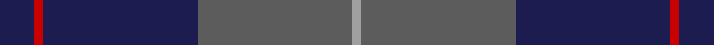

In pattern [BRBBY](/stripes/brbby/).

This was sourced from tartans-authority.  It is a [5 stripe tartan](/stripes/stripes5/).

Original link http://www.tartansauthority.com/tartan-ferret/display/8051/

## Thread count
DB/16 R4 DB72 N72 Na/4

## Palette
Each colour and the base-6 reference it is a variant of.

| Colour | Shade | Base |
|---|---|---|
| DB | <code style="background-color:#1C1C50;">#1C1C50</code> `oklch(26.2% 0.093 277.9)` <small>#1C1C50</small> | B <code style="background-color:#2A418A;">#2A418A</code> |
| N | <code style="background-color:#5C5C5C;">#5C5C5C</code> `oklch(47.5% 0.000 89.9)` <small>#5C5C5C</small> | B <code style="background-color:#2A418A;">#2A418A</code> |
| Na | <code style="background-color:#A0A0A0;">#A0A0A0</code> `oklch(70.6% 0.000 89.9)` <small>#A0A0A0</small> | Y <code style="background-color:#F2BF00;">#F2BF00</code> |
| R | <code style="background-color:#C80000;">#C80000</code> `oklch(52.3% 0.215 29.2)` <small>#C80000</small> | R <code style="background-color:#CC0000;">#CC0000</code> |

# Sample pattern

## Nearest tartans

The nearest existing variants by ΔTartan distance.

1. [Meaux (Personal)](/setts/s4/dt62r24lo5dg3~x2/) — ΔT 1.34
1. [Connaught Green](/setts/s6/r1db12y5db2y4lb1~x2/) — ΔT 1.39
1. [Largan (?)](/setts/s6/db8k39db8k39db87r6/) — ΔT 1.39
1. [MacKay (Blue) #2](/setts/s5/k15db4k15db28r2~x2/) — ΔT 1.43
1. [Hutton](/setts/s6/k2dg7db2dg7db16r1~x6/) — ΔT 1.43
1. [Cameron Hunting](/setts/s6/do15r5do30b32do4lo3~x2/) — ΔT 1.44
1. [Keepers of the Quaich](/setts/s6/lo3dy33db24dy2db2dy2~x2/) — ΔT 1.47
1. [McNiff, Kevin (Personal)](/setts/s4/dg20r7db40w2~x2/) — ΔT 1.49
1. [Lyndon Prep (School)](/setts/s6/k4ly1k18db18lb1db4~x4/) — ΔT 1.51
1. [Dege of Saville Row](/setts/s6/dy11db1dy3db1db9r1~x4/) — ΔT 1.52

## Neighbour map

Every grey dot is one of 14299 variants placed by the first two principal components of the ΔTartan feature space (44% of its variance). Red is this tartan; blue dots are its nearest — click one to open its page.

<svg viewBox="0 0 640 380" role="img" style="max-width:100%;height:auto;border:1px solid #e0e0e0;border-radius:4px;display:block" xmlns="http://www.w3.org/2000/svg"><image href="/nn/cloud.v1.png" width="640" height="380"/><a href="/setts/s4/dt62r24lo5dg3~x2/"><circle cx="471.6" cy="226.0" r="4" fill="#3465a4"><title>Meaux (Personal)</title></circle></a><a href="/setts/s6/r1db12y5db2y4lb1~x2/"><circle cx="353.7" cy="219.6" r="4" fill="#3465a4"><title>Connaught Green</title></circle></a><a href="/setts/s6/db8k39db8k39db87r6/"><circle cx="429.9" cy="254.8" r="4" fill="#3465a4"><title>Largan (?)</title></circle></a><a href="/setts/s5/k15db4k15db28r2~x2/"><circle cx="378.4" cy="270.1" r="4" fill="#3465a4"><title>MacKay (Blue) #2</title></circle></a><a href="/setts/s6/k2dg7db2dg7db16r1~x6/"><circle cx="360.6" cy="234.7" r="4" fill="#3465a4"><title>Hutton</title></circle></a><a href="/setts/s6/do15r5do30b32do4lo3~x2/"><circle cx="349.0" cy="234.3" r="4" fill="#3465a4"><title>Cameron Hunting</title></circle></a><a href="/setts/s6/lo3dy33db24dy2db2dy2~x2/"><circle cx="440.9" cy="220.7" r="4" fill="#3465a4"><title>Keepers of the Quaich</title></circle></a><a href="/setts/s4/dg20r7db40w2~x2/"><circle cx="370.8" cy="221.3" r="4" fill="#3465a4"><title>McNiff, Kevin (Personal)</title></circle></a><a href="/setts/s6/k4ly1k18db18lb1db4~x4/"><circle cx="368.2" cy="219.3" r="4" fill="#3465a4"><title>Lyndon Prep (School)</title></circle></a><a href="/setts/s6/dy11db1dy3db1db9r1~x4/"><circle cx="399.7" cy="245.0" r="4" fill="#3465a4"><title>Dege of Saville Row</title></circle></a><circle cx="400.1" cy="227.8" r="5" fill="#c00000"/></svg>

ID: /setts/s5/db4r1db18n18lr1~x4/
