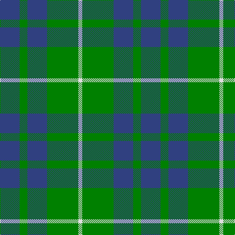

This page is one **sett** — a single exact thread-count. It belongs to the [tartan](/tartans/db5g2db5g8w1/)
(the same proportion at any scale), whose colour order is pattern [BGBGW](/stripes/bgbgw/).

Sourced from weddslist.  It is a [5 stripe tartan](/stripes/stripes5/).

Original link http://www.weddslist.com/cgi-bin/tartans/pg.pl?source=sts

## Also known as

This cloth is also recorded under:

- Hamilton, hunting

2 attestations — the source records this cloth was collapsed from (oldest owns this page)

<ul>
<li>undated — Hamilton, hunting (weddslist, <a href="http://www.weddslist.com/cgi-bin/tartans/pg.pl?source=sts">record</a>)</li>
<li>undated — Hamilton Hunting Clan Tartan Tartan Number: 139. Earliest known date: pre 2003 Sample presented to the Scottish Tartans Society by Wiebe Stodel. See products available Copyright © Blair Urquhart, Comrie, 2015 (house-of-tartan, <a href="http://www.house-of-tartan.scotland.net/house/TartanViewjs.asp?colr=Def&tnam=139">record</a>)</li>
</ul>

## Thread count
B/40 G16 B40 G64 LN/8

## Palette

Palette: <strong>Tartan Dictionary</strong> <small style="color:#888">(1 of 3 colours)</small>
<table><thead><tr><th>Colour</th><th>Threads</th><th>Shade</th><th>Base</th><th>OKLCh</th></tr></thead><tbody><tr><td>B/</td><td style="text-align:right;font-variant-numeric:tabular-nums">40</td><td><code style="background-color:#304080;">#304080</code> <small style="color:#888">#304080</small></td><td>B <code style="background-color:#2A418A;">#2A418A</code></td><td><small style="color:#888">oklch(39.4% 0.109 270.2)</small></td></tr><tr><td>G</td><td style="text-align:right;font-variant-numeric:tabular-nums">16</td><td><code style="background-color:#008000;">#008000</code> <small style="color:#888">#008000</small></td><td>G <code style="background-color:#006100;">#006100</code></td><td><small style="color:#888">oklch(52.0% 0.177 142.5)</small></td></tr><tr><td>B</td><td style="text-align:right;font-variant-numeric:tabular-nums">40</td><td><code style="background-color:#304080;">#304080</code> <small style="color:#888">#304080</small></td><td>B <code style="background-color:#2A418A;">#2A418A</code></td><td><small style="color:#888">oklch(39.4% 0.109 270.2)</small></td></tr><tr><td>G</td><td style="text-align:right;font-variant-numeric:tabular-nums">64</td><td><code style="background-color:#008000;">#008000</code> <small style="color:#888">#008000</small></td><td>G <code style="background-color:#006100;">#006100</code></td><td><small style="color:#888">oklch(52.0% 0.177 142.5)</small></td></tr><tr><td>LN/</td><td style="text-align:right;font-variant-numeric:tabular-nums">8</td><td><code style="background-color:#E0E0E0;">#E0E0E0</code> <small style="color:#888">#E0E0E0</small></td><td>W <code style="background-color:#F7F7F7;">#F7F7F7</code></td><td><small style="color:#888">oklch(90.7% 0.000 89.9)</small></td></tr></tbody></table>

# Sample pattern

## Nearest tartans

The nearest existing variants by ΔTartan distance, with this tartan at the top so the swatches line up against it.

ΔTartan

Tartan

Sett

—

<a href="/ttd/edit/#slug=db5g2db5g8w1~x8">Hamilton, hunting</a> <a class="nn-out" href="/setts/s5/db5g2db5g8w1~x8/" title="open its dictionary page">↗</a>

0.77

<a href="/ttd/edit/#slug=db11g2db15g18w2~x2">Hamilton, hunting</a> <a class="nn-out" href="/setts/s5/db11g2db15g18w2~x2/" title="open its dictionary page">↗</a>

0.78

<a href="/ttd/edit/#slug=db2g7db7w1~x2">Unnamed No 78</a> <a class="nn-out" href="/setts/s4/db2g7db7w1~x2/" title="open its dictionary page">↗</a>

1.21

<a href="/ttd/edit/#slug=db4w1db12g12db1g4~x2">Unidentified, Tweed</a> <a class="nn-out" href="/setts/s6/db4w1db12g12db1g4~x2/" title="open its dictionary page">↗</a>

1.26

<a href="/ttd/edit/#slug=db13r2g13~x2">Wilson's No 62, (Ferguson)</a> <a class="nn-out" href="/setts/s3/db13r2g13~x2/" title="open its dictionary page">↗</a>

1.34

<a href="/ttd/edit/#slug=db5g6r1~x4">Wilson's No 84, Ferguson</a> <a class="nn-out" href="/setts/s3/db5g6r1~x4/" title="open its dictionary page">↗</a>

1.34

<a href="/ttd/edit/#slug=db8g2db8g15lb2~x4">Hamilton Green Hunting</a> <a class="nn-out" href="/setts/s5/db8g2db8g15lb2~x4/" title="open its dictionary page">↗</a>

1.37

<a href="/ttd/edit/#slug=db6g5r1~x4">Ferguson</a> <a class="nn-out" href="/setts/s3/db6g5r1~x4/" title="open its dictionary page">↗</a>

1.46

<a href="/ttd/edit/#slug=b3k1g4k1b4g9k2~x4">Outdoorsmen (Fashion)</a> <a class="nn-out" href="/setts/s7/b3k1g4k1b4g9k2~x4/" title="open its dictionary page">↗</a>

1.46

<a href="/ttd/edit/#slug=t7k7t7g20t2g2~x4">Falconer of Labhdal (Personal)</a> <a class="nn-out" href="/setts/s6/t7k7t7g20t2g2~x4/" title="open its dictionary page">↗</a>

1.48

<a href="/ttd/edit/#slug=t2g4k5g4t1~x2">Glen Lyon #2</a> <a class="nn-out" href="/setts/s5/t2g4k5g4t1~x2/" title="open its dictionary page">↗</a>

## Neighbour map

Every grey dot is one of 14359 variants placed by the first two principal components of the ΔTartan feature space (44% of its variance). Red is this tartan; blue dots are its nearest — click one to open its page.

<svg viewBox="0 0 640 380" role="img" style="max-width:100%;height:auto;border:1px solid #e0e0e0;border-radius:4px;display:block" xmlns="http://www.w3.org/2000/svg"><image href="/nn/cloud.v1.png" width="640" height="380"/><a href="/setts/s5/db11g2db15g18w2~x2/"><circle cx="328.2" cy="271.3" r="4" fill="#3465a4"><title>Hamilton, hunting</title></circle></a><a href="/setts/s4/db2g7db7w1~x2/"><circle cx="303.9" cy="288.6" r="4" fill="#3465a4"><title>Unnamed No 78</title></circle></a><a href="/setts/s6/db4w1db12g12db1g4~x2/"><circle cx="339.4" cy="244.5" r="4" fill="#3465a4"><title>Unidentified, Tweed</title></circle></a><a href="/setts/s3/db13r2g13~x2/"><circle cx="288.5" cy="321.6" r="4" fill="#3465a4"><title>Wilson's No 62, (Ferguson)</title></circle></a><a href="/setts/s3/db5g6r1~x4/"><circle cx="291.3" cy="324.9" r="4" fill="#3465a4"><title>Wilson's No 84, Ferguson</title></circle></a><a href="/setts/s5/db8g2db8g15lb2~x4/"><circle cx="282.4" cy="272.3" r="4" fill="#3465a4"><title>Hamilton Green Hunting</title></circle></a><a href="/setts/s3/db6g5r1~x4/"><circle cx="293.2" cy="325.0" r="4" fill="#3465a4"><title>Ferguson</title></circle></a><a href="/setts/s7/b3k1g4k1b4g9k2~x4/"><circle cx="298.0" cy="246.4" r="4" fill="#3465a4"><title>Outdoorsmen (Fashion)</title></circle></a><a href="/setts/s6/t7k7t7g20t2g2~x4/"><circle cx="296.2" cy="249.8" r="4" fill="#3465a4"><title>Falconer of Labhdal (Personal)</title></circle></a><a href="/setts/s5/t2g4k5g4t1~x2/"><circle cx="230.4" cy="316.4" r="4" fill="#3465a4"><title>Glen Lyon #2</title></circle></a><circle cx="285.1" cy="284.0" r="5" fill="#c00000"/></svg>

ID: /setts/s5/db5g2db5g8w1~x8/
