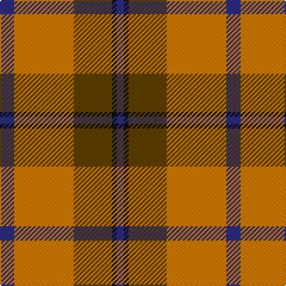

This page is one **sett** — a single exact thread-count. It belongs to the [tartan](/tartans/db6o25t16k2db3/)
(the same proportion at any scale), whose colour order is pattern [BKGYB](/stripes/bkgyb/).

Sourced from register-of-tartans.  It is a [5 stripe tartan](/stripes/stripes5/).

Original link https://www.tartanregister.gov.uk/tartanDetails.aspx?ref=3395

## Register references

External register numbers recorded for this tartan.

- Scottish Register of Tartans: [3395](https://www.tartanregister.gov.uk/tartanDetails.aspx?ref=3395)
- Scottish Tartans Authority (ITI): 365
- Scottish Tartans World Register: 365

## Thread count
DB/12 O50 T32 K4 DB/6

## Palette
Each colour and the base-6 reference it is a variant of.

| Colour | Shade | Base |
|---|---|---|
| DB | <code style="background-color:#2C2C80;">#2C2C80</code> `oklch(35.0% 0.138 276.6)` <small>#2C2C80</small> | B <code style="background-color:#2A418A;">#2A418A</code> |
| K | <code style="background-color:#101010;">#101010</code> `oklch(17.3% 0.000 89.9)` <small>#101010</small> | K <code style="background-color:#000000;">#000000</code> |
| O | <code style="background-color:#D87C00;">#D87C00</code> `oklch(67.3% 0.155 61.8)` <small>#D87C00</small> | Y <code style="background-color:#F2BF00;">#F2BF00</code> |
| T | <code style="background-color:#604000;">#604000</code> `oklch(39.8% 0.083 76.8)` <small>#604000</small> | G <code style="background-color:#006100;">#006100</code> |

# Sample pattern

## Nearest tartans

The nearest existing variants by ΔTartan distance, with this tartan at the top so the swatches line up against it.

ΔTartan

Tartan

Sett

—

<a href="/ttd/edit/#slug=db6lo25dy16k2db3~x2">Prince of Orange #2</a> <a class="nn-out" href="/setts/s5/db6lo25dy16k2db3~x2/" title="open its dictionary page">↗</a>

0.77

<a href="/ttd/edit/#slug=db6lo25o16k2db3~x2">Prince of Orange</a> <a class="nn-out" href="/setts/s5/db6lo25o16k2db3~x2/" title="open its dictionary page">↗</a>

0.80

<a href="/ttd/edit/#slug=db1r12g6ly1g6db1~x4">Cetoloni (Personal)</a> <a class="nn-out" href="/setts/s6/db1r12g6ly1g6db1~x4/" title="open its dictionary page">↗</a>

0.92

<a href="/ttd/edit/#slug=k2r12db6r3g12r4db1~x2">MacBean, MacElvain</a> <a class="nn-out" href="/setts/s7/k2r12db6r3g12r4db1~x2/" title="open its dictionary page">↗</a>

0.94

<a href="/ttd/edit/#slug=g28r7m7g14m7r48k4~x2">MacNab 6</a> <a class="nn-out" href="/setts/s7/g28r7m7g14m7r48k4~x2/" title="open its dictionary page">↗</a>

1.00

<a href="/ttd/edit/#slug=ly2dg17g4r15dg1~x2">Christmas</a> <a class="nn-out" href="/setts/s5/ly2dg17g4r15dg1~x2/" title="open its dictionary page">↗</a>

1.01

<a href="/ttd/edit/#slug=g9r2g9r14k1w2~x2">MacGregor of Balquidder (Logan)</a> <a class="nn-out" href="/setts/s6/g9r2g9r14k1w2~x2/" title="open its dictionary page">↗</a>

1.02

<a href="/ttd/edit/#slug=g6r2r2g4r2r12k1~x2">MacNab 5</a> <a class="nn-out" href="/setts/s7/g6r2r2g4r2r12k1~x2/" title="open its dictionary page">↗</a>

1.02

<a href="/ttd/edit/#slug=p8r3ly1r3g14r3ly1~x4">Logan, with Yellow</a> <a class="nn-out" href="/setts/s7/p8r3ly1r3g14r3ly1~x4/" title="open its dictionary page">↗</a>

1.02

<a href="/ttd/edit/#slug=k2r4w1r10g12r2w2~x4">Starr (1978) (Name)</a> <a class="nn-out" href="/setts/s7/k2r4w1r10g12r2w2~x4/" title="open its dictionary page">↗</a>

1.03

<a href="/ttd/edit/#slug=r6g16r4db12r16t1r2~x2">MacQuarrie 2</a> <a class="nn-out" href="/setts/s7/r6g16r4db12r16t1r2~x2/" title="open its dictionary page">↗</a>

## Neighbour map

Every grey dot is one of 14299 variants placed by the first two principal components of the ΔTartan feature space (44% of its variance). Red is this tartan; blue dots are its nearest — click one to open its page.

<svg viewBox="0 0 640 380" role="img" style="max-width:100%;height:auto;border:1px solid #e0e0e0;border-radius:4px;display:block" xmlns="http://www.w3.org/2000/svg"><image href="/nn/cloud.v1.png" width="640" height="380"/><a href="/setts/s5/db6lo25o16k2db3~x2/"><circle cx="266.5" cy="189.1" r="4" fill="#3465a4"><title>Prince of Orange</title></circle></a><a href="/setts/s6/db1r12g6ly1g6db1~x4/"><circle cx="288.3" cy="197.8" r="4" fill="#3465a4"><title>Cetoloni (Personal)</title></circle></a><a href="/setts/s7/k2r12db6r3g12r4db1~x2/"><circle cx="250.2" cy="196.7" r="4" fill="#3465a4"><title>MacBean, MacElvain</title></circle></a><a href="/setts/s7/g28r7m7g14m7r48k4~x2/"><circle cx="289.3" cy="186.9" r="4" fill="#3465a4"><title>MacNab 6</title></circle></a><a href="/setts/s5/ly2dg17g4r15dg1~x2/"><circle cx="302.1" cy="200.2" r="4" fill="#3465a4"><title>Christmas</title></circle></a><a href="/setts/s6/g9r2g9r14k1w2~x2/"><circle cx="298.1" cy="198.9" r="4" fill="#3465a4"><title>MacGregor of Balquidder (Logan)</title></circle></a><a href="/setts/s7/g6r2r2g4r2r12k1~x2/"><circle cx="288.0" cy="190.4" r="4" fill="#3465a4"><title>MacNab 5</title></circle></a><a href="/setts/s7/p8r3ly1r3g14r3ly1~x4/"><circle cx="239.8" cy="174.0" r="4" fill="#3465a4"><title>Logan, with Yellow</title></circle></a><a href="/setts/s7/k2r4w1r10g12r2w2~x4/"><circle cx="264.8" cy="177.1" r="4" fill="#3465a4"><title>Starr (1978) (Name)</title></circle></a><a href="/setts/s7/r6g16r4db12r16t1r2~x2/"><circle cx="288.7" cy="195.2" r="4" fill="#3465a4"><title>MacQuarrie 2</title></circle></a><circle cx="277.3" cy="200.3" r="5" fill="#c00000"/></svg>

ID: /setts/s5/db6lo25dy16k2db3~x2/
