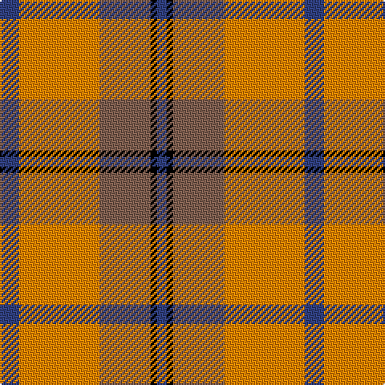

In pattern [BKRYB](/stripes/bkryb/).

This was sourced from weddslist.  It is a [5 stripe tartan](/stripes/stripes5/).

Original link http://www.weddslist.com/cgi-bin/tartans/pg.pl?source=sts

## Thread count
B/12 O50 LT32 K4 B/6

## Palette
Each colour and the base-6 reference it is a variant of.

| Colour | Shade | Base |
|---|---|---|
| B | <code style="background-color:#304080;">#304080</code> `oklch(39.4% 0.109 270.2)` <small>#304080</small> | B <code style="background-color:#2A418A;">#2A418A</code> |
| K | <code style="background-color:#000000;">#000000</code> `oklch(0.0% 0.000 0.0)` <small>#000000</small> | K <code style="background-color:#000000;">#000000</code> |
| LT | <code style="background-color:#806050;">#806050</code> `oklch(51.7% 0.049 47.8)` <small>#806050</small> | R <code style="background-color:#CC0000;">#CC0000</code> |
| O | <code style="background-color:#FF8500;">#FF8500</code> `oklch(74.0% 0.183 55.1)` <small>#FF8500</small> | Y <code style="background-color:#F2BF00;">#F2BF00</code> |

# Sample pattern

## Nearest tartans

The nearest existing variants by ΔTartan distance.

1. [Basque (Corporate)](/setts/s5/r44g6k3g16w22/) — ΔT 0.61
1. [Prince of Orange #2](/setts/s5/db6lo25dy16k2db3~x2/) — ΔT 0.77
1. [Nesbit, Rose](/setts/s6/r6lb3r37k16lb16g4~x2/) — ΔT 0.99
1. [Starr (1978) (Name)](/setts/s7/k2r4w1r10g12r2w2~x4/) — ΔT 1.06
1. [Ruthven (V.S.)](/setts/s6/w6g15db18r30g2r4~x2/) — ΔT 1.19
1. [Henkel (Corporate)](/setts/s6/k3y28k3r22k8w3~x2/) — ΔT 1.24
1. [Manhattan Ethnic](/setts/s7/o72dr30o18lr62y10dr7lr32/) — ΔT 1.25
1. [Logan, Light](/setts/s7/p9r4p1r4g15r4p1~x2/) — ΔT 1.31
1. [Plaid Wine](/setts/s6/r24n5o9n2o9lb9~x4/) — ΔT 1.31
1. [Logan, with Yellow](/setts/s7/p8r3ly1r3g14r3ly1~x4/) — ΔT 1.32

## Neighbour map

Every grey dot is one of 14299 variants placed by the first two principal components of the ΔTartan feature space (44% of its variance). Red is this tartan; blue dots are its nearest — click one to open its page.

<svg viewBox="0 0 640 380" role="img" style="max-width:100%;height:auto;border:1px solid #e0e0e0;border-radius:4px;display:block" xmlns="http://www.w3.org/2000/svg"><image href="/nn/cloud.v1.png" width="640" height="380"/><a href="/setts/s5/r44g6k3g16w22/"><circle cx="253.5" cy="178.8" r="4" fill="#3465a4"><title>Basque (Corporate)</title></circle></a><a href="/setts/s5/db6lo25dy16k2db3~x2/"><circle cx="277.3" cy="200.3" r="4" fill="#3465a4"><title>Prince of Orange #2</title></circle></a><a href="/setts/s6/r6lb3r37k16lb16g4~x2/"><circle cx="266.8" cy="172.0" r="4" fill="#3465a4"><title>Nesbit, Rose</title></circle></a><a href="/setts/s7/k2r4w1r10g12r2w2~x4/"><circle cx="264.8" cy="177.1" r="4" fill="#3465a4"><title>Starr (1978) (Name)</title></circle></a><a href="/setts/s6/w6g15db18r30g2r4~x2/"><circle cx="241.9" cy="184.8" r="4" fill="#3465a4"><title>Ruthven (V.S.)</title></circle></a><a href="/setts/s6/k3y28k3r22k8w3~x2/"><circle cx="222.9" cy="189.5" r="4" fill="#3465a4"><title>Henkel (Corporate)</title></circle></a><a href="/setts/s7/o72dr30o18lr62y10dr7lr32/"><circle cx="227.1" cy="203.8" r="4" fill="#3465a4"><title>Manhattan Ethnic</title></circle></a><a href="/setts/s7/p9r4p1r4g15r4p1~x2/"><circle cx="218.8" cy="173.5" r="4" fill="#3465a4"><title>Logan, Light</title></circle></a><a href="/setts/s6/r24n5o9n2o9lb9~x4/"><circle cx="234.3" cy="206.4" r="4" fill="#3465a4"><title>Plaid Wine</title></circle></a><a href="/setts/s7/p8r3ly1r3g14r3ly1~x4/"><circle cx="239.8" cy="174.0" r="4" fill="#3465a4"><title>Logan, with Yellow</title></circle></a><circle cx="266.5" cy="189.1" r="5" fill="#c00000"/></svg>

ID: /setts/s5/db6lo25o16k2db3~x2/
