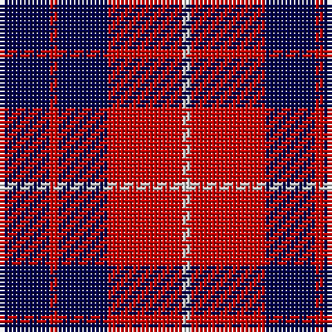

In pattern [BRBRW](/stripes/brbrw/).

This was sourced from weddslist.  It is a [5 stripe tartan](/stripes/stripes5/).

Original link http://www.weddslist.com/cgi-bin/tartans/pg.pl?source=rb

## Thread count
DB/12 R2 DB12 R18 N/2

## Palette
Each colour and the base-6 reference it is a variant of.

| Colour | Shade | Base |
|---|---|---|
| DB | <code style="background-color:#00004C;">#00004C</code> `oklch(18.8% 0.130 264.1)` <small>#00004C</small> | B <code style="background-color:#2A418A;">#2A418A</code> |
| N | <code style="background-color:#D0D0D0;">#D0D0D0</code> `oklch(85.8% 0.000 89.9)` <small>#D0D0D0</small> | W <code style="background-color:#F7F7F7;">#F7F7F7</code> |
| R | <code style="background-color:#C80000;">#C80000</code> `oklch(52.3% 0.215 29.2)` <small>#C80000</small> | R <code style="background-color:#CC0000;">#CC0000</code> |

# Sample pattern

## Nearest tartans

The nearest existing variants by ΔTartan distance, with this tartan at the top so the swatches line up against it.

ΔTartan

Tartan

Sett

—

<a href="/ttd/edit/#slug=db6r1db6r9lb1~x2">Hamilton</a> <a class="nn-out" href="/setts/s5/db6r1db6r9lb1~x2/" title="open its dictionary page">↗</a>

0.60

<a href="/ttd/edit/#slug=db6r1db6r9lr1~x2">Hamilton</a> <a class="nn-out" href="/setts/s5/db6r1db6r9lr1~x2/" title="open its dictionary page">↗</a>

0.83

<a href="/ttd/edit/#slug=r19k3r19k32g3k8~x2">Tartan TV</a> <a class="nn-out" href="/setts/s6/r19k3r19k32g3k8~x2/" title="open its dictionary page">↗</a>

1.12

<a href="/ttd/edit/#slug=db38r6db6r9w5r12db8r16">Edinburgh Marketing</a> <a class="nn-out" href="/setts/s8/db38r6db6r9w5r12db8r16/" title="open its dictionary page">↗</a>

1.14

<a href="/ttd/edit/#slug=db6r1db6r9w1~x4">Hamilton Red Clan Tartan Tartan Number: 477. Earliest known date: 1842 First recorded in the Vestiarium Scoticum which was supposedly based on an ancient manuscript now known to have been forged. The original illustration shows the four main stripes in a very dark shade of blue. There is no evidence of a Hamilton tartan prior to the publication of this spectacular work. The authors, the Sobieski Stuart brothers, enjoyed a popular following amongst the Scottish gentry of the period and it is probable that the design can be attributed to Charles Edward Stuart (Allan Hay) who prepared the illustrations for the book. See products available Copyright © Blair Urquhart, Comrie, 2015</a> <a class="nn-out" href="/setts/s5/db6r1db6r9w1~x4/" title="open its dictionary page">↗</a>

1.32

<a href="/ttd/edit/#slug=db8r2db8r15w2~x4">Hamilton (Clan)</a> <a class="nn-out" href="/setts/s5/db8r2db8r15w2~x4/" title="open its dictionary page">↗</a>

1.36

<a href="/ttd/edit/#slug=r6w3r17k3r3k25r3~x2">Bon Accord</a> <a class="nn-out" href="/setts/s7/r6w3r17k3r3k25r3~x2/" title="open its dictionary page">↗</a>

1.37

<a href="/ttd/edit/#slug=dp27k10dp27k35ly6">Moorlands (Corporate)</a> <a class="nn-out" href="/setts/s5/dp27k10dp27k35ly6/" title="open its dictionary page">↗</a>

1.40

<a href="/ttd/edit/#slug=k4m4k19m9k9m19k2m2w3~x2">McLeod-Bain (Personal)</a> <a class="nn-out" href="/setts/s9/k4m4k19m9k9m19k2m2w3~x2/" title="open its dictionary page">↗</a>

1.40

<a href="/ttd/edit/#slug=db2w2dr8db8w1~x2">Laval (Tartan de..)</a> <a class="nn-out" href="/setts/s5/db2w2dr8db8w1~x2/" title="open its dictionary page">↗</a>

1.44

<a href="/ttd/edit/#slug=r3k25r25k10lb3~x2">Bodog.com</a> <a class="nn-out" href="/setts/s5/r3k25r25k10lb3~x2/" title="open its dictionary page">↗</a>

## Neighbour map

Every grey dot is one of 14299 variants placed by the first two principal components of the ΔTartan feature space (44% of its variance). Red is this tartan; blue dots are its nearest — click one to open its page.

<svg viewBox="0 0 640 380" role="img" style="max-width:100%;height:auto;border:1px solid #e0e0e0;border-radius:4px;display:block" xmlns="http://www.w3.org/2000/svg"><image href="/nn/cloud.v1.png" width="640" height="380"/><a href="/setts/s5/db6r1db6r9lr1~x2/"><circle cx="313.1" cy="249.9" r="4" fill="#3465a4"><title>Hamilton</title></circle></a><a href="/setts/s6/r19k3r19k32g3k8~x2/"><circle cx="311.4" cy="223.1" r="4" fill="#3465a4"><title>Tartan TV</title></circle></a><a href="/setts/s8/db38r6db6r9w5r12db8r16/"><circle cx="292.6" cy="213.9" r="4" fill="#3465a4"><title>Edinburgh Marketing</title></circle></a><a href="/setts/s5/db6r1db6r9w1~x4/"><circle cx="320.8" cy="243.9" r="4" fill="#3465a4"><title>Hamilton Red Clan Tartan Tartan Number: 477. Earliest known date: 1842 First recorded in the Vestiarium Scoticum which was supposedly based on an ancient manuscript now known to have been forged. The original illustration shows the four main stripes in a very dark shade of blue. There is no evidence of a Hamilton tartan prior to the publication of this spectacular work. The authors, the Sobieski Stuart brothers, enjoyed a popular following amongst the Scottish gentry of the period and it is probable that the design can be attributed to Charles Edward Stuart (Allan Hay) who prepared the illustrations for the book. See products available Copyright © Blair Urquhart, Comrie, 2015</title></circle></a><a href="/setts/s5/db8r2db8r15w2~x4/"><circle cx="295.5" cy="245.1" r="4" fill="#3465a4"><title>Hamilton (Clan)</title></circle></a><a href="/setts/s7/r6w3r17k3r3k25r3~x2/"><circle cx="296.0" cy="201.5" r="4" fill="#3465a4"><title>Bon Accord</title></circle></a><a href="/setts/s5/dp27k10dp27k35ly6/"><circle cx="286.3" cy="286.1" r="4" fill="#3465a4"><title>Moorlands (Corporate)</title></circle></a><a href="/setts/s9/k4m4k19m9k9m19k2m2w3~x2/"><circle cx="285.2" cy="196.7" r="4" fill="#3465a4"><title>McLeod-Bain (Personal)</title></circle></a><a href="/setts/s5/db2w2dr8db8w1~x2/"><circle cx="254.6" cy="242.7" r="4" fill="#3465a4"><title>Laval (Tartan de..)</title></circle></a><a href="/setts/s5/r3k25r25k10lb3~x2/"><circle cx="317.5" cy="237.3" r="4" fill="#3465a4"><title>Bodog.com</title></circle></a><circle cx="299.4" cy="239.8" r="5" fill="#c00000"/></svg>

ID: /setts/s5/db6r1db6r9lb1~x2/
