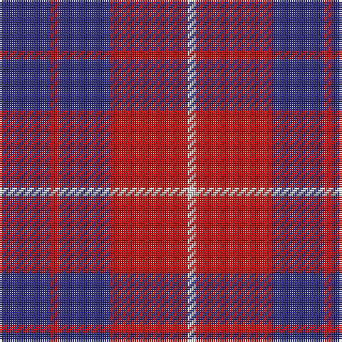

In pattern [BRBRW](/stripes/brbrw/).

This was sourced from house-of-tartan.  It is a [5 stripe tartan](/stripes/stripes5/).

Original link http://www.house-of-tartan.scotland.net/house/TartanViewjs.asp?colr=Def&tnam=477

## Thread count
DB/24 R4 DB24 R36 LN/4

## Palette
Each colour and its ΔE from the base-6 reference it is a variant of.

| Colour | Shade | Base | ΔE (OKLab) |
|---|---|---|---|
| DB | <code style="background-color:#2C2C80;">#2C2C80</code> `#2C2C80` | B <code style="background-color:#2A418A;">#2A418A</code> | 0.06 |
| LN | <code style="background-color:#E0E0E0;">#E0E0E0</code> `#E0E0E0` | W <code style="background-color:#F7F7F7;">#F7F7F7</code> | 0.07 |
| R | <code style="background-color:#C80000;">#C80000</code> `#C80000` | R <code style="background-color:#CC0000;">#CC0000</code> | 0.01 |

# Sample pattern

## Nearest tartans

The nearest existing variants by ΔTartan distance.

1. [Hamilton (Clan)](/setts/s5/db8r2db8r15w2~x4/) — ΔT 0.57
1. [Hamilton, (Red)](/setts/s5/db6r1db6r9w1~x2/) — ΔT 0.60
1. [British European](/setts/s6/r12db2r12db17w2r2~x2/) — ΔT 0.81
1. [British European (Corporate)](/setts/s6/r12db2r12db17w2r2~x4/) — ΔT 0.81
1. [Butler](/setts/s6/db48r18db6r13ly4r14~x2/) — ΔT 0.86
1. [Masai Shuka 25 (Artefact)](/setts/s5/db15w2r20db2r4~x2/) — ΔT 1.10
1. [Hamilton](/setts/s5/db6r1db6r9lb1~x2/) — ΔT 1.14
1. [Hamilton](/setts/s5/db6r1db6r9lr1~x2/) — ΔT 1.14
1. [Matthews (Personal)](/setts/s6/db3r24db3r3db25w3~x2/) — ΔT 1.15
1. [Rajput](/setts/s6/db6r39db10r10db21ly5~x2/) — ΔT 1.19

## Neighbour map

Every grey dot is one of 14299 variants placed by the first two principal components of the ΔTartan feature space (44% of its variance). Red is this tartan; blue dots are its nearest — click one to open its page.

<svg viewBox="0 0 640 380" role="img" style="max-width:100%;height:auto;border:1px solid #e0e0e0;border-radius:4px;display:block" xmlns="http://www.w3.org/2000/svg"><image href="/nn/cloud.v1.png" width="640" height="380"/><a href="/setts/s5/db8r2db8r15w2~x4/"><circle cx="295.5" cy="245.1" r="4" fill="#3465a4"><title>Hamilton (Clan)</title></circle></a><a href="/setts/s5/db6r1db6r9w1~x2/"><circle cx="332.6" cy="250.7" r="4" fill="#3465a4"><title>Hamilton, (Red)</title></circle></a><a href="/setts/s6/r12db2r12db17w2r2~x2/"><circle cx="347.9" cy="235.0" r="4" fill="#3465a4"><title>British European</title></circle></a><a href="/setts/s6/r12db2r12db17w2r2~x4/"><circle cx="347.9" cy="235.0" r="4" fill="#3465a4"><title>British European (Corporate)</title></circle></a><a href="/setts/s6/db48r18db6r13ly4r14~x2/"><circle cx="348.9" cy="213.1" r="4" fill="#3465a4"><title>Butler</title></circle></a><a href="/setts/s5/db15w2r20db2r4~x2/"><circle cx="358.9" cy="218.9" r="4" fill="#3465a4"><title>Masai Shuka 25 (Artefact)</title></circle></a><a href="/setts/s5/db6r1db6r9lb1~x2/"><circle cx="299.4" cy="239.8" r="4" fill="#3465a4"><title>Hamilton</title></circle></a><a href="/setts/s5/db6r1db6r9lr1~x2/"><circle cx="313.1" cy="249.9" r="4" fill="#3465a4"><title>Hamilton</title></circle></a><a href="/setts/s6/db3r24db3r3db25w3~x2/"><circle cx="332.0" cy="211.1" r="4" fill="#3465a4"><title>Matthews (Personal)</title></circle></a><a href="/setts/s6/db6r39db10r10db21ly5~x2/"><circle cx="349.0" cy="247.3" r="4" fill="#3465a4"><title>Rajput</title></circle></a><circle cx="320.8" cy="243.9" r="5" fill="#c00000"/></svg>

ID: /setts/s5/db6r1db6r9w1~x4/
