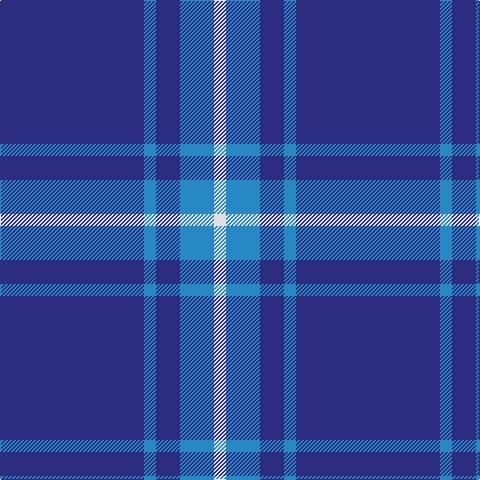

This page is one **sett** — a single exact thread-count. It belongs to the [tartan](/tartans/db72t6db12t17w6/)
(the same proportion at any scale), whose colour order is pattern [BBBBW](/stripes/bbbbw/).

Sourced from tartans-authority.  It is a [5 stripe tartan](/stripes/stripes5/).

Original link http://www.tartansauthority.com/tartan-ferret/display/10325/

## Register references

External register numbers recorded for this tartan.

- Scottish Register of Tartans: [10325](https://www.tartanregister.gov.uk/tartanDetails?ref=10325)
- Scottish Tartans Authority (ITI): 10325

## Thread count
DB/144 B12 DB24 B34 LN/12

## Palette

Palette: <strong>Tartan Register</strong>
<table><thead><tr><th>Colour</th><th>Threads</th><th>Shade</th><th>Base</th><th>OKLCh</th></tr></thead><tbody><tr><td>DB/</td><td style="text-align:right;font-variant-numeric:tabular-nums">144</td><td><code style="background-color:#2C2C80;">#2C2C80</code> <small style="color:#888">#2C2C80</small></td><td>B <code style="background-color:#2A418A;">#2A418A</code></td><td><small style="color:#888">oklch(35.0% 0.138 276.6)</small></td></tr><tr><td>B</td><td style="text-align:right;font-variant-numeric:tabular-nums">12</td><td><code style="background-color:#2888C4;">#2888C4</code> <small style="color:#888">#2888C4</small></td><td>B <code style="background-color:#2A418A;">#2A418A</code></td><td><small style="color:#888">oklch(60.1% 0.125 241.5)</small></td></tr><tr><td>DB</td><td style="text-align:right;font-variant-numeric:tabular-nums">24</td><td><code style="background-color:#2C2C80;">#2C2C80</code> <small style="color:#888">#2C2C80</small></td><td>B <code style="background-color:#2A418A;">#2A418A</code></td><td><small style="color:#888">oklch(35.0% 0.138 276.6)</small></td></tr><tr><td>B</td><td style="text-align:right;font-variant-numeric:tabular-nums">34</td><td><code style="background-color:#2888C4;">#2888C4</code> <small style="color:#888">#2888C4</small></td><td>B <code style="background-color:#2A418A;">#2A418A</code></td><td><small style="color:#888">oklch(60.1% 0.125 241.5)</small></td></tr><tr><td>LN/</td><td style="text-align:right;font-variant-numeric:tabular-nums">12</td><td><code style="background-color:#E0E0E0;">#E0E0E0</code> <small style="color:#888">#E0E0E0</small></td><td>W <code style="background-color:#F7F7F7;">#F7F7F7</code></td><td><small style="color:#888">oklch(90.7% 0.000 89.9)</small></td></tr></tbody></table>

# Sample pattern

## Nearest tartans

The nearest existing variants by ΔTartan distance, with this tartan at the top so the swatches line up against it.

ΔTartan

Tartan

Sett

—

<a href="/ttd/edit/#slug=db72t6db12t17w6~x2">Gulfmark (Corporate)</a> <a class="nn-out" href="/setts/s5/db72t6db12t17w6~x2/" title="open its dictionary page">↗</a>

1.14

<a href="/ttd/edit/#slug=db4w3b6db40b8db12g3~x2">JetBlue (Corporate)</a> <a class="nn-out" href="/setts/s7/db4w3b6db40b8db12g3~x2/" title="open its dictionary page">↗</a>

1.33

<a href="/ttd/edit/#slug=db9k9db9k9db42w5~x2">Dollar Academy (1930s) (Corporate)</a> <a class="nn-out" href="/setts/s6/db9k9db9k9db42w5~x2/" title="open its dictionary page">↗</a>

1.34

<a href="/ttd/edit/#slug=db9k9db9k9db42lb5~x2">Dollar Academy</a> <a class="nn-out" href="/setts/s6/db9k9db9k9db42lb5~x2/" title="open its dictionary page">↗</a>

1.42

<a href="/ttd/edit/#slug=db13b1db3b6ly1b1~x4">Hepburn #2</a> <a class="nn-out" href="/setts/s6/db13b1db3b6ly1b1~x4/" title="open its dictionary page">↗</a>

1.48

<a href="/ttd/edit/#slug=db35w4db10ri3r3ri3~x4">Steffen, Morris (Personal)</a> <a class="nn-out" href="/setts/s6/db35w4db10ri3r3ri3~x4/" title="open its dictionary page">↗</a>

1.49

<a href="/ttd/edit/#slug=dt72b6dt12b17w6~x2">GulfMark</a> <a class="nn-out" href="/setts/s5/dt72b6dt12b17w6~x2/" title="open its dictionary page">↗</a>

1.50

<a href="/ttd/edit/#slug=db40g7ly3g7db15r5~x2">Wheadon (Name)</a> <a class="nn-out" href="/setts/s6/db40g7ly3g7db15r5~x2/" title="open its dictionary page">↗</a>

1.51

<a href="/ttd/edit/#slug=r2k6db33w2~x4">McCallie</a> <a class="nn-out" href="/setts/s4/r2k6db33w2~x4/" title="open its dictionary page">↗</a>

1.66

<a href="/ttd/edit/#slug=db100t10k5t10r8">Waugh (Name)</a> <a class="nn-out" href="/setts/s5/db100t10k5t10r8/" title="open its dictionary page">↗</a>

1.67

<a href="/ttd/edit/#slug=g16db59ly4db59g16dbi9~x2">Oxford University</a> <a class="nn-out" href="/setts/s6/g16db59ly4db59g16dbi9~x2/" title="open its dictionary page">↗</a>

## Neighbour map

Every grey dot is one of 14359 variants placed by the first two principal components of the ΔTartan feature space (44% of its variance). Red is this tartan; blue dots are its nearest — click one to open its page.

<svg viewBox="0 0 640 380" role="img" style="max-width:100%;height:auto;border:1px solid #e0e0e0;border-radius:4px;display:block" xmlns="http://www.w3.org/2000/svg"><image href="/nn/cloud.v1.png" width="640" height="380"/><a href="/setts/s7/db4w3b6db40b8db12g3~x2/"><circle cx="470.9" cy="201.3" r="4" fill="#3465a4"><title>JetBlue (Corporate)</title></circle></a><a href="/setts/s6/db9k9db9k9db42w5~x2/"><circle cx="448.0" cy="250.7" r="4" fill="#3465a4"><title>Dollar Academy (1930s) (Corporate)</title></circle></a><a href="/setts/s6/db9k9db9k9db42lb5~x2/"><circle cx="463.7" cy="258.7" r="4" fill="#3465a4"><title>Dollar Academy</title></circle></a><a href="/setts/s6/db13b1db3b6ly1b1~x4/"><circle cx="424.0" cy="225.3" r="4" fill="#3465a4"><title>Hepburn #2</title></circle></a><a href="/setts/s6/db35w4db10ri3r3ri3~x4/"><circle cx="493.9" cy="197.1" r="4" fill="#3465a4"><title>Steffen, Morris (Personal)</title></circle></a><a href="/setts/s5/dt72b6dt12b17w6~x2/"><circle cx="511.4" cy="237.4" r="4" fill="#3465a4"><title>GulfMark</title></circle></a><a href="/setts/s6/db40g7ly3g7db15r5~x2/"><circle cx="427.3" cy="202.5" r="4" fill="#3465a4"><title>Wheadon (Name)</title></circle></a><a href="/setts/s4/r2k6db33w2~x4/"><circle cx="506.8" cy="205.3" r="4" fill="#3465a4"><title>McCallie</title></circle></a><a href="/setts/s5/db100t10k5t10r8/"><circle cx="511.7" cy="184.1" r="4" fill="#3465a4"><title>Waugh (Name)</title></circle></a><a href="/setts/s6/g16db59ly4db59g16dbi9~x2/"><circle cx="454.3" cy="231.7" r="4" fill="#3465a4"><title>Oxford University</title></circle></a><circle cx="496.1" cy="233.8" r="5" fill="#c00000"/></svg>

ID: /setts/s5/db72t6db12t17w6~x2/
