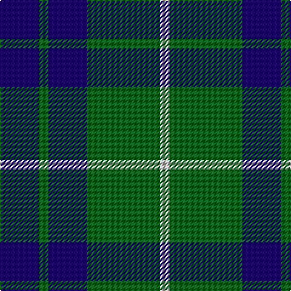

This page is one **sett** — a single exact thread-count. It belongs to the [tartan](/tartans/db8g2db8g15n2/)
(the same proportion at any scale), whose colour order is pattern [BGBGW](/stripes/bgbgw/).

Sourced from register-of-tartans.  It is a [5 stripe tartan](/stripes/stripes5/).

Original link https://www.tartanregister.gov.uk/tartanDetails.aspx?ref=1577

## Also known as

This cloth is also recorded under:

- Hamilton Green Hunting

2 attestations — the source records this cloth was collapsed from (oldest owns this page)

<ul>
<li>01/01/2002 — Hamilton Green Hunting (register-of-tartans, <a href="https://www.tartanregister.gov.uk/tartanDetails.aspx?ref=1577">record</a>)</li>
<li>pre 2002 — Hamilton Green (Hunting) (tartans-authority, <a href="http://www.tartansauthority.com/tartan-ferret/display/139/">record</a>)</li>
</ul>

## Register references

External register numbers recorded for this tartan.

- Scottish Register of Tartans: [1577](https://www.tartanregister.gov.uk/tartanDetails.aspx?ref=1577)
- Scottish Tartans Authority (ITI): 139
- Scottish Tartans World Register: 139

## Thread count
DB/32 G8 DB32 G60 N/8

## Palette
Each colour and the base-6 reference it is a variant of.

| Colour | Shade | Base |
|---|---|---|
| DB | <code style="background-color:#1C0070;">#1C0070</code> `oklch(26.3% 0.162 277.1)` <small>#1C0070</small> | B <code style="background-color:#2A418A;">#2A418A</code> |
| G | <code style="background-color:#006818;">#006818</code> `oklch(45.0% 0.142 145.0)` <small>#006818</small> | G <code style="background-color:#006100;">#006100</code> |
| N | <code style="background-color:#C0C0C0;">#C0C0C0</code> `oklch(80.8% 0.000 89.9)` <small>#C0C0C0</small> | W <code style="background-color:#F7F7F7;">#F7F7F7</code> |

# Sample pattern

## Nearest tartans

The nearest existing variants by ΔTartan distance, with this tartan at the top so the swatches line up against it.

ΔTartan

Tartan

Sett

—

<a href="/ttd/edit/#slug=db8g2db8g15lb2~x4">Hamilton Green Hunting</a> <a class="nn-out" href="/setts/s5/db8g2db8g15lb2~x4/" title="open its dictionary page">↗</a>

1.17

<a href="/ttd/edit/#slug=db2g7db7w1~x2">Unnamed No 78</a> <a class="nn-out" href="/setts/s4/db2g7db7w1~x2/" title="open its dictionary page">↗</a>

1.19

<a href="/ttd/edit/#slug=db11g2db15g18w2~x2">Hamilton, hunting</a> <a class="nn-out" href="/setts/s5/db11g2db15g18w2~x2/" title="open its dictionary page">↗</a>

1.23

<a href="/ttd/edit/#slug=db8r4db24g35lb4g8">Heritage Tartan, The</a> <a class="nn-out" href="/setts/s6/db8r4db24g35lb4g8/" title="open its dictionary page">↗</a>

1.31

<a href="/ttd/edit/#slug=r2g3db2g14db14lr2~x2">Irving of Bonshaw Tower (Personal)</a> <a class="nn-out" href="/setts/s6/r2g3db2g14db14lr2~x2/" title="open its dictionary page">↗</a>

1.34

<a href="/ttd/edit/#slug=db5g2db5g8w1~x8">Hamilton, hunting</a> <a class="nn-out" href="/setts/s5/db5g2db5g8w1~x8/" title="open its dictionary page">↗</a>

1.35

<a href="/ttd/edit/#slug=k12n3k12n18w5~x2">Grampian Television (Corporate)</a> <a class="nn-out" href="/setts/s5/k12n3k12n18w5~x2/" title="open its dictionary page">↗</a>

1.40

<a href="/ttd/edit/#slug=dr5b35k24b9g9dr5~x2">Notre Dame Marching Guard (Corp)</a> <a class="nn-out" href="/setts/s6/dr5b35k24b9g9dr5~x2/" title="open its dictionary page">↗</a>

1.43

<a href="/setts/s8/k12n3k12n18w5~x2/">Grampian Television</a>

1.43

<a href="/ttd/edit/#slug=m4k28b3k3b25k3~x2">Slanj (Corporate)</a> <a class="nn-out" href="/setts/s6/m4k28b3k3b25k3~x2/" title="open its dictionary page">↗</a>

1.46

<a href="/ttd/edit/#slug=b3k1g4k1b4g9k2~x4">Outdoorsmen (Fashion)</a> <a class="nn-out" href="/setts/s7/b3k1g4k1b4g9k2~x4/" title="open its dictionary page">↗</a>

## Neighbour map

Every grey dot is one of 14299 variants placed by the first two principal components of the ΔTartan feature space (44% of its variance). Red is this tartan; blue dots are its nearest — click one to open its page.

<svg viewBox="0 0 640 380" role="img" style="max-width:100%;height:auto;border:1px solid #e0e0e0;border-radius:4px;display:block" xmlns="http://www.w3.org/2000/svg"><image href="/nn/cloud.v1.png" width="640" height="380"/><a href="/setts/s4/db2g7db7w1~x2/"><circle cx="304.3" cy="287.4" r="4" fill="#3465a4"><title>Unnamed No 78</title></circle></a><a href="/setts/s5/db11g2db15g18w2~x2/"><circle cx="328.6" cy="270.2" r="4" fill="#3465a4"><title>Hamilton, hunting</title></circle></a><a href="/setts/s6/db8r4db24g35lb4g8/"><circle cx="284.9" cy="228.3" r="4" fill="#3465a4"><title>Heritage Tartan, The</title></circle></a><a href="/setts/s6/r2g3db2g14db14lr2~x2/"><circle cx="256.3" cy="230.2" r="4" fill="#3465a4"><title>Irving of Bonshaw Tower (Personal)</title></circle></a><a href="/setts/s5/db5g2db5g8w1~x8/"><circle cx="285.4" cy="282.8" r="4" fill="#3465a4"><title>Hamilton, hunting</title></circle></a><a href="/setts/s5/k12n3k12n18w5~x2/"><circle cx="230.0" cy="280.4" r="4" fill="#3465a4"><title>Grampian Television (Corporate)</title></circle></a><a href="/setts/s6/dr5b35k24b9g9dr5~x2/"><circle cx="235.5" cy="234.5" r="4" fill="#3465a4"><title>Notre Dame Marching Guard (Corp)</title></circle></a><a href="/setts/s8/k12n3k12n18w5~x2/"><circle cx="258.1" cy="270.0" r="4" fill="#3465a4"><title>Grampian Television</title></circle></a><a href="/setts/s6/m4k28b3k3b25k3~x2/"><circle cx="323.6" cy="227.2" r="4" fill="#3465a4"><title>Slanj (Corporate)</title></circle></a><a href="/setts/s7/b3k1g4k1b4g9k2~x4/"><circle cx="298.3" cy="245.4" r="4" fill="#3465a4"><title>Outdoorsmen (Fashion)</title></circle></a><circle cx="282.6" cy="271.0" r="5" fill="#c00000"/></svg>

ID: /setts/s5/db8g2db8g15lb2~x4/
