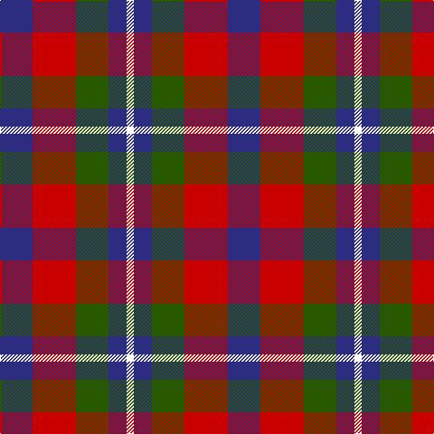

This page is one **sett** — a single exact thread-count. It belongs to the [tartan](/tartans/db9r12dg9db5w2/)
(the same proportion at any scale), whose colour order is pattern [BRGBW](/stripes/brgbw/).

Sourced from tartans-authority.  It is a [5 stripe tartan](/stripes/stripes5/).

Original link http://www.tartansauthority.com/tartan-ferret/display/10841/

## Thread count
DB/36 R48 G36 DB20 W/8

## Palette

Palette: <strong>Tartan Register</strong>
<table><thead><tr><th>Colour</th><th>Threads</th><th>Shade</th><th>Base</th><th>OKLCh</th></tr></thead><tbody><tr><td>DB/</td><td style="text-align:right;font-variant-numeric:tabular-nums">36</td><td><code style="background-color:#2C2C80;">#2C2C80</code> <small style="color:#888">#2C2C80</small></td><td>B <code style="background-color:#2A418A;">#2A418A</code></td><td><small style="color:#888">oklch(35.0% 0.138 276.6)</small></td></tr><tr><td>R</td><td style="text-align:right;font-variant-numeric:tabular-nums">48</td><td><code style="background-color:#C80000;">#C80000</code> <small style="color:#888">#C80000</small></td><td>R <code style="background-color:#CC0000;">#CC0000</code></td><td><small style="color:#888">oklch(52.3% 0.215 29.2)</small></td></tr><tr><td>G</td><td style="text-align:right;font-variant-numeric:tabular-nums">36</td><td><code style="background-color:#285800;">#285800</code> <small style="color:#888">#285800</small></td><td>G <code style="background-color:#006100;">#006100</code></td><td><small style="color:#888">oklch(41.0% 0.122 135.8)</small></td></tr><tr><td>DB</td><td style="text-align:right;font-variant-numeric:tabular-nums">20</td><td><code style="background-color:#2C2C80;">#2C2C80</code> <small style="color:#888">#2C2C80</small></td><td>B <code style="background-color:#2A418A;">#2A418A</code></td><td><small style="color:#888">oklch(35.0% 0.138 276.6)</small></td></tr><tr><td>W/</td><td style="text-align:right;font-variant-numeric:tabular-nums">8</td><td><code style="background-color:#FCFCFC;">#FCFCFC</code> <small style="color:#888">#FCFCFC</small></td><td>W <code style="background-color:#F7F7F7;">#F7F7F7</code></td><td><small style="color:#888">oklch(99.1% 0.000 89.9)</small></td></tr></tbody></table>

# Sample pattern

## Nearest tartans

The nearest existing variants by ΔTartan distance, with this tartan at the top so the swatches line up against it.

ΔTartan

Tartan

Sett

—

<a href="/ttd/edit/#slug=db9r12dg9db5w2~x4">Battle of Prestonpans (1745) Herit</a> <a class="nn-out" href="/setts/s5/db9r12dg9db5w2~x4/" title="open its dictionary page">↗</a>

0.78

<a href="/ttd/edit/#slug=dt6k6dt6r14ly3~x2">Chivas Regal</a> <a class="nn-out" href="/setts/s5/dt6k6dt6r14ly3~x2/" title="open its dictionary page">↗</a>

0.88

<a href="/ttd/edit/#slug=dt2k2dt2r5ly1~x12">Chivas Regal (Corporate)</a> <a class="nn-out" href="/setts/s5/dt2k2dt2r5ly1~x12/" title="open its dictionary page">↗</a>

1.18

<a href="/ttd/edit/#slug=db13k13db13r29ly4~x2">Highland Pub Company</a> <a class="nn-out" href="/setts/s5/db13k13db13r29ly4~x2/" title="open its dictionary page">↗</a>

1.20

<a href="/ttd/edit/#slug=db3r2g5r8db12w3~x2">Edinburgh Bus Company (Corporate)</a> <a class="nn-out" href="/setts/s6/db3r2g5r8db12w3~x2/" title="open its dictionary page">↗</a>

1.22

<a href="/ttd/edit/#slug=r6dg5k5t1~x2">Unidentified No 28</a> <a class="nn-out" href="/setts/s4/r6dg5k5t1~x2/" title="open its dictionary page">↗</a>

1.24

<a href="/ttd/edit/#slug=g21db34r14w6~x2">Harbison (2015)</a> <a class="nn-out" href="/setts/s4/g21db34r14w6~x2/" title="open its dictionary page">↗</a>

1.27

<a href="/ttd/edit/#slug=t1r6db1t3k3t1~x8">MacTavish #2</a> <a class="nn-out" href="/setts/s6/t1r6db1t3k3t1~x8/" title="open its dictionary page">↗</a>

1.29

<a href="/ttd/edit/#slug=dp5k5g5w1~x4">Wilson's No.220</a> <a class="nn-out" href="/setts/s4/dp5k5g5w1~x4/" title="open its dictionary page">↗</a>

1.30

<a href="/ttd/edit/#slug=lo2db4k1db4m4lo4db1~x8">Isle of Gigha (District)</a> <a class="nn-out" href="/setts/s7/lo2db4k1db4m4lo4db1~x8/" title="open its dictionary page">↗</a>

1.34

<a href="/ttd/edit/#slug=dp8k11g9r2~x2">Norwich Collection No. 60</a> <a class="nn-out" href="/setts/s4/dp8k11g9r2~x2/" title="open its dictionary page">↗</a>

## Neighbour map

Every grey dot is one of 14299 variants placed by the first two principal components of the ΔTartan feature space (44% of its variance). Red is this tartan; blue dots are its nearest — click one to open its page.

<svg viewBox="0 0 640 380" role="img" style="max-width:100%;height:auto;border:1px solid #e0e0e0;border-radius:4px;display:block" xmlns="http://www.w3.org/2000/svg"><image href="/nn/cloud.v1.png" width="640" height="380"/><a href="/setts/s5/dt6k6dt6r14ly3~x2/"><circle cx="160.9" cy="268.3" r="4" fill="#3465a4"><title>Chivas Regal</title></circle></a><a href="/setts/s5/dt2k2dt2r5ly1~x12/"><circle cx="176.1" cy="261.3" r="4" fill="#3465a4"><title>Chivas Regal (Corporate)</title></circle></a><a href="/setts/s5/db13k13db13r29ly4~x2/"><circle cx="184.5" cy="248.2" r="4" fill="#3465a4"><title>Highland Pub Company</title></circle></a><a href="/setts/s6/db3r2g5r8db12w3~x2/"><circle cx="182.2" cy="229.9" r="4" fill="#3465a4"><title>Edinburgh Bus Company (Corporate)</title></circle></a><a href="/setts/s4/r6dg5k5t1~x2/"><circle cx="144.5" cy="277.3" r="4" fill="#3465a4"><title>Unidentified No 28</title></circle></a><a href="/setts/s4/g21db34r14w6~x2/"><circle cx="176.1" cy="265.6" r="4" fill="#3465a4"><title>Harbison (2015)</title></circle></a><a href="/setts/s6/t1r6db1t3k3t1~x8/"><circle cx="192.7" cy="234.6" r="4" fill="#3465a4"><title>MacTavish #2</title></circle></a><a href="/setts/s4/dp5k5g5w1~x4/"><circle cx="112.5" cy="291.2" r="4" fill="#3465a4"><title>Wilson's No.220</title></circle></a><a href="/setts/s7/lo2db4k1db4m4lo4db1~x8/"><circle cx="115.5" cy="249.7" r="4" fill="#3465a4"><title>Isle of Gigha (District)</title></circle></a><a href="/setts/s4/dp8k11g9r2~x2/"><circle cx="157.4" cy="296.1" r="4" fill="#3465a4"><title>Norwich Collection No. 60</title></circle></a><circle cx="150.6" cy="262.8" r="5" fill="#c00000"/></svg>

ID: /setts/s5/db9r12dg9db5w2~x4/
