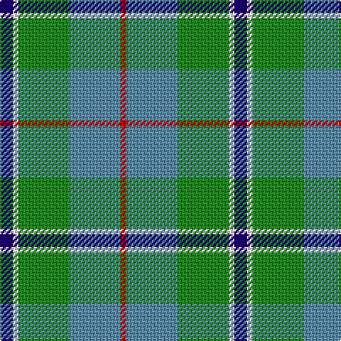

In pattern [BWGBR](/stripes/bwgbr/).

This was sourced from register-of-tartans.  It is a [5 stripe tartan](/stripes/stripes5/).

Original link https://www.tartanregister.gov.uk/tartanDetails.aspx?ref=2081

## Also known as

This cloth is also recorded under:

- Alvis of Lee Personal
- Alvis, of Lee

## Attestations

This cloth appears in 3 source records; the oldest owns this page.

- 01/04/1985 — Alvis of Lee (Personal) (register-of-tartans, [record](https://www.tartanregister.gov.uk/tartanDetails.aspx?ref=2081))
- undated — Alvis, of Lee (weddslist, [record](http://www.weddslist.com/cgi-bin/tartans/pg.pl?source=sts))
- undated — Alvis of Lee Personal Tartan Tartan Number: 643. Earliest known date: 1985 Designed for the Baron of Lee See products available Copyright © Blair Urquhart, Comrie, 2015 (house-of-tartan, [record](http://www.house-of-tartan.scotland.net/house/TartanViewjs.asp?colr=Def&tnam=643))

## Register references

External register numbers recorded for this tartan.

- Scottish Register of Tartans: [2081](https://www.tartanregister.gov.uk/tartanDetails.aspx?ref=2081)
- Scottish Tartans Authority (ITI): 643
- Scottish Tartans World Register: 643

## Thread count
DB/9 LN4 G36 B36 R/4

## Palette
Each colour and the base-6 reference it is a variant of.

| Colour | Shade | Base |
|---|---|---|
| B | <code style="background-color:#5C8CA8;">#5C8CA8</code> `oklch(61.7% 0.067 235.0)` <small>#5C8CA8</small> | B <code style="background-color:#2A418A;">#2A418A</code> |
| DB | <code style="background-color:#1C0070;">#1C0070</code> `oklch(26.3% 0.162 277.1)` <small>#1C0070</small> | B <code style="background-color:#2A418A;">#2A418A</code> |
| G | <code style="background-color:#228B22;">#228B22</code> `oklch(55.8% 0.169 142.9)` <small>#228B22</small> | G <code style="background-color:#006100;">#006100</code> |
| LN | <code style="background-color:#E0E0E0;">#E0E0E0</code> `oklch(90.7% 0.000 89.9)` <small>#E0E0E0</small> | W <code style="background-color:#F7F7F7;">#F7F7F7</code> |
| R | <code style="background-color:#C80000;">#C80000</code> `oklch(52.3% 0.215 29.2)` <small>#C80000</small> | R <code style="background-color:#CC0000;">#CC0000</code> |

# Sample pattern

## Nearest tartans

The nearest existing variants by ΔTartan distance, with this tartan at the top so the swatches line up against it.

ΔTartan

Tartan

Sett

—

<a href="/ttd/edit/#slug=db9w4g36t36r4">Alvis of Lee (Personal)</a> <a class="nn-out" href="/setts/s5/db9w4g36t36r4/" title="open its dictionary page">↗</a>

0.75

<a href="/ttd/edit/#slug=db9w4g36t36r4~x2">Alvis of Lee (Personal)</a> <a class="nn-out" href="/setts/s5/db9w4g36t36r4~x2/" title="open its dictionary page">↗</a>

0.98

<a href="/ttd/edit/#slug=r7ly3g28db28w3~x2">Turnbull, hunting</a> <a class="nn-out" href="/setts/s5/r7ly3g28db28w3~x2/" title="open its dictionary page">↗</a>

1.17

<a href="/ttd/edit/#slug=g11lo10dp11b33w3~x2">Sterling, Rob (Florida) (Personal)</a> <a class="nn-out" href="/setts/s5/g11lo10dp11b33w3~x2/" title="open its dictionary page">↗</a>

1.18

<a href="/ttd/edit/#slug=b30ly3dy11ly3g33r6~x2">Balfour Hunting</a> <a class="nn-out" href="/setts/s6/b30ly3dy11ly3g33r6~x2/" title="open its dictionary page">↗</a>

1.24

<a href="/ttd/edit/#slug=k1t1g8db8w1~x4">Douglas</a> <a class="nn-out" href="/setts/s5/k1t1g8db8w1~x4/" title="open its dictionary page">↗</a>

1.25

<a href="/ttd/edit/#slug=k9lr6n22g28ly2~x2">Wellington (Lochcarron)</a> <a class="nn-out" href="/setts/s5/k9lr6n22g28ly2~x2/" title="open its dictionary page">↗</a>

1.28

<a href="/ttd/edit/#slug=g11lo10dt11b33w3~x2">Sterling (Name)</a> <a class="nn-out" href="/setts/s5/g11lo10dt11b33w3~x2/" title="open its dictionary page">↗</a>

1.36

<a href="/ttd/edit/#slug=lb2k2g8g8r1g1w1~x4">Lundy (Personal)</a> <a class="nn-out" href="/setts/s7/lb2k2g8g8r1g1w1~x4/" title="open its dictionary page">↗</a>

1.37

<a href="/ttd/edit/#slug=t4g16ly2db7t28w4~x2">Allanton (Fashion)</a> <a class="nn-out" href="/setts/s6/t4g16ly2db7t28w4~x2/" title="open its dictionary page">↗</a>

1.39

<a href="/ttd/edit/#slug=k3r1ly1t11g13t5r1ly1~x4">Snodgrass (Clan)</a> <a class="nn-out" href="/setts/s8/k3r1ly1t11g13t5r1ly1~x4/" title="open its dictionary page">↗</a>

## Neighbour map

Every grey dot is one of 14299 variants placed by the first two principal components of the ΔTartan feature space (44% of its variance). Red is this tartan; blue dots are its nearest — click one to open its page.

<svg viewBox="0 0 640 380" role="img" style="max-width:100%;height:auto;border:1px solid #e0e0e0;border-radius:4px;display:block" xmlns="http://www.w3.org/2000/svg"><image href="/nn/cloud.v1.png" width="640" height="380"/><a href="/setts/s5/db9w4g36t36r4~x2/"><circle cx="221.4" cy="220.1" r="4" fill="#3465a4"><title>Alvis of Lee (Personal)</title></circle></a><a href="/setts/s5/r7ly3g28db28w3~x2/"><circle cx="207.2" cy="208.8" r="4" fill="#3465a4"><title>Turnbull, hunting</title></circle></a><a href="/setts/s5/g11lo10dp11b33w3~x2/"><circle cx="229.5" cy="213.6" r="4" fill="#3465a4"><title>Sterling, Rob (Florida) (Personal)</title></circle></a><a href="/setts/s6/b30ly3dy11ly3g33r6~x2/"><circle cx="216.9" cy="209.0" r="4" fill="#3465a4"><title>Balfour Hunting</title></circle></a><a href="/setts/s5/k1t1g8db8w1~x4/"><circle cx="210.4" cy="211.7" r="4" fill="#3465a4"><title>Douglas</title></circle></a><a href="/setts/s5/k9lr6n22g28ly2~x2/"><circle cx="230.5" cy="221.1" r="4" fill="#3465a4"><title>Wellington (Lochcarron)</title></circle></a><a href="/setts/s5/g11lo10dt11b33w3~x2/"><circle cx="229.0" cy="218.8" r="4" fill="#3465a4"><title>Sterling (Name)</title></circle></a><a href="/setts/s7/lb2k2g8g8r1g1w1~x4/"><circle cx="157.9" cy="181.2" r="4" fill="#3465a4"><title>Lundy (Personal)</title></circle></a><a href="/setts/s6/t4g16ly2db7t28w4~x2/"><circle cx="281.5" cy="189.8" r="4" fill="#3465a4"><title>Allanton (Fashion)</title></circle></a><a href="/setts/s8/k3r1ly1t11g13t5r1ly1~x4/"><circle cx="226.4" cy="163.2" r="4" fill="#3465a4"><title>Snodgrass (Clan)</title></circle></a><circle cx="213.7" cy="215.9" r="5" fill="#c00000"/></svg>

ID: /setts/s5/db9w4g36t36r4/
