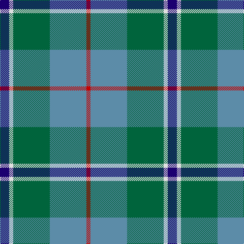

In pattern [BWGBR](/stripes/bwgbr/).

This was sourced from tartans-authority.  It is a [5 stripe tartan](/stripes/stripes5/).

Original link http://www.tartansauthority.com/tartan-ferret/display/643/

## Also known as

This cloth is also recorded under:

- Alvis of Lee Personal
- Alvis, of Lee

## Thread count
DB/18 LN8 G72 B72 R/8

## Palette
Each colour and its ΔE from the base-6 reference it is a variant of.

| Colour | Shade | Base | ΔE (OKLab) |
|---|---|---|---|
| B | <code style="background-color:#5C8CA8;">#5C8CA8</code> `#5C8CA8` | B <code style="background-color:#2A418A;">#2A418A</code> | 0.23 |
| DB | <code style="background-color:#1C0070;">#1C0070</code> `#1C0070` | B <code style="background-color:#2A418A;">#2A418A</code> | 0.14 |
| G | <code style="background-color:#00643C;">#00643C</code> `#00643C` | G <code style="background-color:#006100;">#006100</code> | 0.05 |
| LN | <code style="background-color:#E0E0E0;">#E0E0E0</code> `#E0E0E0` | W <code style="background-color:#F7F7F7;">#F7F7F7</code> | 0.07 |
| R | <code style="background-color:#C80000;">#C80000</code> `#C80000` | R <code style="background-color:#CC0000;">#CC0000</code> | 0.01 |

# Sample pattern

## Nearest tartans

The nearest existing variants by ΔTartan distance.

1. [Alvis of Lee (Personal)](/setts/s5/db9w4g36t36r4/) — ΔT 0.75
1. [Turnbull Hunting](/setts/s5/r7ly3dg28db28w3~x2/) — ΔT 0.92
1. [Sterling (Name)](/setts/s5/g11lo10dt11b33w3~x2/) — ΔT 0.93
1. [MacThomas](/setts/s7/g5m3g32k16b32m3b5~x2/) — ΔT 0.96
1. [Sterling, Rob (Florida) (Personal)](/setts/s5/g11lo10dp11b33w3~x2/) — ΔT 0.97
1. [Turnbull, hunting](/setts/s5/r7ly3g28db28w3~x2/) — ΔT 1.02
1. [DeLoughery (Personal)](/setts/s6/db20k6lo4db3g20w2~x2/) — ΔT 1.04
1. [Ednie (Personal)](/setts/s7/b11k4g4m1g4k1r1~x4/) — ΔT 1.10
1. [Douglas Clan Tartan Tartan Number: 1032. Earliest known date: 1831 Wilson's sent a list of tartans to Logan about 1830 stating that 'No 148' had been sold as Douglas for a 'considerable' time. Logan included the Douglas tartan even though he said that no family tartans appeared in his book. The distinction between clans and families is obscure. There are many historic references to the 'Border Clans' which would certainly describe the Douglas'. There is also a black and grey sett for the clan which first appeared in the Vestiarium Scoticum in 1842. The present chiefship is vacant on account of the compound surnames of the eligible claimants. Lord Lyon will not recognise 'double barrel' names. See products available Copyright © Blair Urquhart, Comrie, 2015](/setts/s5/k3db3g23db21w2~x2/) — ΔT 1.15
1. [Wellington (Lochcarron)](/setts/s5/k9lr6n22g28ly2~x2/) — ΔT 1.16

## Neighbour map

Every grey dot is one of 14299 variants placed by the first two principal components of the ΔTartan feature space (44% of its variance). Red is this tartan; blue dots are its nearest — click one to open its page.

<svg viewBox="0 0 640 380" role="img" style="max-width:100%;height:auto;border:1px solid #e0e0e0;border-radius:4px;display:block" xmlns="http://www.w3.org/2000/svg"><image href="/nn/cloud.v1.png" width="640" height="380"/><a href="/setts/s5/db9w4g36t36r4/"><circle cx="213.7" cy="215.9" r="4" fill="#3465a4"><title>Alvis of Lee (Personal)</title></circle></a><a href="/setts/s5/r7ly3dg28db28w3~x2/"><circle cx="224.8" cy="218.4" r="4" fill="#3465a4"><title>Turnbull Hunting</title></circle></a><a href="/setts/s5/g11lo10dt11b33w3~x2/"><circle cx="229.0" cy="218.8" r="4" fill="#3465a4"><title>Sterling (Name)</title></circle></a><a href="/setts/s7/g5m3g32k16b32m3b5~x2/"><circle cx="212.2" cy="198.7" r="4" fill="#3465a4"><title>MacThomas</title></circle></a><a href="/setts/s5/g11lo10dp11b33w3~x2/"><circle cx="229.5" cy="213.6" r="4" fill="#3465a4"><title>Sterling, Rob (Florida) (Personal)</title></circle></a><a href="/setts/s5/r7ly3g28db28w3~x2/"><circle cx="207.2" cy="208.8" r="4" fill="#3465a4"><title>Turnbull, hunting</title></circle></a><a href="/setts/s6/db20k6lo4db3g20w2~x2/"><circle cx="206.8" cy="203.1" r="4" fill="#3465a4"><title>DeLoughery (Personal)</title></circle></a><a href="/setts/s7/b11k4g4m1g4k1r1~x4/"><circle cx="213.1" cy="194.5" r="4" fill="#3465a4"><title>Ednie (Personal)</title></circle></a><a href="/setts/s5/k3db3g23db21w2~x2/"><circle cx="258.6" cy="212.6" r="4" fill="#3465a4"><title>Douglas Clan Tartan Tartan Number: 1032. Earliest known date: 1831 Wilson's sent a list of tartans to Logan about 1830 stating that 'No 148' had been sold as Douglas for a 'considerable' time. Logan included the Douglas tartan even though he said that no family tartans appeared in his book. The distinction between clans and families is obscure. There are many historic references to the 'Border Clans' which would certainly describe the Douglas'. There is also a black and grey sett for the clan which first appeared in the Vestiarium Scoticum in 1842. The present chiefship is vacant on account of the compound surnames of the eligible claimants. Lord Lyon will not recognise 'double barrel' names. See products available Copyright © Blair Urquhart, Comrie, 2015</title></circle></a><a href="/setts/s5/k9lr6n22g28ly2~x2/"><circle cx="230.5" cy="221.1" r="4" fill="#3465a4"><title>Wellington (Lochcarron)</title></circle></a><circle cx="221.4" cy="220.1" r="5" fill="#c00000"/></svg>

ID: /setts/s5/db9w4g36t36r4~x2/
