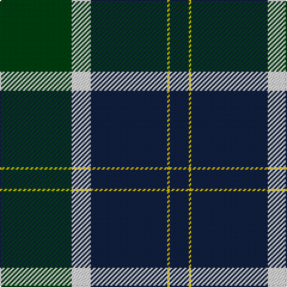

In pattern [BYBWG](/stripes/bybwg/).

This was sourced from weddslist.  It is a [5 stripe tartan](/stripes/stripes5/).

Original link http://www.weddslist.com/cgi-bin/tartans/pg.pl?source=sts

## Thread count
DG/60 LN16 DB64 Y2 DB/16

## Palette
Each colour and the base-6 reference it is a variant of.

| Colour | Shade | Base |
|---|---|---|
| DB | <code style="background-color:#102040;">#102040</code> `oklch(24.9% 0.065 262.6)` <small>#102040</small> | B <code style="background-color:#2A418A;">#2A418A</code> |
| DG | <code style="background-color:#004010;">#004010</code> `oklch(32.3% 0.098 146.3)` <small>#004010</small> | G <code style="background-color:#006100;">#006100</code> |
| LN | <code style="background-color:#E0E0E0;">#E0E0E0</code> `oklch(90.7% 0.000 89.9)` <small>#E0E0E0</small> | W <code style="background-color:#F7F7F7;">#F7F7F7</code> |
| Y | <code style="background-color:#F0C000;">#F0C000</code> `oklch(82.7% 0.169 90.5)` <small>#F0C000</small> | Y <code style="background-color:#F2BF00;">#F2BF00</code> |

# Sample pattern

## Nearest tartans

The nearest existing variants by ΔTartan distance, with this tartan at the top so the swatches line up against it.

ΔTartan

Tartan

Sett

—

<a href="/ttd/edit/#slug=dg30w8dt32ly1dt8~x2">Boroughmuir</a> <a class="nn-out" href="/setts/s5/dg30w8dt32ly1dt8~x2/" title="open its dictionary page">↗</a>

1.06

<a href="/ttd/edit/#slug=k41lg16dg14w2~x2">Hamworthy Association</a> <a class="nn-out" href="/setts/s4/k41lg16dg14w2~x2/" title="open its dictionary page">↗</a>

1.15

<a href="/ttd/edit/#slug=r4g40k21lo2k21g2~x2">Unidentified Furnishing #2</a> <a class="nn-out" href="/setts/s6/r4g40k21lo2k21g2~x2/" title="open its dictionary page">↗</a>

1.18

<a href="/ttd/edit/#slug=g30w8db32ly1db8~x2">Wimbledon</a> <a class="nn-out" href="/setts/s5/g30w8db32ly1db8~x2/" title="open its dictionary page">↗</a>

1.24

<a href="/ttd/edit/#slug=db72k21g16t3g17t3~x2">MacRobart</a> <a class="nn-out" href="/setts/s6/db72k21g16t3g17t3~x2/" title="open its dictionary page">↗</a>

1.32

<a href="/ttd/edit/#slug=r3k1b27k27w3~x2">Bro-Spirit of Northmen (Corporate)</a> <a class="nn-out" href="/setts/s5/r3k1b27k27w3~x2/" title="open its dictionary page">↗</a>

1.41

<a href="/ttd/edit/#slug=r2db32g14db5g16w2~x2">Connacht Irish District Tartan Tartan Number: 4485. Earliest known date: 1994 Phil Smith obtained in Perthshire from a swatch dated 1994 shown to him by Keith Lumsden of the Scottish Tartans Society. However www.uniq-orn.com shows this as Connaught Green. See products available Copyright © Blair Urquhart, Comrie, 2015</a> <a class="nn-out" href="/setts/s6/r2db32g14db5g16w2~x2/" title="open its dictionary page">↗</a>

1.41

<a href="/ttd/edit/#slug=db16k6g8ly1~x2">Sinclair, Sir John</a> <a class="nn-out" href="/setts/s4/db16k6g8ly1~x2/" title="open its dictionary page">↗</a>

1.44

<a href="/ttd/edit/#slug=dt22k16ly4k11dp2n1~x4">Martinez, Clément (Personal)</a> <a class="nn-out" href="/setts/s6/dt22k16ly4k11dp2n1~x4/" title="open its dictionary page">↗</a>

1.47

<a href="/ttd/edit/#slug=db48w2k20g22r3g4~x2">MacFadzean</a> <a class="nn-out" href="/setts/s6/db48w2k20g22r3g4~x2/" title="open its dictionary page">↗</a>

1.51

<a href="/ttd/edit/#slug=db4k4db24dg32lb1dg2~x2">Oliphant</a> <a class="nn-out" href="/setts/s6/db4k4db24dg32lb1dg2~x2/" title="open its dictionary page">↗</a>

## Neighbour map

Every grey dot is one of 14299 variants placed by the first two principal components of the ΔTartan feature space (44% of its variance). Red is this tartan; blue dots are its nearest — click one to open its page.

<svg viewBox="0 0 640 380" role="img" style="max-width:100%;height:auto;border:1px solid #e0e0e0;border-radius:4px;display:block" xmlns="http://www.w3.org/2000/svg"><image href="/nn/cloud.v1.png" width="640" height="380"/><a href="/setts/s4/k41lg16dg14w2~x2/"><circle cx="312.6" cy="213.7" r="4" fill="#3465a4"><title>Hamworthy Association</title></circle></a><a href="/setts/s6/r4g40k21lo2k21g2~x2/"><circle cx="298.8" cy="185.1" r="4" fill="#3465a4"><title>Unidentified Furnishing #2</title></circle></a><a href="/setts/s5/g30w8db32ly1db8~x2/"><circle cx="305.4" cy="180.3" r="4" fill="#3465a4"><title>Wimbledon</title></circle></a><a href="/setts/s6/db72k21g16t3g17t3~x2/"><circle cx="327.8" cy="172.8" r="4" fill="#3465a4"><title>MacRobart</title></circle></a><a href="/setts/s5/r3k1b27k27w3~x2/"><circle cx="303.9" cy="173.9" r="4" fill="#3465a4"><title>Bro-Spirit of Northmen (Corporate)</title></circle></a><a href="/setts/s6/r2db32g14db5g16w2~x2/"><circle cx="323.6" cy="202.1" r="4" fill="#3465a4"><title>Connacht Irish District Tartan Tartan Number: 4485. Earliest known date: 1994 Phil Smith obtained in Perthshire from a swatch dated 1994 shown to him by Keith Lumsden of the Scottish Tartans Society. However www.uniq-orn.com shows this as Connaught Green. See products available Copyright © Blair Urquhart, Comrie, 2015</title></circle></a><a href="/setts/s4/db16k6g8ly1~x2/"><circle cx="265.8" cy="226.7" r="4" fill="#3465a4"><title>Sinclair, Sir John</title></circle></a><a href="/setts/s6/dt22k16ly4k11dp2n1~x4/"><circle cx="296.5" cy="188.9" r="4" fill="#3465a4"><title>Martinez, Clément (Personal)</title></circle></a><a href="/setts/s6/db48w2k20g22r3g4~x2/"><circle cx="259.6" cy="154.7" r="4" fill="#3465a4"><title>MacFadzean</title></circle></a><a href="/setts/s6/db4k4db24dg32lb1dg2~x2/"><circle cx="373.5" cy="183.3" r="4" fill="#3465a4"><title>Oliphant</title></circle></a><circle cx="322.7" cy="193.2" r="5" fill="#c00000"/></svg>

ID: /setts/s5/dg30w8dt32ly1dt8~x2/
