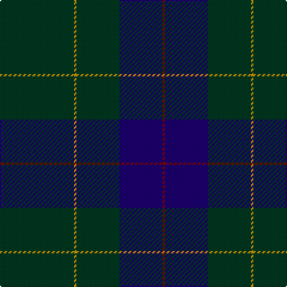

**Bands:** [GYGBR](/stripes/gygbr/) · **Stripes:** [DG LO DG DB R](/stripes/stripes5/) DG LO DG DB R

This was sourced from register-of-tartans.  It is a [5 band tartan](/bands/bands5/).

Original link https://www.tartanregister.gov.uk/tartanDetails.aspx?ref=2962

## Attestations

This cloth appears in 2 source records; the oldest owns this page.

- 01/01/1996 — Miramichi (register-of-tartans, [record](https://www.tartanregister.gov.uk/tartanDetails.aspx?ref=2962))
- 1996 — Miramichi (P&D) (tartans-authority, [record](http://www.tartansauthority.com/tartan-ferret/display/5678/))

## Register references

External register numbers recorded for this tartan.

- Scottish Register of Tartans: [2962](https://www.tartanregister.gov.uk/tartanDetails.aspx?ref=2962)
- Scottish Tartans Authority (ITI): 5678

## Thread count
DG/62 DY2 DG36 DB36 DR/2

## Palette
Each colour and its ΔE from the base-6 reference it is a variant of.

| Colour | Shade | Base | ΔE (OKLab) |
|---|---|---|---|
| DB | <code style="background-color:#1C0070;">#1C0070</code> `#1C0070` | B <code style="background-color:#2A418A;">#2A418A</code> | 0.14 |
| DG | <code style="background-color:#003820;">#003820</code> `#003820` | G <code style="background-color:#006100;">#006100</code> | 0.15 |
| DR | <code style="background-color:#880000;">#880000</code> `#880000` | R <code style="background-color:#CC0000;">#CC0000</code> | 0.15 |
| DY | <code style="background-color:#D09800;">#D09800</code> `#D09800` | Y <code style="background-color:#F2BF00;">#F2BF00</code> | 0.12 |

# Sample pattern

## Nearest tartans

The nearest existing variants by ΔTartan distance.

1. [Lloyd (Welsh Name)](/setts/s5/dt40o2dt20g19db2/) — ΔT 1.31
1. [Burnetts & Struth](/setts/s5/dt68t7dt16k16lo4~x2/) — ΔT 1.39
1. [Kalkofen (Name)](/setts/s6/k40dg15k10r2k10lo2~x2/) — ΔT 1.56
1. [Burnett's & Struth (Corporate)](/setts/s5/dt68b7dt16k16lo4~x2/) — ΔT 1.62
1. [Unidentified #44](/setts/s7/db13k3db20dy70db20dy30w3~x2/) — ΔT 1.83
1. [Langhein Family Tartan Tartan Number: 3235. Earliest known date: April 2002 Based on Black Watch Sett See products available Copyright © Blair Urquhart, Comrie, 2015](/setts/s7/k40dg15k10r2k10ly2k10~x2/) — ΔT 1.87
1. [London Scottish Rugby Club](/setts/s6/r5dt40w1dt13g8k4~x2/) — ΔT 1.95
1. [Meaux (Personal)](/setts/s4/dt62r24lo5dg3~x2/) — ΔT 2.01
1. [Williams (New York) (Personal)](/setts/s5/k30dt6k6dt41t2~x2/) — ΔT 2.02
1. [Kalkofen](/setts/s10/k40dg15k10r2k10lo2k10r2k10dg15~x2/) — ΔT 2.06

## Neighbour map

Every grey dot is one of 14313 variants placed by the first two principal components of the ΔTartan feature space (44% of its variance). Red is this tartan; blue dots are its nearest — click one to open its page.

<svg viewBox="0 0 640 380" role="img" style="max-width:100%;height:auto;border:1px solid #e0e0e0;border-radius:4px;display:block" xmlns="http://www.w3.org/2000/svg"><image href="/nn/cloud.v1.png" width="640" height="380"/><a href="/setts/s5/dt40o2dt20g19db2/"><circle cx="542.7" cy="267.6" r="4" fill="#3465a4"><title>Lloyd (Welsh Name)</title></circle></a><a href="/setts/s5/dt68t7dt16k16lo4~x2/"><circle cx="551.3" cy="244.9" r="4" fill="#3465a4"><title>Burnetts &amp; Struth</title></circle></a><a href="/setts/s6/k40dg15k10r2k10lo2~x2/"><circle cx="566.4" cy="243.3" r="4" fill="#3465a4"><title>Kalkofen (Name)</title></circle></a><a href="/setts/s5/dt68b7dt16k16lo4~x2/"><circle cx="548.2" cy="240.7" r="4" fill="#3465a4"><title>Burnett's &amp; Struth (Corporate)</title></circle></a><a href="/setts/s7/db13k3db20dy70db20dy30w3~x2/"><circle cx="482.0" cy="221.1" r="4" fill="#3465a4"><title>Unidentified #44</title></circle></a><a href="/setts/s7/k40dg15k10r2k10ly2k10~x2/"><circle cx="568.7" cy="233.4" r="4" fill="#3465a4"><title>Langhein Family Tartan Tartan Number: 3235. Earliest known date: April 2002 Based on Black Watch Sett See products available Copyright © Blair Urquhart, Comrie, 2015</title></circle></a><a href="/setts/s6/r5dt40w1dt13g8k4~x2/"><circle cx="524.9" cy="170.6" r="4" fill="#3465a4"><title>London Scottish Rugby Club</title></circle></a><a href="/setts/s4/dt62r24lo5dg3~x2/"><circle cx="471.7" cy="226.2" r="4" fill="#3465a4"><title>Meaux (Personal)</title></circle></a><a href="/setts/s5/k30dt6k6dt41t2~x2/"><circle cx="474.0" cy="270.6" r="4" fill="#3465a4"><title>Williams (New York) (Personal)</title></circle></a><a href="/setts/s10/k40dg15k10r2k10lo2k10r2k10dg15~x2/"><circle cx="511.1" cy="230.3" r="4" fill="#3465a4"><title>Kalkofen</title></circle></a><circle cx="537.5" cy="245.0" r="5" fill="#c00000"/></svg>

ID: /setts/s5/dg31lo1dg18db18r1~x2/
