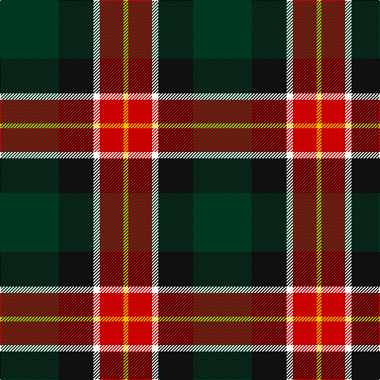

This page is one **sett** — a single exact thread-count. It belongs to the [tartan](/tartans/dg37k22w4r15ly3/)
(the same proportion at any scale), whose colour order is pattern [GKWRY](/stripes/gkwry/).

Sourced from tartans-authority.  It is a [5 stripe tartan](/stripes/stripes5/).

Original link http://www.tartansauthority.com/tartan-ferret/display/11255/

## Register references

External register numbers recorded for this tartan.

- Scottish Register of Tartans: [11255](https://www.tartanregister.gov.uk/tartanDetails?ref=11255)
- Scottish Tartans Authority (ITI): 11255

## Thread count
DG/74 K44 W8 R30 Y/6

## Palette

Palette: <strong>Tartan Register</strong>
<table><thead><tr><th>Colour</th><th>Threads</th><th>Shade</th><th>Base</th><th>OKLCh</th></tr></thead><tbody><tr><td>DG/</td><td style="text-align:right;font-variant-numeric:tabular-nums">74</td><td><code style="background-color:#003820;">#003820</code> <small style="color:#888">#003820</small></td><td>G <code style="background-color:#006100;">#006100</code></td><td><small style="color:#888">oklch(30.0% 0.070 158.3)</small></td></tr><tr><td>K</td><td style="text-align:right;font-variant-numeric:tabular-nums">44</td><td><code style="background-color:#101010;">#101010</code> <small style="color:#888">#101010</small></td><td>K <code style="background-color:#000000;">#000000</code></td><td><small style="color:#888">oklch(17.3% 0.000 89.9)</small></td></tr><tr><td>W</td><td style="text-align:right;font-variant-numeric:tabular-nums">8</td><td><code style="background-color:#FCFCFC;">#FCFCFC</code> <small style="color:#888">#FCFCFC</small></td><td>W <code style="background-color:#F7F7F7;">#F7F7F7</code></td><td><small style="color:#888">oklch(99.1% 0.000 89.9)</small></td></tr><tr><td>R</td><td style="text-align:right;font-variant-numeric:tabular-nums">30</td><td><code style="background-color:#C80000;">#C80000</code> <small style="color:#888">#C80000</small></td><td>R <code style="background-color:#CC0000;">#CC0000</code></td><td><small style="color:#888">oklch(52.3% 0.215 29.2)</small></td></tr><tr><td>Y/</td><td style="text-align:right;font-variant-numeric:tabular-nums">6</td><td><code style="background-color:#E8C000;">#E8C000</code> <small style="color:#888">#E8C000</small></td><td>Y <code style="background-color:#F2BF00;">#F2BF00</code></td><td><small style="color:#888">oklch(81.9% 0.168 93.7)</small></td></tr></tbody></table>

# Sample pattern

## Nearest tartans

The nearest existing variants by ΔTartan distance, with this tartan at the top so the swatches line up against it.

ΔTartan

Tartan

Sett

—

<a href="/ttd/edit/#slug=dg37k22w4r15ly3~x2">Oakley (2015)</a> <a class="nn-out" href="/setts/s5/dg37k22w4r15ly3~x2/" title="open its dictionary page">↗</a>

0.37

<a href="/ttd/edit/#slug=dg37k22w4r15lo3~x2">Oakley (2015)</a> <a class="nn-out" href="/setts/s5/dg37k22w4r15lo3~x2/" title="open its dictionary page">↗</a>

1.08

<a href="/ttd/edit/#slug=w15k8m25k72g98ly15">Afternoon Tea / Afternoon Tea</a> <a class="nn-out" href="/setts/s6/w15k8m25k72g98ly15/" title="open its dictionary page">↗</a>

1.11

<a href="/ttd/edit/#slug=w6dy36k48r4k5ly6">Drambuie Dress</a> <a class="nn-out" href="/setts/s6/w6dy36k48r4k5ly6/" title="open its dictionary page">↗</a>

1.12

<a href="/ttd/edit/#slug=r5dg18ly2k14t5k4~x2">Unidentified No 79</a> <a class="nn-out" href="/setts/s6/r5dg18ly2k14t5k4~x2/" title="open its dictionary page">↗</a>

1.16

<a href="/ttd/edit/#slug=k3lo18dg6r17k31dg3~x2">MacMillan - 2002 (Black - Unofficial</a> <a class="nn-out" href="/setts/s6/k3lo18dg6r17k31dg3~x2/" title="open its dictionary page">↗</a>

1.18

<a href="/ttd/edit/#slug=w3k25do9dp17ly3~x2">Teylu Coleman (Cornwall)</a> <a class="nn-out" href="/setts/s5/w3k25do9dp17ly3~x2/" title="open its dictionary page">↗</a>

1.20

<a href="/ttd/edit/#slug=dy30ly5t10k10w2k2~x2">Bryan Wedding (Personal)</a> <a class="nn-out" href="/setts/s6/dy30ly5t10k10w2k2~x2/" title="open its dictionary page">↗</a>

1.23

<a href="/ttd/edit/#slug=w15dg98dt72r25dt8ly15">Afternoon Tea / Darjeeling</a> <a class="nn-out" href="/setts/s6/w15dg98dt72r25dt8ly15/" title="open its dictionary page">↗</a>

1.26

<a href="/ttd/edit/#slug=dy30ly5b10k10w2k2~x2">Bryan Wedding (Personal)</a> <a class="nn-out" href="/setts/s6/dy30ly5b10k10w2k2~x2/" title="open its dictionary page">↗</a>

1.26

<a href="/ttd/edit/#slug=k17dg48ly4r10lb12dg4">Asheville Firefighters, The</a> <a class="nn-out" href="/setts/s6/k17dg48ly4r10lb12dg4/" title="open its dictionary page">↗</a>

## Neighbour map

Every grey dot is one of 14359 variants placed by the first two principal components of the ΔTartan feature space (44% of its variance). Red is this tartan; blue dots are its nearest — click one to open its page.

<svg viewBox="0 0 640 380" role="img" style="max-width:100%;height:auto;border:1px solid #e0e0e0;border-radius:4px;display:block" xmlns="http://www.w3.org/2000/svg"><image href="/nn/cloud.v1.png" width="640" height="380"/><a href="/setts/s5/dg37k22w4r15lo3~x2/"><circle cx="220.4" cy="201.2" r="4" fill="#3465a4"><title>Oakley (2015)</title></circle></a><a href="/setts/s6/w15k8m25k72g98ly15/"><circle cx="201.0" cy="181.5" r="4" fill="#3465a4"><title>Afternoon Tea / Afternoon Tea</title></circle></a><a href="/setts/s6/w6dy36k48r4k5ly6/"><circle cx="266.3" cy="174.6" r="4" fill="#3465a4"><title>Drambuie Dress</title></circle></a><a href="/setts/s6/r5dg18ly2k14t5k4~x2/"><circle cx="170.8" cy="214.0" r="4" fill="#3465a4"><title>Unidentified No 79</title></circle></a><a href="/setts/s6/k3lo18dg6r17k31dg3~x2/"><circle cx="217.6" cy="211.7" r="4" fill="#3465a4"><title>MacMillan - 2002 (Black - Unofficial</title></circle></a><a href="/setts/s5/w3k25do9dp17ly3~x2/"><circle cx="198.2" cy="223.0" r="4" fill="#3465a4"><title>Teylu Coleman (Cornwall)</title></circle></a><a href="/setts/s6/dy30ly5t10k10w2k2~x2/"><circle cx="251.9" cy="162.2" r="4" fill="#3465a4"><title>Bryan Wedding (Personal)</title></circle></a><a href="/setts/s6/w15dg98dt72r25dt8ly15/"><circle cx="205.8" cy="188.5" r="4" fill="#3465a4"><title>Afternoon Tea / Darjeeling</title></circle></a><a href="/setts/s6/dy30ly5b10k10w2k2~x2/"><circle cx="267.3" cy="172.6" r="4" fill="#3465a4"><title>Bryan Wedding (Personal)</title></circle></a><a href="/setts/s6/k17dg48ly4r10lb12dg4/"><circle cx="261.5" cy="178.8" r="4" fill="#3465a4"><title>Asheville Firefighters, The</title></circle></a><circle cx="213.1" cy="198.1" r="5" fill="#c00000"/></svg>

ID: /setts/s5/dg37k22w4r15ly3~x2/
