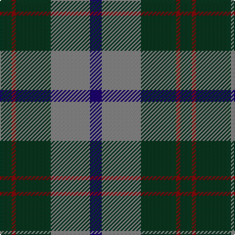

In pattern [BRGRG](/stripes/brgrg/).

This was sourced from register-of-tartans.  It is a [5 stripe tartan](/stripes/stripes5/).

Original link https://www.tartanregister.gov.uk/tartanDetails.aspx?ref=4988

## Register references

External register numbers recorded for this tartan.

- Scottish Register of Tartans: [4988](https://www.tartanregister.gov.uk/tartanDetails.aspx?ref=4988)
- Scottish Tartans Authority (ITI): 3263

## Thread count
DG/12 DR4 DG36 N40 DB/12

## Palette
Each colour and the base-6 reference it is a variant of.

| Colour | Shade | Base |
|---|---|---|
| DB | <code style="background-color:#1C0070;">#1C0070</code> `oklch(26.3% 0.162 277.1)` <small>#1C0070</small> | B <code style="background-color:#2A418A;">#2A418A</code> |
| DG | <code style="background-color:#003820;">#003820</code> `oklch(30.0% 0.070 158.3)` <small>#003820</small> | G <code style="background-color:#006100;">#006100</code> |
| DR | <code style="background-color:#880000;">#880000</code> `oklch(39.4% 0.162 29.2)` <small>#880000</small> | R <code style="background-color:#CC0000;">#CC0000</code> |
| N | <code style="background-color:#888888;">#888888</code> `oklch(62.7% 0.000 89.9)` <small>#888888</small> | R <code style="background-color:#CC0000;">#CC0000</code> |

# Sample pattern

## Nearest tartans

The nearest existing variants by ΔTartan distance, with this tartan at the top so the swatches line up against it.

ΔTartan

Tartan

Sett

—

<a href="/ttd/edit/#slug=dg3r1dg9o10db3~x4">Bethlehem, City of</a> <a class="nn-out" href="/setts/s5/dg3r1dg9o10db3~x4/" title="open its dictionary page">↗</a>

0.82

<a href="/ttd/edit/#slug=dg15r3dp11lb2">MacNab WI2</a> <a class="nn-out" href="/setts/s4/dg15r3dp11lb2/" title="open its dictionary page">↗</a>

0.85

<a href="/ttd/edit/#slug=g3db1g8db7k3ly1~x2">Trafalgar (Fashion)</a> <a class="nn-out" href="/setts/s6/g3db1g8db7k3ly1~x2/" title="open its dictionary page">↗</a>

1.02

<a href="/ttd/edit/#slug=k2dg9t1k6b4dg2~x2">Unidentified #28</a> <a class="nn-out" href="/setts/s6/k2dg9t1k6b4dg2~x2/" title="open its dictionary page">↗</a>

1.05

<a href="/ttd/edit/#slug=r2g23db11db22r2~x2">Skibo</a> <a class="nn-out" href="/setts/s5/r2g23db11db22r2~x2/" title="open its dictionary page">↗</a>

1.08

<a href="/ttd/edit/#slug=g40k15b10k10ly3~x2">U.S. Border Patrol (Corporate)</a> <a class="nn-out" href="/setts/s5/g40k15b10k10ly3~x2/" title="open its dictionary page">↗</a>

1.08

<a href="/ttd/edit/#slug=g7db1g1k4dp4k1~x4">MacArthur of Milton (Clan)</a> <a class="nn-out" href="/setts/s6/g7db1g1k4dp4k1~x4/" title="open its dictionary page">↗</a>

1.09

<a href="/ttd/edit/#slug=g14db2g2k8dp9k2~x2">MacArthur of Milton Hunting Clan Tartan Tartan Number: 700. Earliest known date: 1823 This is the older of the two MacArthur setts, which links the clan with the Campbells. See products available Copyright © Blair Urquhart, Comrie, 2015</a> <a class="nn-out" href="/setts/s6/g14db2g2k8dp9k2~x2/" title="open its dictionary page">↗</a>

1.10

<a href="/ttd/edit/#slug=r5db25w5db3g25db3~x2">Thayer USA (Name)</a> <a class="nn-out" href="/setts/s6/r5db25w5db3g25db3~x2/" title="open its dictionary page">↗</a>

1.13

<a href="/ttd/edit/#slug=g9lb1g6k7db7k1~x4">Menteith</a> <a class="nn-out" href="/setts/s6/g9lb1g6k7db7k1~x4/" title="open its dictionary page">↗</a>

1.14

<a href="/ttd/edit/#slug=g52lb7g9k35db35k7">Redland</a> <a class="nn-out" href="/setts/s6/g52lb7g9k35db35k7/" title="open its dictionary page">↗</a>

## Neighbour map

Every grey dot is one of 14299 variants placed by the first two principal components of the ΔTartan feature space (44% of its variance). Red is this tartan; blue dots are its nearest — click one to open its page.

<svg viewBox="0 0 640 380" role="img" style="max-width:100%;height:auto;border:1px solid #e0e0e0;border-radius:4px;display:block" xmlns="http://www.w3.org/2000/svg"><image href="/nn/cloud.v1.png" width="640" height="380"/><a href="/setts/s4/dg15r3dp11lb2/"><circle cx="253.4" cy="254.7" r="4" fill="#3465a4"><title>MacNab WI2</title></circle></a><a href="/setts/s6/g3db1g8db7k3ly1~x2/"><circle cx="248.8" cy="247.4" r="4" fill="#3465a4"><title>Trafalgar (Fashion)</title></circle></a><a href="/setts/s6/k2dg9t1k6b4dg2~x2/"><circle cx="229.3" cy="242.6" r="4" fill="#3465a4"><title>Unidentified #28</title></circle></a><a href="/setts/s5/r2g23db11db22r2~x2/"><circle cx="216.4" cy="231.8" r="4" fill="#3465a4"><title>Skibo</title></circle></a><a href="/setts/s5/g40k15b10k10ly3~x2/"><circle cx="280.0" cy="216.3" r="4" fill="#3465a4"><title>U.S. Border Patrol (Corporate)</title></circle></a><a href="/setts/s6/g7db1g1k4dp4k1~x4/"><circle cx="233.3" cy="248.6" r="4" fill="#3465a4"><title>MacArthur of Milton (Clan)</title></circle></a><a href="/setts/s6/g14db2g2k8dp9k2~x2/"><circle cx="221.3" cy="245.2" r="4" fill="#3465a4"><title>MacArthur of Milton Hunting Clan Tartan Tartan Number: 700. Earliest known date: 1823 This is the older of the two MacArthur setts, which links the clan with the Campbells. See products available Copyright © Blair Urquhart, Comrie, 2015</title></circle></a><a href="/setts/s6/r5db25w5db3g25db3~x2/"><circle cx="251.8" cy="215.9" r="4" fill="#3465a4"><title>Thayer USA (Name)</title></circle></a><a href="/setts/s6/g9lb1g6k7db7k1~x4/"><circle cx="232.9" cy="254.6" r="4" fill="#3465a4"><title>Menteith</title></circle></a><a href="/setts/s6/g52lb7g9k35db35k7/"><circle cx="207.6" cy="246.5" r="4" fill="#3465a4"><title>Redland</title></circle></a><circle cx="256.4" cy="242.7" r="5" fill="#c00000"/></svg>

ID: /setts/s5/dg3r1dg9o10db3~x4/
