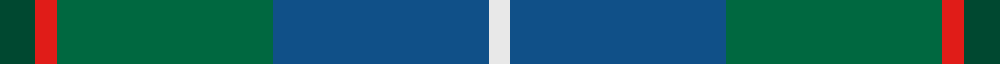
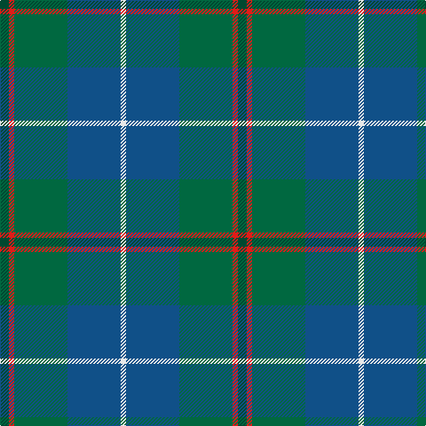

This page is one **sett** — a single exact thread-count. It belongs to the [tartan](/tartans/dg5r3g30b30ln3/)
(the same proportion at any scale), whose colour order is pattern [GRGBW](/stripes/grgbw/).

Sourced from register-of-tartans.  It is a [5 stripe tartan](/stripes/stripes5/).

Original link https://www.tartanregister.gov.uk/tartanDetails.aspx?ref=10664

## Also known as

This cloth is also recorded under:

- Gamba Tuscany Fife

3 attestations — the source records this cloth was collapsed from (oldest owns this page)

<ul>
<li>02/08/2012 — Gamba Tuscany Fife (register-of-tartans, <a href="https://www.tartanregister.gov.uk/tartanDetails.aspx?ref=10664">record</a>)</li>
<li>02/08/2012 — Gamba (Commemorative) (tartans-authority, <a href="http://www.tartansauthority.com/tartan-ferret/display/10664/">record</a>)</li>
<li>undated — Gamba Tuscany Fife Name Tartan Tartan Number: 10664. Earliest known date: 02/08/2012 Designed by Catherine Gamba to commemorate the golden wedding of Joseph and Catherine Gamba, whose roots are in Tuscany and Fife. The colours are taken from the Scottish and Italian flags. See products available Copyright © Blair Urquhart, Comrie, 2015 (house-of-tartan, <a href="http://www.house-of-tartan.scotland.net/house/TartanViewjs.asp?colr=Def&tnam=10664">record</a>)</li>
</ul>

## Register references

External register numbers recorded for this tartan.

- Scottish Register of Tartans: [10664](https://www.tartanregister.gov.uk/tartanDetails.aspx?ref=10664)

## Thread count
DG/10 R6 G60 B60 LN/6

## Palette
Each colour and the base-6 reference it is a variant of.

| Colour | Shade | Base |
|---|---|---|
| B | <code style="background-color:#105088;">#105088</code> `oklch(42.4% 0.111 250.4)` <small>#105088</small> | B <code style="background-color:#2A418A;">#2A418A</code> |
| DG | <code style="background-color:#004830;">#004830</code> `oklch(35.5% 0.077 163.0)` <small>#004830</small> | G <code style="background-color:#006100;">#006100</code> |
| G | <code style="background-color:#006840;">#006840</code> `oklch(45.6% 0.106 158.5)` <small>#006840</small> | G <code style="background-color:#006100;">#006100</code> |
| LN | <code style="background-color:#E8E8E8;">#E8E8E8</code> `oklch(93.1% 0.000 89.9)` <small>#E8E8E8</small> | W <code style="background-color:#F7F7F7;">#F7F7F7</code> |
| R | <code style="background-color:#E01C18;">#E01C18</code> `oklch(57.8% 0.225 28.6)` <small>#E01C18</small> | R <code style="background-color:#CC0000;">#CC0000</code> |

# Sample pattern

## Nearest tartans

The nearest existing variants by ΔTartan distance, with this tartan at the top so the swatches line up against it.

ΔTartan

Tartan

Sett

—

<a href="/ttd/edit/#slug=dg5r3g30db30w3~x2">Gamba Tuscany Fife</a> <a class="nn-out" href="/setts/s5/dg5r3g30db30w3~x2/" title="open its dictionary page">↗</a>

0.91

<a href="/ttd/edit/#slug=dt37dg37o8k3dp5~x2">Dallard Personal Tartan Tartan Number: 7424. Earliest known date: 2007 The material was going towards a kilt for my wedding in June 2008. See products available Copyright © Blair Urquhart, Comrie, 2015</a> <a class="nn-out" href="/setts/s5/dt37dg37o8k3dp5~x2/" title="open its dictionary page">↗</a>

1.10

<a href="/ttd/edit/#slug=db6b47db22g47dp4g4lb4">Boroughmuir</a> <a class="nn-out" href="/setts/s7/db6b47db22g47dp4g4lb4/" title="open its dictionary page">↗</a>

1.19

<a href="/ttd/edit/#slug=dg6ly3dg26k10n30lb3~x2">Montrose (1983)</a> <a class="nn-out" href="/setts/s6/dg6ly3dg26k10n30lb3~x2/" title="open its dictionary page">↗</a>

1.21

<a href="/ttd/edit/#slug=db6b47db22g47dp4g4o4">Boroughmuir</a> <a class="nn-out" href="/setts/s7/db6b47db22g47dp4g4o4/" title="open its dictionary page">↗</a>

1.23

<a href="/ttd/edit/#slug=b32dy16g3lo4dg28~x2">Corey (Name)</a> <a class="nn-out" href="/setts/s5/b32dy16g3lo4dg28~x2/" title="open its dictionary page">↗</a>

1.41

<a href="/ttd/edit/#slug=db3g13lr1o3lr1db10lo1~x2">Graeme Heckenberg Hunting</a> <a class="nn-out" href="/setts/s7/db3g13lr1o3lr1db10lo1~x2/" title="open its dictionary page">↗</a>

1.43

<a href="/ttd/edit/#slug=k9lr6n22g28ly2~x2">Wellington (Lochcarron)</a> <a class="nn-out" href="/setts/s5/k9lr6n22g28ly2~x2/" title="open its dictionary page">↗</a>

1.47

<a href="/ttd/edit/#slug=db9w4g36t36r4~x2">Alvis of Lee (Personal)</a> <a class="nn-out" href="/setts/s5/db9w4g36t36r4~x2/" title="open its dictionary page">↗</a>

1.49

<a href="/ttd/edit/#slug=g15dt2w2dt11n28dt4~x2">Rhode Island, The State of</a> <a class="nn-out" href="/setts/s6/g15dt2w2dt11n28dt4~x2/" title="open its dictionary page">↗</a>

1.52

<a href="/ttd/edit/#slug=dg5g32dp5k10dg8r3dg8dp3~x2">Scottish Power (Corporate)</a> <a class="nn-out" href="/setts/s8/dg5g32dp5k10dg8r3dg8dp3~x2/" title="open its dictionary page">↗</a>

## Neighbour map

Every grey dot is one of 14299 variants placed by the first two principal components of the ΔTartan feature space (44% of its variance). Red is this tartan; blue dots are its nearest — click one to open its page.

<svg viewBox="0 0 640 380" role="img" style="max-width:100%;height:auto;border:1px solid #e0e0e0;border-radius:4px;display:block" xmlns="http://www.w3.org/2000/svg"><image href="/nn/cloud.v1.png" width="640" height="380"/><a href="/setts/s5/dt37dg37o8k3dp5~x2/"><circle cx="287.7" cy="237.0" r="4" fill="#3465a4"><title>Dallard Personal Tartan Tartan Number: 7424. Earliest known date: 2007 The material was going towards a kilt for my wedding in June 2008. See products available Copyright © Blair Urquhart, Comrie, 2015</title></circle></a><a href="/setts/s7/db6b47db22g47dp4g4lb4/"><circle cx="243.1" cy="206.9" r="4" fill="#3465a4"><title>Boroughmuir</title></circle></a><a href="/setts/s6/dg6ly3dg26k10n30lb3~x2/"><circle cx="254.3" cy="228.2" r="4" fill="#3465a4"><title>Montrose (1983)</title></circle></a><a href="/setts/s7/db6b47db22g47dp4g4o4/"><circle cx="236.0" cy="202.3" r="4" fill="#3465a4"><title>Boroughmuir</title></circle></a><a href="/setts/s5/b32dy16g3lo4dg28~x2/"><circle cx="218.0" cy="237.9" r="4" fill="#3465a4"><title>Corey (Name)</title></circle></a><a href="/setts/s7/db3g13lr1o3lr1db10lo1~x2/"><circle cx="261.7" cy="190.9" r="4" fill="#3465a4"><title>Graeme Heckenberg Hunting</title></circle></a><a href="/setts/s5/k9lr6n22g28ly2~x2/"><circle cx="230.5" cy="221.1" r="4" fill="#3465a4"><title>Wellington (Lochcarron)</title></circle></a><a href="/setts/s5/db9w4g36t36r4~x2/"><circle cx="221.4" cy="220.1" r="4" fill="#3465a4"><title>Alvis of Lee (Personal)</title></circle></a><a href="/setts/s6/g15dt2w2dt11n28dt4~x2/"><circle cx="299.5" cy="222.8" r="4" fill="#3465a4"><title>Rhode Island, The State of</title></circle></a><a href="/setts/s8/dg5g32dp5k10dg8r3dg8dp3~x2/"><circle cx="243.4" cy="196.9" r="4" fill="#3465a4"><title>Scottish Power (Corporate)</title></circle></a><circle cx="278.8" cy="235.9" r="5" fill="#c00000"/></svg>

ID: /setts/s5/dg5r3g30db30w3~x2/
