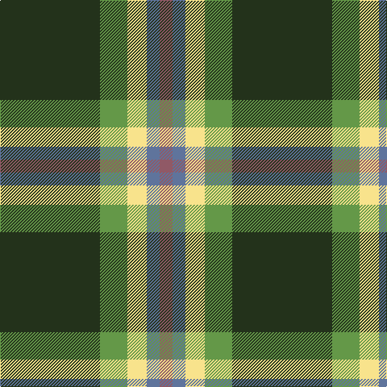

**Bands:** [RBYGG](/stripes/rbygg/) · **Stripes:** [O T LY G DG](/stripes/stripes5/) O T LY G DG

This was sourced from register-of-tartans.  It is a [5 band tartan](/bands/bands5/).

Original link https://www.tartanregister.gov.uk/tartanDetails.aspx?ref=10230

## Register references

External register numbers recorded for this tartan.

- Scottish Register of Tartans: [10230](https://www.tartanregister.gov.uk/tartanDetails.aspx?ref=10230)

## Variants

Other setts woven to the same stripe pattern.

- [Dundhuin Dress (Personal)](/setts/s5/o62t17ly12g8dg8~x2/)

## Thread count
K/124 LG34 LY24 B16 LT/16

## Palette
Each colour and its ΔE from the base-6 reference it is a variant of.

| Colour | Shade | Base | ΔE (OKLab) |
|---|---|---|---|
| B | <code style="background-color:#5F749C;">#5F749C</code> `#5F749C` | B <code style="background-color:#2A418A;">#2A418A</code> | 0.17 |
| K | <code style="background-color:#23321B;">#23321B</code> `#23321B` | G <code style="background-color:#006100;">#006100</code> | 0.16 |
| LG | <code style="background-color:#649848;">#649848</code> `#649848` | G <code style="background-color:#006100;">#006100</code> | 0.20 |
| LT | <code style="background-color:#905966;">#905966</code> `#905966` | R <code style="background-color:#CC0000;">#CC0000</code> | 0.15 |
| LY | <code style="background-color:#F8E38C;">#F8E38C</code> `#F8E38C` | Y <code style="background-color:#F2BF00;">#F2BF00</code> | 0.11 |

# Sample pattern

## Nearest tartans

The nearest existing variants by ΔTartan distance.

1. [Asheville Firefighters, The](/setts/s6/k17dg48ly4r10lb12dg4/) — ΔT 1.05
1. [St Johns County Sheriff Office (Cor)](/setts/s5/r17db7lo8g58k6~x2/) — ΔT 1.14
1. [Asheville Firefighters, The](/setts/s6/k17g48ly4r10db12g4/) — ΔT 1.15
1. [ChuMac (Personal)](/setts/s5/g15ly3r3dp8w2~x6/) — ΔT 1.24
1. [Phinn (Personal)](/setts/s5/dg11dg3r4ly2w2~x10/) — ΔT 1.25
1. [St Johns County's Sheriff's Office](/setts/s5/r17db7lo8dg58k6~x2/) — ΔT 1.27
1. [Celtic Norse Heritage Society](/setts/s5/o10k1db3g3ly1~x6/) — ΔT 1.33
1. [Wilson's No.189](/setts/s4/dp4g10r1w1~x2/) — ΔT 1.33
1. [St Patrick's Krewe](/setts/s8/dg50r5dg8w10dg8db8dg8lo21~x2/) — ΔT 1.37
1. [Newfoundland](/setts/s7/r6g4do14w4do7g30lo4~x2/) — ΔT 1.37

## Neighbour map

Every grey dot is one of 14299 variants placed by the first two principal components of the ΔTartan feature space (44% of its variance). Red is this tartan; blue dots are its nearest — click one to open its page.

<svg viewBox="0 0 640 380" role="img" style="max-width:100%;height:auto;border:1px solid #e0e0e0;border-radius:4px;display:block" xmlns="http://www.w3.org/2000/svg"><image href="/nn/cloud.v1.png" width="640" height="380"/><a href="/setts/s6/k17dg48ly4r10lb12dg4/"><circle cx="262.0" cy="178.0" r="4" fill="#3465a4"><title>Asheville Firefighters, The</title></circle></a><a href="/setts/s5/r17db7lo8g58k6~x2/"><circle cx="325.7" cy="200.2" r="4" fill="#3465a4"><title>St Johns County Sheriff Office (Cor)</title></circle></a><a href="/setts/s6/k17g48ly4r10db12g4/"><circle cx="278.8" cy="189.6" r="4" fill="#3465a4"><title>Asheville Firefighters, The</title></circle></a><a href="/setts/s5/g15ly3r3dp8w2~x6/"><circle cx="205.8" cy="210.4" r="4" fill="#3465a4"><title>ChuMac (Personal)</title></circle></a><a href="/setts/s5/dg11dg3r4ly2w2~x10/"><circle cx="191.5" cy="223.8" r="4" fill="#3465a4"><title>Phinn (Personal)</title></circle></a><a href="/setts/s5/r17db7lo8dg58k6~x2/"><circle cx="317.4" cy="197.5" r="4" fill="#3465a4"><title>St Johns County's Sheriff's Office</title></circle></a><a href="/setts/s5/o10k1db3g3ly1~x6/"><circle cx="260.8" cy="190.1" r="4" fill="#3465a4"><title>Celtic Norse Heritage Society</title></circle></a><a href="/setts/s4/dp4g10r1w1~x2/"><circle cx="343.3" cy="223.6" r="4" fill="#3465a4"><title>Wilson's No.189</title></circle></a><a href="/setts/s8/dg50r5dg8w10dg8db8dg8lo21~x2/"><circle cx="294.4" cy="164.9" r="4" fill="#3465a4"><title>St Patrick's Krewe</title></circle></a><a href="/setts/s7/r6g4do14w4do7g30lo4~x2/"><circle cx="233.0" cy="196.9" r="4" fill="#3465a4"><title>Newfoundland</title></circle></a><circle cx="269.4" cy="199.6" r="5" fill="#c00000"/></svg>

ID: /setts/s5/dg62g17ly12t8o8~x2/
