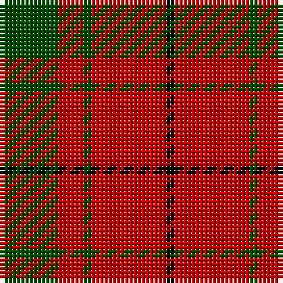

**Bands:** [GRGRK](/stripes/grgrk/) · **Stripes:** [DG R DG R K](/stripes/stripes5/) DG R DG R K

This was sourced from weddslist.  It is a [5 band tartan](/bands/bands5/).

Original link http://www.weddslist.com/cgi-bin/tartans/pg.pl?source=rb

## Register references

External register numbers recorded for this tartan.

- Scottish Register of Tartans: [2540](https://www.tartanregister.gov.uk/tartanDetails.aspx?ref=2540)
- Scottish Register of Tartans: [2666](https://www.tartanregister.gov.uk/tartanDetails.aspx?ref=2666)
- Scottish Register of Tartans: [3808](https://www.tartanregister.gov.uk/tartanDetails.aspx?ref=3808)
- Scottish Tartans Authority (ITI): 218
- Scottish Tartans World Register: 1010
- Scottish Tartans World Register: 1585
- Scottish Tartans World Register: 218

## Variants

Other setts woven to the same stripe pattern.

- [MacDonald Lord of the Isles #2](/setts/s5/dg16r5dg2r18k2~x2/)
- [MacDonald of Sleat](/setts/s5/dg16r5dg2r18k2/)

## Thread count
G/14 R6 G2 R18 K/2

## Palette
Each colour and its ΔE from the base-6 reference it is a variant of.

| Colour | Shade | Base | ΔE (OKLab) |
|---|---|---|---|
| G | <code style="background-color:#004C00;">#004C00</code> `#004C00` | G <code style="background-color:#006100;">#006100</code> | 0.07 |
| K | <code style="background-color:#000000;">#000000</code> `#000000` | K <code style="background-color:#000000;">#000000</code> | 0.00 |
| R | <code style="background-color:#C80000;">#C80000</code> `#C80000` | R <code style="background-color:#CC0000;">#CC0000</code> | 0.01 |

# Sample pattern

## Nearest tartans

The nearest existing variants by ΔTartan distance.

1. [MacDonald Lord of the Isles #2](/setts/s5/dg16r5dg2r18k2~x2/) — ΔT 0.44
1. [Lugo (2013)](/setts/s4/r10dg4ly1dg4~x8/) — ΔT 0.76
1. [MacDonald, Lord of The Isles (Artef)](/setts/s5/g16r5g2r18k2~x2/) — ΔT 0.79
1. [MacKinnon #6](/setts/s4/r3dg20r25w3~x4/) — ΔT 0.85
1. [MacDonald of Sleat](/setts/s5/dg16r5dg2r18k2/) — ΔT 0.99
1. [Dunbar](/setts/s6/r6g21k8r28k2r4~x2/) — ΔT 0.99
1. [Cameron](/setts/s6/ly1r8g3r1g3r1~x8/) — ΔT 1.01
1. [Auld Lang Syne (red) Tartan Tartan Number: 2402. Earliest known date: Threadcount and colours aren't 100% original. Generated manually. See products available Copyright © Blair Urquhart, Comrie, 2015](/setts/s7/r4g14r5k6r24g2r4~x2/) — ΔT 1.11
1. [Lugo (2013)](/setts/s4/r10dg4lo1dg4~x8/) — ΔT 1.13
1. [Murray, Lord George (Hose)](/setts/s5/g1r5g10r5k1~x4/) — ΔT 1.13

## Neighbour map

Every grey dot is one of 14313 variants placed by the first two principal components of the ΔTartan feature space (44% of its variance). Red is this tartan; blue dots are its nearest — click one to open its page.

<svg viewBox="0 0 640 380" role="img" style="max-width:100%;height:auto;border:1px solid #e0e0e0;border-radius:4px;display:block" xmlns="http://www.w3.org/2000/svg"><image href="/nn/cloud.v1.png" width="640" height="380"/><a href="/setts/s5/dg16r5dg2r18k2~x2/"><circle cx="343.4" cy="233.0" r="4" fill="#3465a4"><title>MacDonald Lord of the Isles #2</title></circle></a><a href="/setts/s4/r10dg4ly1dg4~x8/"><circle cx="331.4" cy="248.8" r="4" fill="#3465a4"><title>Lugo (2013)</title></circle></a><a href="/setts/s5/g16r5g2r18k2~x2/"><circle cx="352.7" cy="240.4" r="4" fill="#3465a4"><title>MacDonald, Lord of The Isles (Artef)</title></circle></a><a href="/setts/s4/r3dg20r25w3~x4/"><circle cx="335.4" cy="240.1" r="4" fill="#3465a4"><title>MacKinnon #6</title></circle></a><a href="/setts/s5/dg16r5dg2r18k2/"><circle cx="363.3" cy="249.7" r="4" fill="#3465a4"><title>MacDonald of Sleat</title></circle></a><a href="/setts/s6/r6g21k8r28k2r4~x2/"><circle cx="345.8" cy="207.9" r="4" fill="#3465a4"><title>Dunbar</title></circle></a><a href="/setts/s6/ly1r8g3r1g3r1~x8/"><circle cx="371.1" cy="226.6" r="4" fill="#3465a4"><title>Cameron</title></circle></a><a href="/setts/s7/r4g14r5k6r24g2r4~x2/"><circle cx="395.1" cy="206.0" r="4" fill="#3465a4"><title>Auld Lang Syne (red) Tartan Tartan Number: 2402. Earliest known date: Threadcount and colours aren't 100% original. Generated manually. See products available Copyright © Blair Urquhart, Comrie, 2015</title></circle></a><a href="/setts/s4/r10dg4lo1dg4~x8/"><circle cx="349.8" cy="263.6" r="4" fill="#3465a4"><title>Lugo (2013)</title></circle></a><a href="/setts/s5/g1r5g10r5k1~x4/"><circle cx="324.2" cy="239.6" r="4" fill="#3465a4"><title>Murray, Lord George (Hose)</title></circle></a><circle cx="354.9" cy="237.2" r="5" fill="#c00000"/></svg>

ID: /setts/s5/dg7r3dg1r9k1~x2/
