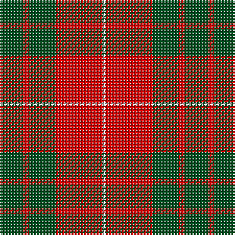

This page is one **sett** — a single exact thread-count. It belongs to the [tartan](/tartans/dg8r2dg9r16w1/)
(the same proportion at any scale), whose colour order is pattern [GRGRW](/stripes/grgrw/).

Sourced from register-of-tartans.  It is a [5 stripe tartan](/stripes/stripes5/).

Original link https://www.tartanregister.gov.uk/tartanDetails.aspx?ref=2455

## Register references

External register numbers recorded for this tartan.

- Scottish Register of Tartans: [2455](https://www.tartanregister.gov.uk/tartanDetails.aspx?ref=2455)
- Scottish Tartans World Register: 989

## Thread count
G/16 R4 G18 R32 LN/2

## Palette

Palette: <strong>Tartan Register</strong>
<table><thead><tr><th>Colour</th><th>Threads</th><th>Shade</th><th>Base</th><th>OKLCh</th></tr></thead><tbody><tr><td>G/</td><td style="text-align:right;font-variant-numeric:tabular-nums">16</td><td><code style="background-color:#005020;">#005020</code> <small style="color:#888">#005020</small></td><td>G <code style="background-color:#006100;">#006100</code></td><td><small style="color:#888">oklch(37.7% 0.105 149.6)</small></td></tr><tr><td>R</td><td style="text-align:right;font-variant-numeric:tabular-nums">4</td><td><code style="background-color:#DC0000;">#DC0000</code> <small style="color:#888">#DC0000</small></td><td>R <code style="background-color:#CC0000;">#CC0000</code></td><td><small style="color:#888">oklch(56.2% 0.230 29.2)</small></td></tr><tr><td>G</td><td style="text-align:right;font-variant-numeric:tabular-nums">18</td><td><code style="background-color:#005020;">#005020</code> <small style="color:#888">#005020</small></td><td>G <code style="background-color:#006100;">#006100</code></td><td><small style="color:#888">oklch(37.7% 0.105 149.6)</small></td></tr><tr><td>R</td><td style="text-align:right;font-variant-numeric:tabular-nums">32</td><td><code style="background-color:#DC0000;">#DC0000</code> <small style="color:#888">#DC0000</small></td><td>R <code style="background-color:#CC0000;">#CC0000</code></td><td><small style="color:#888">oklch(56.2% 0.230 29.2)</small></td></tr><tr><td>LN/</td><td style="text-align:right;font-variant-numeric:tabular-nums">2</td><td><code style="background-color:#E0E0E0;">#E0E0E0</code> <small style="color:#888">#E0E0E0</small></td><td>W <code style="background-color:#F7F7F7;">#F7F7F7</code></td><td><small style="color:#888">oklch(90.7% 0.000 89.9)</small></td></tr></tbody></table>

# Sample pattern

## Nearest tartans

The nearest existing variants by ΔTartan distance, with this tartan at the top so the swatches line up against it.

ΔTartan

Tartan

Sett

—

<a href="/ttd/edit/#slug=dg8r2dg9r16w1~x2">MacGregor of Balquhidder</a> <a class="nn-out" href="/setts/s5/dg8r2dg9r16w1~x2/" title="open its dictionary page">↗</a>

0.93

<a href="/ttd/edit/#slug=r6g21k8r28k2r4~x2">Dunbar</a> <a class="nn-out" href="/setts/s6/r6g21k8r28k2r4~x2/" title="open its dictionary page">↗</a>

0.93

<a href="/ttd/edit/#slug=dg8r2dg9r16dg1~x2">MacGregor of Glenstrae</a> <a class="nn-out" href="/setts/s5/dg8r2dg9r16dg1~x2/" title="open its dictionary page">↗</a>

0.99

<a href="/ttd/edit/#slug=dg16r5dg2r18k2~x2">MacDonald Lord of the Isles #2</a> <a class="nn-out" href="/setts/s5/dg16r5dg2r18k2~x2/" title="open its dictionary page">↗</a>

1.02

<a href="/ttd/edit/#slug=k1r5g10r5g1~x4">Murray, Lord George (Hose)</a> <a class="nn-out" href="/setts/s5/k1r5g10r5g1~x4/" title="open its dictionary page">↗</a>

1.02

<a href="/setts/s4/r10dg4ly1~x8/">Lugo (2013)</a>

1.10

<a href="/ttd/edit/#slug=k2r16g6r3g8w1~x4">MacAulay (Clan)</a> <a class="nn-out" href="/setts/s6/k2r16g6r3g8w1~x4/" title="open its dictionary page">↗</a>

1.10

<a href="/ttd/edit/#slug=g16r5g2r18k2~x2">MacDonald, Lord of The Isles (Artef)</a> <a class="nn-out" href="/setts/s5/g16r5g2r18k2~x2/" title="open its dictionary page">↗</a>

1.13

<a href="/ttd/edit/#slug=k2r16g6r3g8lb1~x2">MacAulay</a> <a class="nn-out" href="/setts/s6/k2r16g6r3g8lb1~x2/" title="open its dictionary page">↗</a>

1.13

<a href="/ttd/edit/#slug=g5w2r27g27r5w2~x2">MacDonald of Glenaladale (symmetrical)</a> <a class="nn-out" href="/setts/s6/g5w2r27g27r5w2~x2/" title="open its dictionary page">↗</a>

1.13

<a href="/ttd/edit/#slug=r1dg6r1dg6r15ly1~x2">Cameron Clan D</a> <a class="nn-out" href="/setts/s6/r1dg6r1dg6r15ly1~x2/" title="open its dictionary page">↗</a>

## Neighbour map

Every grey dot is one of 14299 variants placed by the first two principal components of the ΔTartan feature space (44% of its variance). Red is this tartan; blue dots are its nearest — click one to open its page.

<svg viewBox="0 0 640 380" role="img" style="max-width:100%;height:auto;border:1px solid #e0e0e0;border-radius:4px;display:block" xmlns="http://www.w3.org/2000/svg"><image href="/nn/cloud.v1.png" width="640" height="380"/><a href="/setts/s6/r6g21k8r28k2r4~x2/"><circle cx="345.5" cy="207.7" r="4" fill="#3465a4"><title>Dunbar</title></circle></a><a href="/setts/s5/dg8r2dg9r16dg1~x2/"><circle cx="381.5" cy="238.1" r="4" fill="#3465a4"><title>MacGregor of Glenstrae</title></circle></a><a href="/setts/s5/dg16r5dg2r18k2~x2/"><circle cx="343.2" cy="232.8" r="4" fill="#3465a4"><title>MacDonald Lord of the Isles #2</title></circle></a><a href="/setts/s5/k1r5g10r5g1~x4/"><circle cx="324.0" cy="239.4" r="4" fill="#3465a4"><title>Murray, Lord George (Hose)</title></circle></a><a href="/setts/s4/r10dg4ly1~x8/"><circle cx="331.2" cy="248.6" r="4" fill="#3465a4"><title>Lugo (2013)</title></circle></a><a href="/setts/s6/k2r16g6r3g8w1~x4/"><circle cx="331.6" cy="187.7" r="4" fill="#3465a4"><title>MacAulay (Clan)</title></circle></a><a href="/setts/s5/g16r5g2r18k2~x2/"><circle cx="352.4" cy="240.2" r="4" fill="#3465a4"><title>MacDonald, Lord of The Isles (Artef)</title></circle></a><a href="/setts/s6/k2r16g6r3g8lb1~x2/"><circle cx="335.7" cy="189.8" r="4" fill="#3465a4"><title>MacAulay</title></circle></a><a href="/setts/s6/g5w2r27g27r5w2~x2/"><circle cx="335.2" cy="199.1" r="4" fill="#3465a4"><title>MacDonald of Glenaladale (symmetrical)</title></circle></a><a href="/setts/s6/r1dg6r1dg6r15ly1~x2/"><circle cx="394.4" cy="195.3" r="4" fill="#3465a4"><title>Cameron Clan D</title></circle></a><circle cx="346.6" cy="217.1" r="5" fill="#c00000"/></svg>

ID: /setts/s5/dg8r2dg9r16w1~x2/
