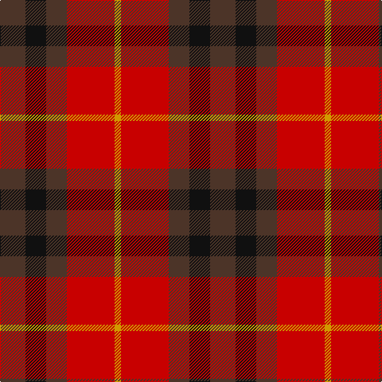

This page is one **sett** — a single exact thread-count. It belongs to the [tartan](/tartans/do16k13do13r30lo4/)
(the same proportion at any scale), whose colour order is pattern [BKBRY](/stripes/bkbry/).

Sourced from register-of-tartans.  It is a [5 stripe tartan](/stripes/stripes5/).

Original link https://www.tartanregister.gov.uk/tartanDetails.aspx?ref=1716

3 attestations — the source records this cloth was collapsed from (oldest owns this page)

<ul>
<li>01/11/1996 — Highland Pub Company (register-of-tartans, <a href="https://www.tartanregister.gov.uk/tartanDetails.aspx?ref=1716">record</a>)</li>
<li>1996 — Highland Pub Company (Corporate) (tartans-authority, <a href="http://www.tartansauthority.com/tartan-ferret/display/2289/">record</a>)</li>
<li>undated — Highland Pub Company Corporate Tartan Tartan Number: 2289. Earliest known date: 1996 Designed by Polly Wittering of The House of Edgar for the Highland Pub Co, part of Scottish & Newcastle Breweries. See products available Copyright © Blair Urquhart, Comrie, 2015 (house-of-tartan, <a href="http://www.house-of-tartan.scotland.net/house/TartanViewjs.asp?colr=Def&tnam=2289">record</a>)</li>
</ul>

## Register references

External register numbers recorded for this tartan.

- Scottish Register of Tartans: [1716](https://www.tartanregister.gov.uk/tartanDetails.aspx?ref=1716)
- Scottish Tartans Authority (ITI): 2289
- Scottish Tartans World Register: 2289

## Thread count
T/32 K26 T26 R60 DY/8

## Palette

Palette: <strong>Tartan Register</strong> <small style="color:#888">(3 of 4 colours)</small>
<table><thead><tr><th>Colour</th><th>Threads</th><th>Shade</th><th>Base</th><th>OKLCh</th></tr></thead><tbody><tr><td>T/</td><td style="text-align:right;font-variant-numeric:tabular-nums">32</td><td><code style="background-color:#4C3428;">#4C3428</code> <small style="color:#888">#4C3428</small></td><td>B <code style="background-color:#2A418A;">#2A418A</code></td><td><small style="color:#888">oklch(34.9% 0.040 47.5)</small></td></tr><tr><td>K</td><td style="text-align:right;font-variant-numeric:tabular-nums">26</td><td><code style="background-color:#101010;">#101010</code> <small style="color:#888">#101010</small></td><td>K <code style="background-color:#000000;">#000000</code></td><td><small style="color:#888">oklch(17.3% 0.000 89.9)</small></td></tr><tr><td>T</td><td style="text-align:right;font-variant-numeric:tabular-nums">26</td><td><code style="background-color:#4C3428;">#4C3428</code> <small style="color:#888">#4C3428</small></td><td>B <code style="background-color:#2A418A;">#2A418A</code></td><td><small style="color:#888">oklch(34.9% 0.040 47.5)</small></td></tr><tr><td>R</td><td style="text-align:right;font-variant-numeric:tabular-nums">60</td><td><code style="background-color:#C80000;">#C80000</code> <small style="color:#888">#C80000</small></td><td>R <code style="background-color:#CC0000;">#CC0000</code></td><td><small style="color:#888">oklch(52.3% 0.215 29.2)</small></td></tr><tr><td>DY/</td><td style="text-align:right;font-variant-numeric:tabular-nums">8</td><td><code style="background-color:#D09800;">#D09800</code> <small style="color:#888">#D09800</small></td><td>Y <code style="background-color:#F2BF00;">#F2BF00</code></td><td><small style="color:#888">oklch(71.4% 0.147 82.1)</small></td></tr></tbody></table>

# Sample pattern

## Nearest tartans

The nearest existing variants by ΔTartan distance, with this tartan at the top so the swatches line up against it.

ΔTartan

Tartan

Sett

—

<a href="/ttd/edit/#slug=do16k13do13r30lo4~x2">Highland Pub Company</a> <a class="nn-out" href="/setts/s5/do16k13do13r30lo4~x2/" title="open its dictionary page">↗</a>

1.09

<a href="/ttd/edit/#slug=r8r1dg4r1db4~x2">Moray of Abercairney #2</a> <a class="nn-out" href="/setts/s5/r8r1dg4r1db4~x2/" title="open its dictionary page">↗</a>

1.17

<a href="/ttd/edit/#slug=r8r1g4r1db4~x2">Moray of Abercairney</a> <a class="nn-out" href="/setts/s5/r8r1g4r1db4~x2/" title="open its dictionary page">↗</a>

1.45

<a href="/ttd/edit/#slug=dp2r4g12r3dp6r10w2~x2">MacKintosh-Geddes (Personal?)</a> <a class="nn-out" href="/setts/s7/dp2r4g12r3dp6r10w2~x2/" title="open its dictionary page">↗</a>

1.48

<a href="/setts/s8/dg6dp6y1r6dg6r6y1dp6~x4/">Wilson's No.223</a>

1.49

<a href="/ttd/edit/#slug=dg3dp3dg19dp18r19dp3~x2">MacNab (Macgregor - Hastie)</a> <a class="nn-out" href="/setts/s6/dg3dp3dg19dp18r19dp3~x2/" title="open its dictionary page">↗</a>

1.50

<a href="/ttd/edit/#slug=dp4r3dp26r26g26r4~x2">Unidentified Artifact Tartan Tartan Number: 463. Earliest known date: 0 Wilson's of Bannockburn 'New Broad Sett' perhaps. See products available Copyright © Blair Urquhart, Comrie, 2015</a> <a class="nn-out" href="/setts/s6/dp4r3dp26r26g26r4~x2/" title="open its dictionary page">↗</a>

1.51

<a href="/ttd/edit/#slug=dt2k2dt2r5ly1~x12">Chivas Regal (Corporate)</a> <a class="nn-out" href="/setts/s5/dt2k2dt2r5ly1~x12/" title="open its dictionary page">↗</a>

1.54

<a href="/ttd/edit/#slug=r4g26r26p26r3p4~x2">Unidentified 16</a> <a class="nn-out" href="/setts/s6/r4g26r26p26r3p4~x2/" title="open its dictionary page">↗</a>

1.54

<a href="/ttd/edit/#slug=r8db3k4g6r4k1r4~x4">MacDuff Clan Tartan Tartan Number: 2141. Earliest known date: 1831 According to D.C.Stewart, &quot;It will be observed that the MacDuff tartan is substantially the Royal Stuart with the white and yellow lines removed. Whether this indicates it as a source of the Stuart, or the association of the Earls of Fife with the Crown, remains to be determined.&quot; James Logan published this sett in his book, 'The Scottish Gael' in 1831. See products available Copyright © Blair Urquhart, Comrie, 2015</a> <a class="nn-out" href="/setts/s7/r8db3k4g6r4k1r4~x4/" title="open its dictionary page">↗</a>

1.56

<a href="/ttd/edit/#slug=dg14db8dg14r14k3r14~x2">Tulsa, City of</a> <a class="nn-out" href="/setts/s6/dg14db8dg14r14k3r14~x2/" title="open its dictionary page">↗</a>

## Neighbour map

Every grey dot is one of 14299 variants placed by the first two principal components of the ΔTartan feature space (44% of its variance). Red is this tartan; blue dots are its nearest — click one to open its page.

<svg viewBox="0 0 640 380" role="img" style="max-width:100%;height:auto;border:1px solid #e0e0e0;border-radius:4px;display:block" xmlns="http://www.w3.org/2000/svg"><image href="/nn/cloud.v1.png" width="640" height="380"/><a href="/setts/s5/r8r1dg4r1db4~x2/"><circle cx="239.8" cy="231.3" r="4" fill="#3465a4"><title>Moray of Abercairney #2</title></circle></a><a href="/setts/s5/r8r1g4r1db4~x2/"><circle cx="242.3" cy="235.1" r="4" fill="#3465a4"><title>Moray of Abercairney</title></circle></a><a href="/setts/s7/dp2r4g12r3dp6r10w2~x2/"><circle cx="201.3" cy="222.3" r="4" fill="#3465a4"><title>MacKintosh-Geddes (Personal?)</title></circle></a><a href="/setts/s8/dg6dp6y1r6dg6r6y1dp6~x4/"><circle cx="142.7" cy="255.5" r="4" fill="#3465a4"><title>Wilson's No.223</title></circle></a><a href="/setts/s6/dg3dp3dg19dp18r19dp3~x2/"><circle cx="226.3" cy="251.0" r="4" fill="#3465a4"><title>MacNab (Macgregor - Hastie)</title></circle></a><a href="/setts/s6/dp4r3dp26r26g26r4~x2/"><circle cx="249.6" cy="235.9" r="4" fill="#3465a4"><title>Unidentified Artifact Tartan Tartan Number: 463. Earliest known date: 0 Wilson's of Bannockburn 'New Broad Sett' perhaps. See products available Copyright © Blair Urquhart, Comrie, 2015</title></circle></a><a href="/setts/s5/dt2k2dt2r5ly1~x12/"><circle cx="176.1" cy="261.3" r="4" fill="#3465a4"><title>Chivas Regal (Corporate)</title></circle></a><a href="/setts/s6/r4g26r26p26r3p4~x2/"><circle cx="240.3" cy="231.3" r="4" fill="#3465a4"><title>Unidentified 16</title></circle></a><a href="/setts/s7/r8db3k4g6r4k1r4~x4/"><circle cx="239.9" cy="239.5" r="4" fill="#3465a4"><title>MacDuff Clan Tartan Tartan Number: 2141. Earliest known date: 1831 According to D.C.Stewart, &quot;It will be observed that the MacDuff tartan is substantially the Royal Stuart with the white and yellow lines removed. Whether this indicates it as a source of the Stuart, or the association of the Earls of Fife with the Crown, remains to be determined.&quot; James Logan published this sett in his book, 'The Scottish Gael' in 1831. See products available Copyright © Blair Urquhart, Comrie, 2015</title></circle></a><a href="/setts/s6/dg14db8dg14r14k3r14~x2/"><circle cx="182.4" cy="290.0" r="4" fill="#3465a4"><title>Tulsa, City of</title></circle></a><circle cx="218.2" cy="256.0" r="5" fill="#c00000"/></svg>

ID: /setts/s5/do16k13do13r30lo4~x2/
