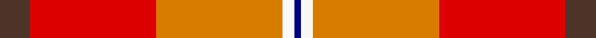
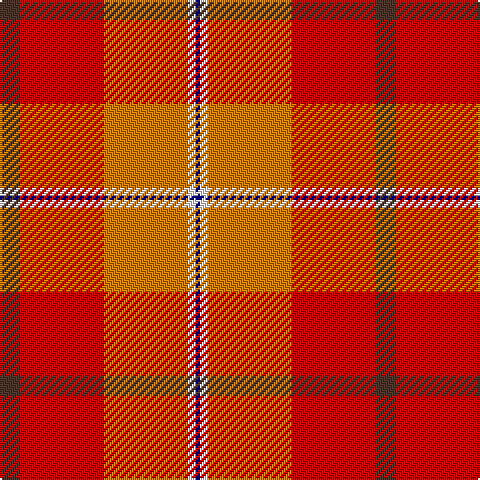

This page is one **sett** — a single exact thread-count. It belongs to the [tartan](/tartans/t5r21o21w2db1/)
(the same proportion at any scale), whose colour order is pattern [BRYWB](/stripes/brywb/).

Sourced from register-of-tartans.  It is a [5 stripe tartan](/stripes/stripes5/).

Original link https://www.tartanregister.gov.uk/tartanDetails.aspx?ref=11390

## Register references

External register numbers recorded for this tartan.

- Scottish Register of Tartans: [11390](https://www.tartanregister.gov.uk/tartanDetails.aspx?ref=11390)

## Thread count
T/10 R42 O42 W4 DB/2

## Palette
Each colour and the base-6 reference it is a variant of.

| Colour | Shade | Base |
|---|---|---|
| DB | <code style="background-color:#000080;">#000080</code> `oklch(27.1% 0.188 264.1)` <small>#000080</small> | B <code style="background-color:#2A418A;">#2A418A</code> |
| O | <code style="background-color:#D87C00;">#D87C00</code> `oklch(67.3% 0.155 61.8)` <small>#D87C00</small> | Y <code style="background-color:#F2BF00;">#F2BF00</code> |
| R | <code style="background-color:#DC0000;">#DC0000</code> `oklch(56.2% 0.230 29.2)` <small>#DC0000</small> | R <code style="background-color:#CC0000;">#CC0000</code> |
| T | <code style="background-color:#4C3428;">#4C3428</code> `oklch(34.9% 0.040 47.5)` <small>#4C3428</small> | B <code style="background-color:#2A418A;">#2A418A</code> |
| W | <code style="background-color:#F8F8F8;">#F8F8F8</code> `oklch(97.9% 0.000 89.9)` <small>#F8F8F8</small> | W <code style="background-color:#F7F7F7;">#F7F7F7</code> |

# Sample pattern

## Nearest tartans

The nearest existing variants by ΔTartan distance, with this tartan at the top so the swatches line up against it.

ΔTartan

Tartan

Sett

—

<a href="/ttd/edit/#slug=do5r21lo21w2db1~x2">Haughey (2015)</a> <a class="nn-out" href="/setts/s5/do5r21lo21w2db1~x2/" title="open its dictionary page">↗</a>

1.55

<a href="/ttd/edit/#slug=r3ly2r18db8w1r18r2~x2">Barbour - Cardinal Red</a> <a class="nn-out" href="/setts/s7/r3ly2r18db8w1r18r2~x2/" title="open its dictionary page">↗</a>

1.59

<a href="/ttd/edit/#slug=r15k1lo2g3r2k1lo15~x6">Scrymgeour (Clan)</a> <a class="nn-out" href="/setts/s7/r15k1lo2g3r2k1lo15~x6/" title="open its dictionary page">↗</a>

1.76

<a href="/ttd/edit/#slug=k7w2dg2o31r35lo2~x2">Mason (Personal)</a> <a class="nn-out" href="/setts/s6/k7w2dg2o31r35lo2~x2/" title="open its dictionary page">↗</a>

1.82

<a href="/ttd/edit/#slug=k7w2dg2r31r35lo2~x2">Mason, David Elsworth (Personal)</a> <a class="nn-out" href="/setts/s6/k7w2dg2r31r35lo2~x2/" title="open its dictionary page">↗</a>

1.86

<a href="/ttd/edit/#slug=r1r4r10lo2w1~x4">Love (Fashion)</a> <a class="nn-out" href="/setts/s5/r1r4r10lo2w1~x4/" title="open its dictionary page">↗</a>

1.88

<a href="/ttd/edit/#slug=r26r5m12ly1g1r3~x2">Roseate Sunrise</a> <a class="nn-out" href="/setts/s6/r26r5m12ly1g1r3~x2/" title="open its dictionary page">↗</a>

1.95

<a href="/ttd/edit/#slug=k2g6dy4t1r18dy5lo1~x4">Snelgrove (Name)</a> <a class="nn-out" href="/setts/s7/k2g6dy4t1r18dy5lo1~x4/" title="open its dictionary page">↗</a>

1.97

<a href="/ttd/edit/#slug=r15k1y2db3r2k1y15~x6">Scrymgeour</a> <a class="nn-out" href="/setts/s7/r15k1y2db3r2k1y15~x6/" title="open its dictionary page">↗</a>

1.99

<a href="/ttd/edit/#slug=t9dy2g12r31lo9~x2">Buncle (Name)</a> <a class="nn-out" href="/setts/s5/t9dy2g12r31lo9~x2/" title="open its dictionary page">↗</a>

2.05

<a href="/ttd/edit/#slug=n9do2dg12o31lo9~x2">Buncle (Duns)</a> <a class="nn-out" href="/setts/s5/n9do2dg12o31lo9~x2/" title="open its dictionary page">↗</a>

## Neighbour map

Every grey dot is one of 14299 variants placed by the first two principal components of the ΔTartan feature space (44% of its variance). Red is this tartan; blue dots are its nearest — click one to open its page.

<svg viewBox="0 0 640 380" role="img" style="max-width:100%;height:auto;border:1px solid #e0e0e0;border-radius:4px;display:block" xmlns="http://www.w3.org/2000/svg"><image href="/nn/cloud.v1.png" width="640" height="380"/><a href="/setts/s7/r3ly2r18db8w1r18r2~x2/"><circle cx="304.9" cy="162.2" r="4" fill="#3465a4"><title>Barbour - Cardinal Red</title></circle></a><a href="/setts/s7/r15k1lo2g3r2k1lo15~x6/"><circle cx="310.7" cy="161.3" r="4" fill="#3465a4"><title>Scrymgeour (Clan)</title></circle></a><a href="/setts/s6/k7w2dg2o31r35lo2~x2/"><circle cx="304.9" cy="150.1" r="4" fill="#3465a4"><title>Mason (Personal)</title></circle></a><a href="/setts/s6/k7w2dg2r31r35lo2~x2/"><circle cx="281.7" cy="132.5" r="4" fill="#3465a4"><title>Mason, David Elsworth (Personal)</title></circle></a><a href="/setts/s5/r1r4r10lo2w1~x4/"><circle cx="348.8" cy="196.6" r="4" fill="#3465a4"><title>Love (Fashion)</title></circle></a><a href="/setts/s6/r26r5m12ly1g1r3~x2/"><circle cx="350.9" cy="122.5" r="4" fill="#3465a4"><title>Roseate Sunrise</title></circle></a><a href="/setts/s7/k2g6dy4t1r18dy5lo1~x4/"><circle cx="288.4" cy="138.8" r="4" fill="#3465a4"><title>Snelgrove (Name)</title></circle></a><a href="/setts/s7/r15k1y2db3r2k1y15~x6/"><circle cx="305.7" cy="166.4" r="4" fill="#3465a4"><title>Scrymgeour</title></circle></a><a href="/setts/s5/t9dy2g12r31lo9~x2/"><circle cx="283.8" cy="198.0" r="4" fill="#3465a4"><title>Buncle (Name)</title></circle></a><a href="/setts/s5/n9do2dg12o31lo9~x2/"><circle cx="282.4" cy="197.8" r="4" fill="#3465a4"><title>Buncle (Duns)</title></circle></a><circle cx="302.1" cy="161.9" r="5" fill="#c00000"/></svg>

ID: /setts/s5/do5r21lo21w2db1~x2/
