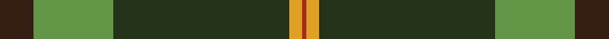

This page is one **sett** — a single exact thread-count. It belongs to the [tartan](/tartans/do8g19dg42lo3o1/)
(the same proportion at any scale), whose colour order is pattern [BGGYR](/stripes/bggyr/).

Sourced from register-of-tartans.  It is a [5 stripe tartan](/stripes/stripes5/).

Original link https://www.tartanregister.gov.uk/tartanDetails.aspx?ref=10542

## Register references

External register numbers recorded for this tartan.

- Scottish Register of Tartans: [10542](https://www.tartanregister.gov.uk/tartanDetails.aspx?ref=10542)

## Thread count
Ka/16 LG38 K84 Y6 R/2

## Palette

Palette: <strong>Tartan Register</strong> <small style="color:#888">(2 of 5 colours)</small>
<table><thead><tr><th>Colour</th><th>Threads</th><th>Shade</th><th>Base</th><th>OKLCh</th></tr></thead><tbody><tr><td>Ka/</td><td style="text-align:right;font-variant-numeric:tabular-nums">16</td><td><code style="background-color:#351E14;">#351E14</code> <small style="color:#888">#351E14</small></td><td>B <code style="background-color:#2A418A;">#2A418A</code></td><td><small style="color:#888">oklch(26.3% 0.040 44.1)</small></td></tr><tr><td>LG</td><td style="text-align:right;font-variant-numeric:tabular-nums">38</td><td><code style="background-color:#649848;">#649848</code> <small style="color:#888">#649848</small></td><td>G <code style="background-color:#006100;">#006100</code></td><td><small style="color:#888">oklch(62.4% 0.125 135.7)</small></td></tr><tr><td>K</td><td style="text-align:right;font-variant-numeric:tabular-nums">84</td><td><code style="background-color:#23321B;">#23321B</code> <small style="color:#888">#23321B</small></td><td>G <code style="background-color:#006100;">#006100</code></td><td><small style="color:#888">oklch(29.7% 0.045 135.3)</small></td></tr><tr><td>Y</td><td style="text-align:right;font-variant-numeric:tabular-nums">6</td><td><code style="background-color:#E0A126;">#E0A126</code> <small style="color:#888">#E0A126</small></td><td>Y <code style="background-color:#F2BF00;">#F2BF00</code></td><td><small style="color:#888">oklch(75.1% 0.146 78.3)</small></td></tr><tr><td>R/</td><td style="text-align:right;font-variant-numeric:tabular-nums">2</td><td><code style="background-color:#A32D18;">#A32D18</code> <small style="color:#888">#A32D18</small></td><td>R <code style="background-color:#CC0000;">#CC0000</code></td><td><small style="color:#888">oklch(47.8% 0.158 32.4)</small></td></tr></tbody></table>

# Sample pattern

## Nearest tartans

The nearest existing variants by ΔTartan distance, with this tartan at the top so the swatches line up against it.

ΔTartan

Tartan

Sett

—

<a href="/ttd/edit/#slug=do8g19dg42lo3o1~x2">Nolan Family, John J (Personal)</a> <a class="nn-out" href="/setts/s5/do8g19dg42lo3o1~x2/" title="open its dictionary page">↗</a>

0.94

<a href="/ttd/edit/#slug=g55k17r9k11ly2db4~x2">Moran Family Tartan Tartan Number: 675. Earliest known date: 1986 The designers requested that the threadcount be Restricted. See products available Copyright © Blair Urquhart, Comrie, 2015</a> <a class="nn-out" href="/setts/s6/g55k17r9k11ly2db4~x2/" title="open its dictionary page">↗</a>

1.28

<a href="/ttd/edit/#slug=lo2db4g60dp30w1~x2">McGuinness, Tam (Personal)</a> <a class="nn-out" href="/setts/s5/lo2db4g60dp30w1~x2/" title="open its dictionary page">↗</a>

1.32

<a href="/ttd/edit/#slug=g55k17r9k11ly2k4~x2">Moran (Name)</a> <a class="nn-out" href="/setts/s6/g55k17r9k11ly2k4~x2/" title="open its dictionary page">↗</a>

1.33

<a href="/ttd/edit/#slug=t5k1g30db15r8g30r8db2~x2">Shaw of Tordarroch Green (Htg) (Clan</a> <a class="nn-out" href="/setts/s8/t5k1g30db15r8g30r8db2~x2/" title="open its dictionary page">↗</a>

1.39

<a href="/ttd/edit/#slug=dy2dg44k10r1db16r1~x2">MacWilliam Hunting</a> <a class="nn-out" href="/setts/s6/dy2dg44k10r1db16r1~x2/" title="open its dictionary page">↗</a>

1.45

<a href="/ttd/edit/#slug=g25k8o10r1o3~x4">Herbage Family Tartan Tartan Number: 811. Earliest known date: 1983 Designed by the Scottish Tartans Society for Mr Herbage, Laggan. See products available Copyright © Blair Urquhart, Comrie, 2015</a> <a class="nn-out" href="/setts/s5/g25k8o10r1o3~x4/" title="open its dictionary page">↗</a>

1.47

<a href="/ttd/edit/#slug=r3g30k12g1k16lo2~x2">MacArthur-Fox Htg (Personal)</a> <a class="nn-out" href="/setts/s6/r3g30k12g1k16lo2~x2/" title="open its dictionary page">↗</a>

1.55

<a href="/ttd/edit/#slug=g30g1g3r30k1ly3~x2">Abadia Da Cova (Corporate)</a> <a class="nn-out" href="/setts/s6/g30g1g3r30k1ly3~x2/" title="open its dictionary page">↗</a>

1.59

<a href="/ttd/edit/#slug=k83r16dg56k2w5k2dg56r5~x2">MacDiarmid #2</a> <a class="nn-out" href="/setts/s8/k83r16dg56k2w5k2dg56r5~x2/" title="open its dictionary page">↗</a>

1.62

<a href="/ttd/edit/#slug=dg60ly16m8t2o3~x2">Isle of Raasay</a> <a class="nn-out" href="/setts/s5/dg60ly16m8t2o3~x2/" title="open its dictionary page">↗</a>

## Neighbour map

Every grey dot is one of 14299 variants placed by the first two principal components of the ΔTartan feature space (44% of its variance). Red is this tartan; blue dots are its nearest — click one to open its page.

<svg viewBox="0 0 640 380" role="img" style="max-width:100%;height:auto;border:1px solid #e0e0e0;border-radius:4px;display:block" xmlns="http://www.w3.org/2000/svg"><image href="/nn/cloud.v1.png" width="640" height="380"/><a href="/setts/s6/g55k17r9k11ly2db4~x2/"><circle cx="345.4" cy="155.8" r="4" fill="#3465a4"><title>Moran Family Tartan Tartan Number: 675. Earliest known date: 1986 The designers requested that the threadcount be Restricted. See products available Copyright © Blair Urquhart, Comrie, 2015</title></circle></a><a href="/setts/s5/lo2db4g60dp30w1~x2/"><circle cx="426.9" cy="136.1" r="4" fill="#3465a4"><title>McGuinness, Tam (Personal)</title></circle></a><a href="/setts/s6/g55k17r9k11ly2k4~x2/"><circle cx="369.9" cy="171.1" r="4" fill="#3465a4"><title>Moran (Name)</title></circle></a><a href="/setts/s8/t5k1g30db15r8g30r8db2~x2/"><circle cx="365.4" cy="161.3" r="4" fill="#3465a4"><title>Shaw of Tordarroch Green (Htg) (Clan</title></circle></a><a href="/setts/s6/dy2dg44k10r1db16r1~x2/"><circle cx="428.1" cy="155.3" r="4" fill="#3465a4"><title>MacWilliam Hunting</title></circle></a><a href="/setts/s5/g25k8o10r1o3~x4/"><circle cx="339.6" cy="198.8" r="4" fill="#3465a4"><title>Herbage Family Tartan Tartan Number: 811. Earliest known date: 1983 Designed by the Scottish Tartans Society for Mr Herbage, Laggan. See products available Copyright © Blair Urquhart, Comrie, 2015</title></circle></a><a href="/setts/s6/r3g30k12g1k16lo2~x2/"><circle cx="348.3" cy="184.8" r="4" fill="#3465a4"><title>MacArthur-Fox Htg (Personal)</title></circle></a><a href="/setts/s6/g30g1g3r30k1ly3~x2/"><circle cx="362.5" cy="148.4" r="4" fill="#3465a4"><title>Abadia Da Cova (Corporate)</title></circle></a><a href="/setts/s8/k83r16dg56k2w5k2dg56r5~x2/"><circle cx="358.6" cy="151.7" r="4" fill="#3465a4"><title>MacDiarmid #2</title></circle></a><a href="/setts/s5/dg60ly16m8t2o3~x2/"><circle cx="425.1" cy="151.6" r="4" fill="#3465a4"><title>Isle of Raasay</title></circle></a><circle cx="378.3" cy="157.0" r="5" fill="#c00000"/></svg>

ID: /setts/s5/do8g19dg42lo3o1~x2/
