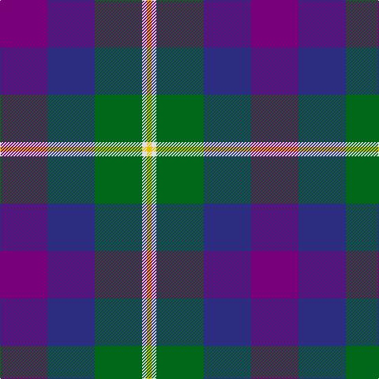

This page is one **sett** — a single exact thread-count. It belongs to the [tartan](/tartans/p10db10g10ln1y1/)
(the same proportion at any scale), whose colour order is pattern [BBGWY](/stripes/bbgwy/).

Sourced from register-of-tartans.  It is a [5 stripe tartan](/stripes/stripes5/).

Original link https://www.tartanregister.gov.uk/tartanDetails.aspx?ref=1071

2 attestations — the source records this cloth was collapsed from (oldest owns this page)

<ul>
<li>01/01/2006 — Edelstein (Personal) (register-of-tartans, <a href="https://www.tartanregister.gov.uk/tartanDetails.aspx?ref=1071">record</a>)</li>
<li>pre 2006 — Edelstein (Personal) (tartans-authority, <a href="http://www.tartansauthority.com/tartan-ferret/display/6931/">record</a>)</li>
</ul>

## Register references

External register numbers recorded for this tartan.

- Scottish Register of Tartans: [1071](https://www.tartanregister.gov.uk/tartanDetails.aspx?ref=1071)
- Scottish Tartans Authority (ITI): 6931

## Thread count
P/60 DB60 G60 LN6 Y/6

## Palette
Each colour and the base-6 reference it is a variant of.

| Colour | Shade | Base |
|---|---|---|
| DB | <code style="background-color:#2C2C80;">#2C2C80</code> `oklch(35.0% 0.138 276.6)` <small>#2C2C80</small> | B <code style="background-color:#2A418A;">#2A418A</code> |
| G | <code style="background-color:#006818;">#006818</code> `oklch(45.0% 0.142 145.0)` <small>#006818</small> | G <code style="background-color:#006100;">#006100</code> |
| LN | <code style="background-color:#E0E0E0;">#E0E0E0</code> `oklch(90.7% 0.000 89.9)` <small>#E0E0E0</small> | W <code style="background-color:#F7F7F7;">#F7F7F7</code> |
| P | <code style="background-color:#780078;">#780078</code> `oklch(40.2% 0.185 328.4)` <small>#780078</small> | B <code style="background-color:#2A418A;">#2A418A</code> |
| Y | <code style="background-color:#E8C000;">#E8C000</code> `oklch(81.9% 0.168 93.7)` <small>#E8C000</small> | Y <code style="background-color:#F2BF00;">#F2BF00</code> |

# Sample pattern

## Nearest tartans

The nearest existing variants by ΔTartan distance, with this tartan at the top so the swatches line up against it.

ΔTartan

Tartan

Sett

—

<a href="/ttd/edit/#slug=dp10db10g10w1ly1~x6">Edelstein (Personal)</a> <a class="nn-out" href="/setts/s5/dp10db10g10w1ly1~x6/" title="open its dictionary page">↗</a>

0.92

<a href="/ttd/edit/#slug=db6g27db3k19dp27w3~x2">Gold Brothers</a> <a class="nn-out" href="/setts/s6/db6g27db3k19dp27w3~x2/" title="open its dictionary page">↗</a>

1.03

<a href="/ttd/edit/#slug=do7w1r6db10g10w1~x4">McEachern, Andrew</a> <a class="nn-out" href="/setts/s6/do7w1r6db10g10w1~x4/" title="open its dictionary page">↗</a>

1.04

<a href="/ttd/edit/#slug=r5o20dt13db42dt13o20lo5">Newmill Corporate Tartan Tartan Number: 2053. Earliest known date: March 1992 Designed to be used in the refurbishing of Johnstons of Elgin new mill shop and based on the colours of the mill shop house style. The lighter square is represented here as green from the 'Antique' colour range, a speciality of Johnstons of Elgin. See products available Copyright © Blair Urquhart, Comrie, 2015</a> <a class="nn-out" href="/setts/s7/r5o20dt13db42dt13o20lo5/" title="open its dictionary page">↗</a>

1.06

<a href="/ttd/edit/#slug=w2k1m10k6b12lo2~x2">Soroptimist International (Corporate</a> <a class="nn-out" href="/setts/s6/w2k1m10k6b12lo2~x2/" title="open its dictionary page">↗</a>

1.08

<a href="/ttd/edit/#slug=db27o9w3dy16r7~x2">Unidentified (Sock Tie)</a> <a class="nn-out" href="/setts/s5/db27o9w3dy16r7~x2/" title="open its dictionary page">↗</a>

1.10

<a href="/ttd/edit/#slug=ly5db24k8db18ly6dy3">Cala Homes (Corporate)</a> <a class="nn-out" href="/setts/s6/ly5db24k8db18ly6dy3/" title="open its dictionary page">↗</a>

1.15

<a href="/ttd/edit/#slug=k4t3dp11dg14w2~x2">Wellington No 229</a> <a class="nn-out" href="/setts/s5/k4t3dp11dg14w2~x2/" title="open its dictionary page">↗</a>

1.16

<a href="/ttd/edit/#slug=g3db12w1dg12r12dg2~x2">Patterson, John (Personal)</a> <a class="nn-out" href="/setts/s6/g3db12w1dg12r12dg2~x2/" title="open its dictionary page">↗</a>

1.16

<a href="/ttd/edit/#slug=dp20k5k19g19ly2~x2">Martin Hunting</a> <a class="nn-out" href="/setts/s5/dp20k5k19g19ly2~x2/" title="open its dictionary page">↗</a>

1.18

<a href="/ttd/edit/#slug=m5g20k13db42k13g20ly5~x2">Newmill</a> <a class="nn-out" href="/setts/s7/m5g20k13db42k13g20ly5~x2/" title="open its dictionary page">↗</a>

## Neighbour map

Every grey dot is one of 14299 variants placed by the first two principal components of the ΔTartan feature space (44% of its variance). Red is this tartan; blue dots are its nearest — click one to open its page.

<svg viewBox="0 0 640 380" role="img" style="max-width:100%;height:auto;border:1px solid #e0e0e0;border-radius:4px;display:block" xmlns="http://www.w3.org/2000/svg"><image href="/nn/cloud.v1.png" width="640" height="380"/><a href="/setts/s6/db6g27db3k19dp27w3~x2/"><circle cx="141.0" cy="206.8" r="4" fill="#3465a4"><title>Gold Brothers</title></circle></a><a href="/setts/s6/do7w1r6db10g10w1~x4/"><circle cx="104.6" cy="209.9" r="4" fill="#3465a4"><title>McEachern, Andrew</title></circle></a><a href="/setts/s7/r5o20dt13db42dt13o20lo5/"><circle cx="177.2" cy="218.3" r="4" fill="#3465a4"><title>Newmill Corporate Tartan Tartan Number: 2053. Earliest known date: March 1992 Designed to be used in the refurbishing of Johnstons of Elgin new mill shop and based on the colours of the mill shop house style. The lighter square is represented here as green from the 'Antique' colour range, a speciality of Johnstons of Elgin. See products available Copyright © Blair Urquhart, Comrie, 2015</title></circle></a><a href="/setts/s6/w2k1m10k6b12lo2~x2/"><circle cx="164.2" cy="188.5" r="4" fill="#3465a4"><title>Soroptimist International (Corporate</title></circle></a><a href="/setts/s5/db27o9w3dy16r7~x2/"><circle cx="195.4" cy="224.4" r="4" fill="#3465a4"><title>Unidentified (Sock Tie)</title></circle></a><a href="/setts/s6/ly5db24k8db18ly6dy3/"><circle cx="142.8" cy="211.7" r="4" fill="#3465a4"><title>Cala Homes (Corporate)</title></circle></a><a href="/setts/s5/k4t3dp11dg14w2~x2/"><circle cx="173.1" cy="231.0" r="4" fill="#3465a4"><title>Wellington No 229</title></circle></a><a href="/setts/s6/g3db12w1dg12r12dg2~x2/"><circle cx="169.2" cy="199.7" r="4" fill="#3465a4"><title>Patterson, John (Personal)</title></circle></a><a href="/setts/s5/dp20k5k19g19ly2~x2/"><circle cx="138.1" cy="228.6" r="4" fill="#3465a4"><title>Martin Hunting</title></circle></a><a href="/setts/s7/m5g20k13db42k13g20ly5~x2/"><circle cx="163.1" cy="220.7" r="4" fill="#3465a4"><title>Newmill</title></circle></a><circle cx="162.2" cy="220.6" r="5" fill="#c00000"/></svg>

ID: /setts/s5/dp10db10g10w1ly1~x6/
