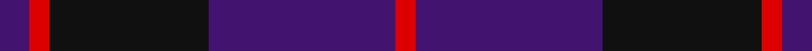

In pattern [BRKBR](/stripes/brkbr/).

This was sourced from register-of-tartans.  It is a [5 stripe tartan](/stripes/stripes5/).

Original link https://www.tartanregister.gov.uk/tartanDetails.aspx?ref=11395

## Register references

External register numbers recorded for this tartan.

- Scottish Register of Tartans: [11395](https://www.tartanregister.gov.uk/tartanDetails.aspx?ref=11395)

## Thread count
DB/12 R8 K64 DB75 R/8

## Palette
Each colour and the base-6 reference it is a variant of.

| Colour | Shade | Base |
|---|---|---|
| DB | <code style="background-color:#43146F;">#43146F</code> `oklch(32.3% 0.145 302.0)` <small>#43146F</small> | B <code style="background-color:#2A418A;">#2A418A</code> |
| K | <code style="background-color:#101010;">#101010</code> `oklch(17.3% 0.000 89.9)` <small>#101010</small> | K <code style="background-color:#000000;">#000000</code> |
| R | <code style="background-color:#DC0000;">#DC0000</code> `oklch(56.2% 0.230 29.2)` <small>#DC0000</small> | R <code style="background-color:#CC0000;">#CC0000</code> |

# Sample pattern

## Nearest tartans

The nearest existing variants by ΔTartan distance.

1. [Robbins](/setts/s6/db1r3db1r3db6g1~x8/) — ΔT 1.17
1. [Hillsdale (Corporate?)](/setts/s5/db13n6r51db51n5~x2/) — ΔT 1.23
1. [Wellington Variation](/setts/s4/k3db23k17r2~x2/) — ΔT 1.35
1. [Morgan (MacKay Blue) Clan Tartan Tartan Number: 264. Earliest known date: 1842 The design comes from the Vestiarium Scoticum (1842). The authors, the Sobieski Stuart brothers, enjoyed a popular following among the Scottish gentry in the early Victorian era, and in the spirit of the times, added mystery, romance and some spurious historical documentation to the subject of tartan. Of the better known tartans, the book offers some minor variation, but in other cases it provides the only recorded version of many tartans in use today. See products available Copyright © Blair Urquhart, Comrie, 2015](/setts/s6/db1k3db1k3db8r1~x4/) — ΔT 1.35
1. [Royal Scotsman Train (Corporate)](/setts/s6/db5k2db14k14db2lr2~x2/) — ΔT 1.38
1. [Komissarov, Dmitry (Personal)](/setts/s7/dp30db30y4db4y4db5r6~x2/) — ΔT 1.41
1. [Robbins Family Tartan Tartan Number: 412. Earliest known date: 1985 See products available Copyright © Blair Urquhart, Comrie, 2015](/setts/s6/db1m3db1m3db6g1~x4/) — ΔT 1.48
1. [Perthshire Tourist Board (Corporate)](/setts/s6/dp26r6g16dp8g3r2~x2/) — ΔT 1.49
1. [MacKay (Blue) #2](/setts/s5/k15db4k15db28r2~x2/) — ΔT 1.54
1. [Robert Gordon University](/setts/s6/k4r2k12db12k1lo2~x2/) — ΔT 1.57

## Neighbour map

Every grey dot is one of 14299 variants placed by the first two principal components of the ΔTartan feature space (44% of its variance). Red is this tartan; blue dots are its nearest — click one to open its page.

<svg viewBox="0 0 640 380" role="img" style="max-width:100%;height:auto;border:1px solid #e0e0e0;border-radius:4px;display:block" xmlns="http://www.w3.org/2000/svg"><image href="/nn/cloud.v1.png" width="640" height="380"/><a href="/setts/s6/db1r3db1r3db6g1~x8/"><circle cx="332.3" cy="272.8" r="4" fill="#3465a4"><title>Robbins</title></circle></a><a href="/setts/s5/db13n6r51db51n5~x2/"><circle cx="386.9" cy="267.2" r="4" fill="#3465a4"><title>Hillsdale (Corporate?)</title></circle></a><a href="/setts/s4/k3db23k17r2~x2/"><circle cx="394.5" cy="285.2" r="4" fill="#3465a4"><title>Wellington Variation</title></circle></a><a href="/setts/s6/db1k3db1k3db8r1~x4/"><circle cx="404.3" cy="271.9" r="4" fill="#3465a4"><title>Morgan (MacKay Blue) Clan Tartan Tartan Number: 264. Earliest known date: 1842 The design comes from the Vestiarium Scoticum (1842). The authors, the Sobieski Stuart brothers, enjoyed a popular following among the Scottish gentry in the early Victorian era, and in the spirit of the times, added mystery, romance and some spurious historical documentation to the subject of tartan. Of the better known tartans, the book offers some minor variation, but in other cases it provides the only recorded version of many tartans in use today. See products available Copyright © Blair Urquhart, Comrie, 2015</title></circle></a><a href="/setts/s6/db5k2db14k14db2lr2~x2/"><circle cx="353.1" cy="270.6" r="4" fill="#3465a4"><title>Royal Scotsman Train (Corporate)</title></circle></a><a href="/setts/s7/dp30db30y4db4y4db5r6~x2/"><circle cx="292.3" cy="225.9" r="4" fill="#3465a4"><title>Komissarov, Dmitry (Personal)</title></circle></a><a href="/setts/s6/db1m3db1m3db6g1~x4/"><circle cx="355.5" cy="280.1" r="4" fill="#3465a4"><title>Robbins Family Tartan Tartan Number: 412. Earliest known date: 1985 See products available Copyright © Blair Urquhart, Comrie, 2015</title></circle></a><a href="/setts/s6/dp26r6g16dp8g3r2~x2/"><circle cx="378.9" cy="239.5" r="4" fill="#3465a4"><title>Perthshire Tourist Board (Corporate)</title></circle></a><a href="/setts/s5/k15db4k15db28r2~x2/"><circle cx="378.4" cy="270.1" r="4" fill="#3465a4"><title>MacKay (Blue) #2</title></circle></a><a href="/setts/s6/k4r2k12db12k1lo2~x2/"><circle cx="338.7" cy="237.6" r="4" fill="#3465a4"><title>Robert Gordon University</title></circle></a><circle cx="367.5" cy="258.9" r="5" fill="#c00000"/></svg>

ID: /setts/s5/dp12r8k64dp75r8/
