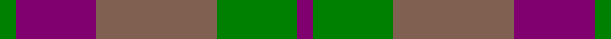
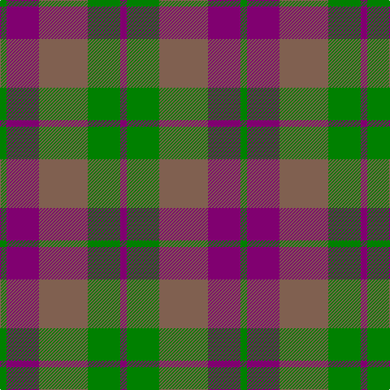

This page is one **sett** — a single exact thread-count. It belongs to the [tartan](/tartans/g2p10lt15g10p2/)
(the same proportion at any scale), whose colour order is pattern [BGRBG](/stripes/bgrbg/).

Sourced from weddslist.  It is a [5 stripe tartan](/stripes/stripes5/).

Original link http://www.weddslist.com/cgi-bin/tartans/pg.pl?source=sts

## Thread count
G/8 P40 LT60 G40 P/8

## Palette
Each colour and the base-6 reference it is a variant of.

| Colour | Shade | Base |
|---|---|---|
| G | <code style="background-color:#008000;">#008000</code> `oklch(52.0% 0.177 142.5)` <small>#008000</small> | G <code style="background-color:#006100;">#006100</code> |
| LT | <code style="background-color:#806050;">#806050</code> `oklch(51.7% 0.049 47.8)` <small>#806050</small> | R <code style="background-color:#CC0000;">#CC0000</code> |
| P | <code style="background-color:#800070;">#800070</code> `oklch(41.1% 0.183 335.2)` <small>#800070</small> | B <code style="background-color:#2A418A;">#2A418A</code> |

# Sample pattern

## Nearest tartans

The nearest existing variants by ΔTartan distance, with this tartan at the top so the swatches line up against it.

ΔTartan

Tartan

Sett

—

<a href="/ttd/edit/#slug=dp2g10o15dp10g2~x4">Harmony, 6</a> <a class="nn-out" href="/setts/s5/dp2g10o15dp10g2~x4/" title="open its dictionary page">↗</a>

0.59

<a href="/ttd/edit/#slug=dr2y10o15dr10y2~x4">Harmony 8</a> <a class="nn-out" href="/setts/s5/dr2y10o15dr10y2~x4/" title="open its dictionary page">↗</a>

1.12

<a href="/ttd/edit/#slug=dy2y10o15dy10y2~x4">Harmony 8</a> <a class="nn-out" href="/setts/s5/dy2y10o15dy10y2~x4/" title="open its dictionary page">↗</a>

1.24

<a href="/ttd/edit/#slug=dg25r4db24r21dg25r3db4~x2">Glasgow #2</a> <a class="nn-out" href="/setts/s7/dg25r4db24r21dg25r3db4~x2/" title="open its dictionary page">↗</a>

1.36

<a href="/ttd/edit/#slug=db9r3db1r3g9r3db1~x2">Logan, or Skene</a> <a class="nn-out" href="/setts/s7/db9r3db1r3g9r3db1~x2/" title="open its dictionary page">↗</a>

1.38

<a href="/ttd/edit/#slug=dg2r1dg8r5y5r1y2~x4">Glen Esk (1993)</a> <a class="nn-out" href="/setts/s7/dg2r1dg8r5y5r1y2~x4/" title="open its dictionary page">↗</a>

1.40

<a href="/ttd/edit/#slug=t3dg1t10dg4r10t2~x4">Rob Roy (Film)</a> <a class="nn-out" href="/setts/s6/t3dg1t10dg4r10t2~x4/" title="open its dictionary page">↗</a>

1.43

<a href="/ttd/edit/#slug=r1dy8r2db8t1~x2">Unamed Riding cloak 1745</a> <a class="nn-out" href="/setts/s5/r1dy8r2db8t1~x2/" title="open its dictionary page">↗</a>

1.44

<a href="/ttd/edit/#slug=dt30r5g30r22dt30r5g4">GS Gaelic School (School)</a> <a class="nn-out" href="/setts/s7/dt30r5g30r22dt30r5g4/" title="open its dictionary page">↗</a>

1.45

<a href="/ttd/edit/#slug=r4n3n12db8n2r4">Bristol Gramar School Check (School)</a> <a class="nn-out" href="/setts/s6/r4n3n12db8n2r4/" title="open its dictionary page">↗</a>

1.48

<a href="/ttd/edit/#slug=r1g7r3db7t1~x2">Hebridean 4</a> <a class="nn-out" href="/setts/s5/r1g7r3db7t1~x2/" title="open its dictionary page">↗</a>

## Neighbour map

Every grey dot is one of 14299 variants placed by the first two principal components of the ΔTartan feature space (44% of its variance). Red is this tartan; blue dots are its nearest — click one to open its page.

<svg viewBox="0 0 640 380" role="img" style="max-width:100%;height:auto;border:1px solid #e0e0e0;border-radius:4px;display:block" xmlns="http://www.w3.org/2000/svg"><image href="/nn/cloud.v1.png" width="640" height="380"/><a href="/setts/s5/dr2y10o15dr10y2~x4/"><circle cx="257.0" cy="276.7" r="4" fill="#3465a4"><title>Harmony 8</title></circle></a><a href="/setts/s5/dy2y10o15dy10y2~x4/"><circle cx="229.1" cy="262.0" r="4" fill="#3465a4"><title>Harmony 8</title></circle></a><a href="/setts/s7/dg25r4db24r21dg25r3db4~x2/"><circle cx="281.8" cy="261.5" r="4" fill="#3465a4"><title>Glasgow #2</title></circle></a><a href="/setts/s7/db9r3db1r3g9r3db1~x2/"><circle cx="235.8" cy="232.9" r="4" fill="#3465a4"><title>Logan, or Skene</title></circle></a><a href="/setts/s7/dg2r1dg8r5y5r1y2~x4/"><circle cx="271.1" cy="257.8" r="4" fill="#3465a4"><title>Glen Esk (1993)</title></circle></a><a href="/setts/s6/t3dg1t10dg4r10t2~x4/"><circle cx="314.4" cy="246.9" r="4" fill="#3465a4"><title>Rob Roy (Film)</title></circle></a><a href="/setts/s5/r1dy8r2db8t1~x2/"><circle cx="274.0" cy="253.0" r="4" fill="#3465a4"><title>Unamed Riding cloak 1745</title></circle></a><a href="/setts/s7/dt30r5g30r22dt30r5g4/"><circle cx="270.3" cy="261.8" r="4" fill="#3465a4"><title>GS Gaelic School (School)</title></circle></a><a href="/setts/s6/r4n3n12db8n2r4/"><circle cx="197.5" cy="265.4" r="4" fill="#3465a4"><title>Bristol Gramar School Check (School)</title></circle></a><a href="/setts/s5/r1g7r3db7t1~x2/"><circle cx="201.1" cy="250.4" r="4" fill="#3465a4"><title>Hebridean 4</title></circle></a><circle cx="253.8" cy="277.7" r="5" fill="#c00000"/></svg>

ID: /setts/s5/dp2g10o15dp10g2~x4/
