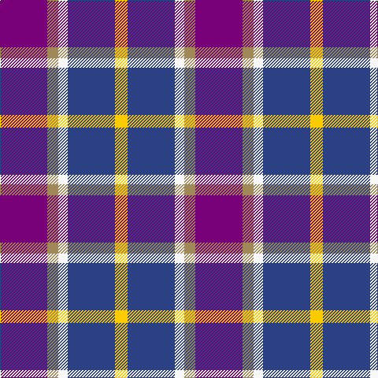

In pattern [BYWBY](/stripes/bywby/).

This was sourced from register-of-tartans.  It is a [5 stripe tartan](/stripes/stripes5/).

Original link https://www.tartanregister.gov.uk/tartanDetails.aspx?ref=11257

## Register references

External register numbers recorded for this tartan.

- Scottish Register of Tartans: [11257](https://www.tartanregister.gov.uk/tartanDetails.aspx?ref=11257)

## Thread count
P/60 LT14 W12 B60 Y/16

## Palette
Each colour and the base-6 reference it is a variant of.

| Colour | Shade | Base |
|---|---|---|
| B | <code style="background-color:#2C4084;">#2C4084</code> `oklch(39.4% 0.117 268.3)` <small>#2C4084</small> | B <code style="background-color:#2A418A;">#2A418A</code> |
| LT | <code style="background-color:#A08858;">#A08858</code> `oklch(63.7% 0.071 84.0)` <small>#A08858</small> | Y <code style="background-color:#F2BF00;">#F2BF00</code> |
| P | <code style="background-color:#780078;">#780078</code> `oklch(40.2% 0.185 328.4)` <small>#780078</small> | B <code style="background-color:#2A418A;">#2A418A</code> |
| W | <code style="background-color:#F8F8F8;">#F8F8F8</code> `oklch(97.9% 0.000 89.9)` <small>#F8F8F8</small> | W <code style="background-color:#F7F7F7;">#F7F7F7</code> |
| Y | <code style="background-color:#FCCC00;">#FCCC00</code> `oklch(86.2% 0.176 91.5)` <small>#FCCC00</small> | Y <code style="background-color:#F2BF00;">#F2BF00</code> |

# Sample pattern

## Nearest tartans

The nearest existing variants by ΔTartan distance.

1. [Pownall (2015)](/setts/s5/dp30y7w6db30ly8~x2/) — ΔT 0.31
1. [Unidentified Printing](/setts/s7/r2db4r6db2lb6k1ly2~x2/) — ΔT 1.27
1. [U.S. Postal Service (Corporate)](/setts/s7/k2t10r5w2db2w2r2~x6/) — ΔT 1.40
1. [Benreay Medical Centre (Corporate)](/setts/s6/dp4r1b5dp4k6lb1~x4/) — ΔT 1.41
1. [Think Pink (ICF)](/setts/s5/k4db2lr13m13lb2~x4/) — ΔT 1.43
1. [Bryson (1988) (Name)](/setts/s5/lr2r1t7db7lb1~x8/) — ΔT 1.43
1. [Lands of Liberty (Fashion)](/setts/s5/r15w10db48t32r6~x2/) — ΔT 1.45
1. [Fife (McGill)](/setts/s6/db31t4db6k19r20ly4~x2/) — ΔT 1.53
1. [Common Ground Dress (Fashion)](/setts/s5/w3r27w16db27lo3~x2/) — ΔT 1.57
1. [Over Mountain](/setts/s7/r2b1db8b8o8b1o1~x2/) — ΔT 1.58

## Neighbour map

Every grey dot is one of 14299 variants placed by the first two principal components of the ΔTartan feature space (44% of its variance). Red is this tartan; blue dots are its nearest — click one to open its page.

<svg viewBox="0 0 640 380" role="img" style="max-width:100%;height:auto;border:1px solid #e0e0e0;border-radius:4px;display:block" xmlns="http://www.w3.org/2000/svg"><image href="/nn/cloud.v1.png" width="640" height="380"/><a href="/setts/s5/dp30y7w6db30ly8~x2/"><circle cx="136.5" cy="223.6" r="4" fill="#3465a4"><title>Pownall (2015)</title></circle></a><a href="/setts/s7/r2db4r6db2lb6k1ly2~x2/"><circle cx="84.4" cy="203.6" r="4" fill="#3465a4"><title>Unidentified Printing</title></circle></a><a href="/setts/s7/k2t10r5w2db2w2r2~x6/"><circle cx="119.0" cy="189.4" r="4" fill="#3465a4"><title>U.S. Postal Service (Corporate)</title></circle></a><a href="/setts/s6/dp4r1b5dp4k6lb1~x4/"><circle cx="142.6" cy="240.9" r="4" fill="#3465a4"><title>Benreay Medical Centre (Corporate)</title></circle></a><a href="/setts/s5/k4db2lr13m13lb2~x4/"><circle cx="167.3" cy="202.0" r="4" fill="#3465a4"><title>Think Pink (ICF)</title></circle></a><a href="/setts/s5/lr2r1t7db7lb1~x8/"><circle cx="161.2" cy="211.8" r="4" fill="#3465a4"><title>Bryson (1988) (Name)</title></circle></a><a href="/setts/s5/r15w10db48t32r6~x2/"><circle cx="186.1" cy="222.9" r="4" fill="#3465a4"><title>Lands of Liberty (Fashion)</title></circle></a><a href="/setts/s6/db31t4db6k19r20ly4~x2/"><circle cx="188.6" cy="209.0" r="4" fill="#3465a4"><title>Fife (McGill)</title></circle></a><a href="/setts/s5/w3r27w16db27lo3~x2/"><circle cx="165.3" cy="208.2" r="4" fill="#3465a4"><title>Common Ground Dress (Fashion)</title></circle></a><a href="/setts/s7/r2b1db8b8o8b1o1~x2/"><circle cx="171.2" cy="206.4" r="4" fill="#3465a4"><title>Over Mountain</title></circle></a><circle cx="134.8" cy="222.5" r="5" fill="#c00000"/></svg>

ID: /setts/s5/dp30lo7w6db30ly8~x2/
