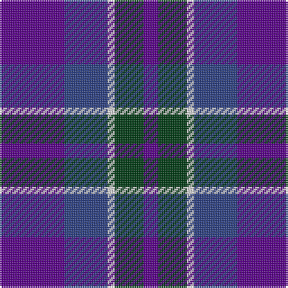

This page is one **sett** — a single exact thread-count. It belongs to the [tartan](/tartans/dp9db6w1dg4dp2/)
(the same proportion at any scale), whose colour order is pattern [BBWGB](/stripes/bbwgb/).

Sourced from register-of-tartans.  It is a [5 stripe tartan](/stripes/stripes5/).

Original link https://www.tartanregister.gov.uk/tartanDetails.aspx?ref=5875

## Register references

External register numbers recorded for this tartan.

- Scottish Register of Tartans: [5875](https://www.tartanregister.gov.uk/tartanDetails.aspx?ref=5875)
- Scottish Tartans Authority (ITI): 7354
- Scottish Tartans World Register: 3113

## Thread count
P/36 B24 LN4 DG16 P/8

## Palette

Palette: <strong>Tartan Register</strong>
<table><thead><tr><th>Colour</th><th>Threads</th><th>Shade</th><th>Base</th><th>OKLCh</th></tr></thead><tbody><tr><td>P/</td><td style="text-align:right;font-variant-numeric:tabular-nums">36</td><td><code style="background-color:#5A008C;">#5A008C</code> <small style="color:#888">#5A008C</small></td><td>B <code style="background-color:#2A418A;">#2A418A</code></td><td><small style="color:#888">oklch(37.0% 0.191 306.3)</small></td></tr><tr><td>B</td><td style="text-align:right;font-variant-numeric:tabular-nums">24</td><td><code style="background-color:#2C4084;">#2C4084</code> <small style="color:#888">#2C4084</small></td><td>B <code style="background-color:#2A418A;">#2A418A</code></td><td><small style="color:#888">oklch(39.4% 0.117 268.3)</small></td></tr><tr><td>LN</td><td style="text-align:right;font-variant-numeric:tabular-nums">4</td><td><code style="background-color:#E0E0E0;">#E0E0E0</code> <small style="color:#888">#E0E0E0</small></td><td>W <code style="background-color:#F7F7F7;">#F7F7F7</code></td><td><small style="color:#888">oklch(90.7% 0.000 89.9)</small></td></tr><tr><td>DG</td><td style="text-align:right;font-variant-numeric:tabular-nums">16</td><td><code style="background-color:#003C14;">#003C14</code> <small style="color:#888">#003C14</small></td><td>G <code style="background-color:#006100;">#006100</code></td><td><small style="color:#888">oklch(31.1% 0.089 148.5)</small></td></tr><tr><td>P/</td><td style="text-align:right;font-variant-numeric:tabular-nums">8</td><td><code style="background-color:#5A008C;">#5A008C</code> <small style="color:#888">#5A008C</small></td><td>B <code style="background-color:#2A418A;">#2A418A</code></td><td><small style="color:#888">oklch(37.0% 0.191 306.3)</small></td></tr></tbody></table>

# Sample pattern

## Nearest tartans

The nearest existing variants by ΔTartan distance, with this tartan at the top so the swatches line up against it.

ΔTartan

Tartan

Sett

—

<a href="/ttd/edit/#slug=dp9db6w1dg4dp2~x4">Cathro</a> <a class="nn-out" href="/setts/s5/dp9db6w1dg4dp2~x4/" title="open its dictionary page">↗</a>

1.36

<a href="/ttd/edit/#slug=dp20db25w3k2~x2">Murdoch, Ellis (Personal)</a> <a class="nn-out" href="/setts/s4/dp20db25w3k2~x2/" title="open its dictionary page">↗</a>

1.37

<a href="/ttd/edit/#slug=db23dp2g11dp24lb3~x2">Scottish Open Squash (Corporate)</a> <a class="nn-out" href="/setts/s5/db23dp2g11dp24lb3~x2/" title="open its dictionary page">↗</a>

1.40

<a href="/ttd/edit/#slug=db21k10dt8r3~x2">Rangers 1989 (Sports)</a> <a class="nn-out" href="/setts/s4/db21k10dt8r3~x2/" title="open its dictionary page">↗</a>

1.40

<a href="/ttd/edit/#slug=r21db43dt86lb10">Fong (Personal)</a> <a class="nn-out" href="/setts/s4/r21db43dt86lb10/" title="open its dictionary page">↗</a>

1.44

<a href="/ttd/edit/#slug=b11k1b3k5dp9lo1~x2">Joker Fancy Tartan Tartan Number: 6769. Earliest known date: 2005 I have a photo of a fabric swatch that I am trying to match as close as possible. I have been commissioned to make a life size mannequin of Jack Nicholson as the Joker and he wore plaid/tartan pants. I could send you some photos through email and possibly you could help me. Thanks, Andy Garringer USA, January 2008. (96 threads @ 40 epi heavyweight = 2.5 inch repeat) See products available Copyright © Blair Urquhart, Comrie, 2015</a> <a class="nn-out" href="/setts/s6/b11k1b3k5dp9lo1~x2/" title="open its dictionary page">↗</a>

1.49

<a href="/ttd/edit/#slug=p20db25w3k2~x2">Murdoch, Ellis (Personal)</a> <a class="nn-out" href="/setts/s4/p20db25w3k2~x2/" title="open its dictionary page">↗</a>

1.57

<a href="/ttd/edit/#slug=db6w3db21k16dp6k3dp6~x2">Heritage of Scotland</a> <a class="nn-out" href="/setts/s7/db6w3db21k16dp6k3dp6~x2/" title="open its dictionary page">↗</a>

1.57

<a href="/ttd/edit/#slug=p9b6w1g4p2~x8">Cathro (Name)</a> <a class="nn-out" href="/setts/s5/p9b6w1g4p2~x8/" title="open its dictionary page">↗</a>

1.60

<a href="/ttd/edit/#slug=t8r3dbi29db29t4~x2">Bryson</a> <a class="nn-out" href="/setts/s5/t8r3dbi29db29t4~x2/" title="open its dictionary page">↗</a>

1.62

<a href="/ttd/edit/#slug=t5db30k25t5db30dp3t5~x2">Van Loo Tartan Tartan Number: 6717. Earliest known date: pre 2005 Nothing See products available Copyright © Blair Urquhart, Comrie, 2015</a> <a class="nn-out" href="/setts/s7/t5db30k25t5db30dp3t5~x2/" title="open its dictionary page">↗</a>

## Neighbour map

Every grey dot is one of 14359 variants placed by the first two principal components of the ΔTartan feature space (44% of its variance). Red is this tartan; blue dots are its nearest — click one to open its page.

<svg viewBox="0 0 640 380" role="img" style="max-width:100%;height:auto;border:1px solid #e0e0e0;border-radius:4px;display:block" xmlns="http://www.w3.org/2000/svg"><image href="/nn/cloud.v1.png" width="640" height="380"/><a href="/setts/s4/dp20db25w3k2~x2/"><circle cx="341.7" cy="243.4" r="4" fill="#3465a4"><title>Murdoch, Ellis (Personal)</title></circle></a><a href="/setts/s5/db23dp2g11dp24lb3~x2/"><circle cx="258.6" cy="240.6" r="4" fill="#3465a4"><title>Scottish Open Squash (Corporate)</title></circle></a><a href="/setts/s4/db21k10dt8r3~x2/"><circle cx="301.7" cy="304.6" r="4" fill="#3465a4"><title>Rangers 1989 (Sports)</title></circle></a><a href="/setts/s4/r21db43dt86lb10/"><circle cx="291.7" cy="258.8" r="4" fill="#3465a4"><title>Fong (Personal)</title></circle></a><a href="/setts/s6/b11k1b3k5dp9lo1~x2/"><circle cx="263.6" cy="229.4" r="4" fill="#3465a4"><title>Joker Fancy Tartan Tartan Number: 6769. Earliest known date: 2005 I have a photo of a fabric swatch that I am trying to match as close as possible. I have been commissioned to make a life size mannequin of Jack Nicholson as the Joker and he wore plaid/tartan pants. I could send you some photos through email and possibly you could help me. Thanks, Andy Garringer USA, January 2008. (96 threads @ 40 epi heavyweight = 2.5 inch repeat) See products available Copyright © Blair Urquhart, Comrie, 2015</title></circle></a><a href="/setts/s4/p20db25w3k2~x2/"><circle cx="326.2" cy="239.3" r="4" fill="#3465a4"><title>Murdoch, Ellis (Personal)</title></circle></a><a href="/setts/s7/db6w3db21k16dp6k3dp6~x2/"><circle cx="226.2" cy="237.7" r="4" fill="#3465a4"><title>Heritage of Scotland</title></circle></a><a href="/setts/s5/p9b6w1g4p2~x8/"><circle cx="270.3" cy="251.9" r="4" fill="#3465a4"><title>Cathro (Name)</title></circle></a><a href="/setts/s5/t8r3dbi29db29t4~x2/"><circle cx="283.9" cy="263.1" r="4" fill="#3465a4"><title>Bryson</title></circle></a><a href="/setts/s7/t5db30k25t5db30dp3t5~x2/"><circle cx="349.1" cy="241.3" r="4" fill="#3465a4"><title>Van Loo Tartan Tartan Number: 6717. Earliest known date: pre 2005 Nothing See products available Copyright © Blair Urquhart, Comrie, 2015</title></circle></a><circle cx="288.0" cy="264.8" r="5" fill="#c00000"/></svg>

ID: /setts/s5/dp9db6w1dg4dp2~x4/
