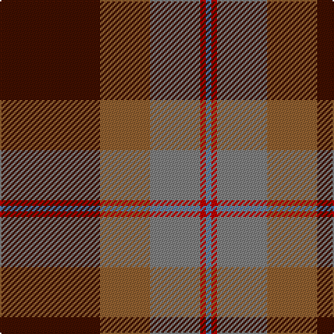

This page is one **sett** — a single exact thread-count. It belongs to the [tartan](/tartans/dr18o9y9r1t1/)
(the same proportion at any scale), whose colour order is pattern [BRGRB](/stripes/brgrb/).

Sourced from weddslist.  It is a [5 stripe tartan](/stripes/stripes5/).

Original link http://www.weddslist.com/cgi-bin/tartans/pg.pl?source=sts

## Thread count
DR/72 LT36 N36 R4 B/4

## Palette

Palette: <strong>Tartan Register</strong> <small style="color:#888">(1 of 5 colours)</small>
<table><thead><tr><th>Colour</th><th>Threads</th><th>Shade</th><th>Base</th><th>OKLCh</th></tr></thead><tbody><tr><td>DR/</td><td style="text-align:right;font-variant-numeric:tabular-nums">72</td><td><code style="background-color:#401000;">#401000</code> <small style="color:#888">#401000</small></td><td>B <code style="background-color:#2A418A;">#2A418A</code></td><td><small style="color:#888">oklch(25.3% 0.079 39.9)</small></td></tr><tr><td>LT</td><td style="text-align:right;font-variant-numeric:tabular-nums">36</td><td><code style="background-color:#906030;">#906030</code> <small style="color:#888">#906030</small></td><td>R <code style="background-color:#CC0000;">#CC0000</code></td><td><small style="color:#888">oklch(53.1% 0.089 63.7)</small></td></tr><tr><td>N</td><td style="text-align:right;font-variant-numeric:tabular-nums">36</td><td><code style="background-color:#808080;">#808080</code> <small style="color:#888">#808080</small></td><td>G <code style="background-color:#006100;">#006100</code></td><td><small style="color:#888">oklch(60.0% 0.000 89.9)</small></td></tr><tr><td>R</td><td style="text-align:right;font-variant-numeric:tabular-nums">4</td><td><code style="background-color:#C00000;">#C00000</code> <small style="color:#888">#C00000</small></td><td>R <code style="background-color:#CC0000;">#CC0000</code></td><td><small style="color:#888">oklch(50.7% 0.208 29.2)</small></td></tr><tr><td>B/</td><td style="text-align:right;font-variant-numeric:tabular-nums">4</td><td><code style="background-color:#5480B0;">#5480B0</code> <small style="color:#888">#5480B0</small></td><td>B <code style="background-color:#2A418A;">#2A418A</code></td><td><small style="color:#888">oklch(58.8% 0.089 251.5)</small></td></tr></tbody></table>

# Sample pattern

## Nearest tartans

The nearest existing variants by ΔTartan distance, with this tartan at the top so the swatches line up against it.

ΔTartan

Tartan

Sett

—

<a href="/ttd/edit/#slug=dr18o9y9r1t1~x4">Jardine</a> <a class="nn-out" href="/setts/s5/dr18o9y9r1t1~x4/" title="open its dictionary page">↗</a>

0.85

<a href="/ttd/edit/#slug=k8lo2n30r30lb3~x2">Douglas Ancient Red</a> <a class="nn-out" href="/setts/s5/k8lo2n30r30lb3~x2/" title="open its dictionary page">↗</a>

0.89

<a href="/ttd/edit/#slug=n9do2dg12o31lo9~x2">Buncle (Duns)</a> <a class="nn-out" href="/setts/s5/n9do2dg12o31lo9~x2/" title="open its dictionary page">↗</a>

1.07

<a href="/ttd/edit/#slug=dp2g18dp15r24k1ly2~x2">Miller, Reverend Ian (Personal</a> <a class="nn-out" href="/setts/s6/dp2g18dp15r24k1ly2~x2/" title="open its dictionary page">↗</a>

1.08

<a href="/ttd/edit/#slug=t9dy2g12r31lo9~x2">Buncle (Name)</a> <a class="nn-out" href="/setts/s5/t9dy2g12r31lo9~x2/" title="open its dictionary page">↗</a>

1.10

<a href="/ttd/edit/#slug=ly2dg17g4r15dg1~x2">Christmas</a> <a class="nn-out" href="/setts/s5/ly2dg17g4r15dg1~x2/" title="open its dictionary page">↗</a>

1.16

<a href="/ttd/edit/#slug=o50k25dg10o5ly2~x2">MacGleish Formal (Personal)</a> <a class="nn-out" href="/setts/s5/o50k25dg10o5ly2~x2/" title="open its dictionary page">↗</a>

1.20

<a href="/ttd/edit/#slug=lb2dr12g6dr1n6dr1~x4">Fraser Green</a> <a class="nn-out" href="/setts/s6/lb2dr12g6dr1n6dr1~x4/" title="open its dictionary page">↗</a>

1.24

<a href="/ttd/edit/#slug=r3db1r12o3dg12lb1dg2~x4">Leckie (Personal)</a> <a class="nn-out" href="/setts/s7/r3db1r12o3dg12lb1dg2~x4/" title="open its dictionary page">↗</a>

1.25

<a href="/ttd/edit/#slug=r30k8dg30b4r3b2~x2">Plummer Family Personal Tartan Tartan Number: 2778. Earliest known date: 2001 From a D C Dalgliesh swatch in 2001 via Phil Smith June 2004. See products available Copyright © Blair Urquhart, Comrie, 2015</a> <a class="nn-out" href="/setts/s6/r30k8dg30b4r3b2~x2/" title="open its dictionary page">↗</a>

1.27

<a href="/ttd/edit/#slug=dt12w2dt13dg3g2r24g3~x2">Wellmont Foundation (Corporate)</a> <a class="nn-out" href="/setts/s7/dt12w2dt13dg3g2r24g3~x2/" title="open its dictionary page">↗</a>

## Neighbour map

Every grey dot is one of 14299 variants placed by the first two principal components of the ΔTartan feature space (44% of its variance). Red is this tartan; blue dots are its nearest — click one to open its page.

<svg viewBox="0 0 640 380" role="img" style="max-width:100%;height:auto;border:1px solid #e0e0e0;border-radius:4px;display:block" xmlns="http://www.w3.org/2000/svg"><image href="/nn/cloud.v1.png" width="640" height="380"/><a href="/setts/s5/k8lo2n30r30lb3~x2/"><circle cx="283.9" cy="200.2" r="4" fill="#3465a4"><title>Douglas Ancient Red</title></circle></a><a href="/setts/s5/n9do2dg12o31lo9~x2/"><circle cx="282.4" cy="197.8" r="4" fill="#3465a4"><title>Buncle (Duns)</title></circle></a><a href="/setts/s6/dp2g18dp15r24k1ly2~x2/"><circle cx="264.8" cy="168.6" r="4" fill="#3465a4"><title>Miller, Reverend Ian (Personal</title></circle></a><a href="/setts/s5/t9dy2g12r31lo9~x2/"><circle cx="283.8" cy="198.0" r="4" fill="#3465a4"><title>Buncle (Name)</title></circle></a><a href="/setts/s5/ly2dg17g4r15dg1~x2/"><circle cx="302.1" cy="200.2" r="4" fill="#3465a4"><title>Christmas</title></circle></a><a href="/setts/s5/o50k25dg10o5ly2~x2/"><circle cx="341.9" cy="164.9" r="4" fill="#3465a4"><title>MacGleish Formal (Personal)</title></circle></a><a href="/setts/s6/lb2dr12g6dr1n6dr1~x4/"><circle cx="288.5" cy="212.1" r="4" fill="#3465a4"><title>Fraser Green</title></circle></a><a href="/setts/s7/r3db1r12o3dg12lb1dg2~x4/"><circle cx="275.0" cy="180.8" r="4" fill="#3465a4"><title>Leckie (Personal)</title></circle></a><a href="/setts/s6/r30k8dg30b4r3b2~x2/"><circle cx="280.6" cy="187.6" r="4" fill="#3465a4"><title>Plummer Family Personal Tartan Tartan Number: 2778. Earliest known date: 2001 From a D C Dalgliesh swatch in 2001 via Phil Smith June 2004. See products available Copyright © Blair Urquhart, Comrie, 2015</title></circle></a><a href="/setts/s7/dt12w2dt13dg3g2r24g3~x2/"><circle cx="248.5" cy="179.7" r="4" fill="#3465a4"><title>Wellmont Foundation (Corporate)</title></circle></a><circle cx="287.2" cy="192.1" r="5" fill="#c00000"/></svg>

ID: /setts/s5/dr18o9y9r1t1~x4/
