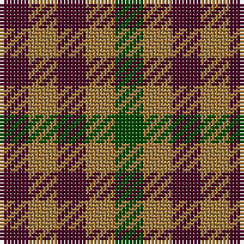

In pattern [BRBRG](/stripes/brbrg/).

This was sourced from register-of-tartans.  It is a [5 stripe tartan](/stripes/stripes5/).

Original link https://www.tartanregister.gov.uk/tartanDetails.aspx?ref=5001

## Register references

External register numbers recorded for this tartan.

- Scottish Register of Tartans: [5001](https://www.tartanregister.gov.uk/tartanDetails.aspx?ref=5001)
- Scottish Tartans Authority (ITI): 3641

## Thread count
DR/8 LT8 DR8 LT8 G/8

## Palette
Each colour and the base-6 reference it is a variant of.

| Colour | Shade | Base |
|---|---|---|
| DR | <code style="background-color:#4C0C28;">#4C0C28</code> `oklch(28.2% 0.097 359.3)` <small>#4C0C28</small> | B <code style="background-color:#2A418A;">#2A418A</code> |
| G | <code style="background-color:#004C00;">#004C00</code> `oklch(36.1% 0.123 142.5)` <small>#004C00</small> | G <code style="background-color:#006100;">#006100</code> |
| LT | <code style="background-color:#A0783C;">#A0783C</code> `oklch(60.0% 0.092 75.5)` <small>#A0783C</small> | R <code style="background-color:#CC0000;">#CC0000</code> |

# Sample pattern

## Nearest tartans

The nearest existing variants by ΔTartan distance, with this tartan at the top so the swatches line up against it.

ΔTartan

Tartan

Sett

—

<a href="/ttd/edit/#slug=dr1o1dr1o1dg1~x8">Ballindalloch Check</a> <a class="nn-out" href="/setts/s5/dr1o1dr1o1dg1~x8/" title="open its dictionary page">↗</a>

1.43

<a href="/setts/s4/k1g1r1~x8/">Wilson's No.187</a>

1.73

<a href="/ttd/edit/#slug=k11g9r10~x2">Wilson's No.204</a> <a class="nn-out" href="/setts/s3/k11g9r10~x2/" title="open its dictionary page">↗</a>

2.06

<a href="/ttd/edit/#slug=k11g9dp10~x2">Wilson's No.185</a> <a class="nn-out" href="/setts/s3/k11g9dp10~x2/" title="open its dictionary page">↗</a>

2.11

<a href="/ttd/edit/#slug=r1o1k1o1y1o1k1o1y1~x12">Seaforth (Estate Check)</a> <a class="nn-out" href="/setts/s9/r1o1k1o1y1o1k1o1y1~x12/" title="open its dictionary page">↗</a>

2.11

<a href="/ttd/edit/#slug=r1o1k1o1y1o1k1o1y1~x6">Seaforth Estate Check Estate Check Weavers Tartan Tartan Number: 5344. Earliest known date: pre 1990 No details. See products available Copyright © Blair Urquhart, Comrie, 2015</a> <a class="nn-out" href="/setts/s9/r1o1k1o1y1o1k1o1y1~x6/" title="open its dictionary page">↗</a>

2.32

<a href="/ttd/edit/#slug=r1db1ly1~x40">Mothers Pride</a> <a class="nn-out" href="/setts/s3/r1db1ly1~x40/" title="open its dictionary page">↗</a>

2.33

<a href="/ttd/edit/#slug=r1ly1g1ly1r1ly1g1~x8">Lochwood (Estate Check)</a> <a class="nn-out" href="/setts/s7/r1ly1g1ly1r1ly1g1~x8/" title="open its dictionary page">↗</a>

2.37

<a href="/ttd/edit/#slug=k1g1r1~x8">Wilson's, No 187</a> <a class="nn-out" href="/setts/s3/k1g1r1~x8/" title="open its dictionary page">↗</a>

2.40

<a href="/ttd/edit/#slug=dp1k1dy1r1~x4">Bowater (Estate Check)</a> <a class="nn-out" href="/setts/s4/dp1k1dy1r1~x4/" title="open its dictionary page">↗</a>

2.47

<a href="/ttd/edit/#slug=db1lr1r1~x4">Usa</a> <a class="nn-out" href="/setts/s3/db1lr1r1~x4/" title="open its dictionary page">↗</a>

## Neighbour map

Every grey dot is one of 14299 variants placed by the first two principal components of the ΔTartan feature space (44% of its variance). Red is this tartan; blue dots are its nearest — click one to open its page.

<svg viewBox="0 0 640 380" role="img" style="max-width:100%;height:auto;border:1px solid #e0e0e0;border-radius:4px;display:block" xmlns="http://www.w3.org/2000/svg"><image href="/nn/cloud.v1.png" width="640" height="380"/><a href="/setts/s4/k1g1r1~x8/"><circle cx="90.0" cy="366.0" r="4" fill="#3465a4"><title>Wilson's No.187</title></circle></a><a href="/setts/s3/k11g9r10~x2/"><circle cx="64.1" cy="366.0" r="4" fill="#3465a4"><title>Wilson's No.204</title></circle></a><a href="/setts/s3/k11g9dp10~x2/"><circle cx="78.1" cy="366.0" r="4" fill="#3465a4"><title>Wilson's No.185</title></circle></a><a href="/setts/s9/r1o1k1o1y1o1k1o1y1~x12/"><circle cx="14.0" cy="366.0" r="4" fill="#3465a4"><title>Seaforth (Estate Check)</title></circle></a><a href="/setts/s9/r1o1k1o1y1o1k1o1y1~x6/"><circle cx="14.0" cy="366.0" r="4" fill="#3465a4"><title>Seaforth Estate Check Estate Check Weavers Tartan Tartan Number: 5344. Earliest known date: pre 1990 No details. See products available Copyright © Blair Urquhart, Comrie, 2015</title></circle></a><a href="/setts/s3/r1db1ly1~x40/"><circle cx="14.0" cy="366.0" r="4" fill="#3465a4"><title>Mothers Pride</title></circle></a><a href="/setts/s7/r1ly1g1ly1r1ly1g1~x8/"><circle cx="14.0" cy="366.0" r="4" fill="#3465a4"><title>Lochwood (Estate Check)</title></circle></a><a href="/setts/s3/k1g1r1~x8/"><circle cx="14.0" cy="366.0" r="4" fill="#3465a4"><title>Wilson's, No 187</title></circle></a><a href="/setts/s4/dp1k1dy1r1~x4/"><circle cx="14.0" cy="366.0" r="4" fill="#3465a4"><title>Bowater (Estate Check)</title></circle></a><a href="/setts/s3/db1lr1r1~x4/"><circle cx="14.0" cy="366.0" r="4" fill="#3465a4"><title>Usa</title></circle></a><circle cx="67.6" cy="366.0" r="5" fill="#c00000"/></svg>

ID: /setts/s5/dr1o1dr1o1dg1~x8/
