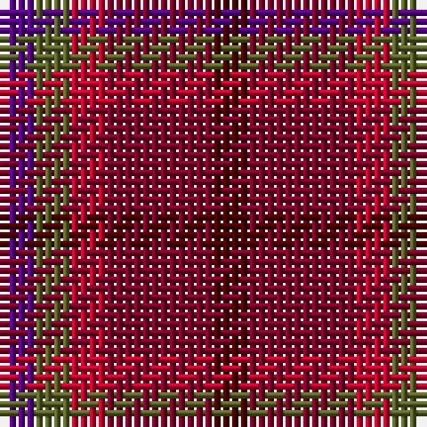

This page is one **sett** — a single exact thread-count. It belongs to the [tartan](/tartans/p1g1r1dr3dra1/)
(the same proportion at any scale), whose colour order is pattern [BGRRB](/stripes/bgrrb/).

Sourced from register-of-tartans.  It is a [5 stripe tartan](/stripes/stripes5/).

Original link https://www.tartanregister.gov.uk/tartanDetails.aspx?ref=11150

## Register references

External register numbers recorded for this tartan.

- Scottish Register of Tartans: [11150](https://www.tartanregister.gov.uk/tartanDetails.aspx?ref=11150)

## Thread count
P/4 G4 R4 DR12 DRa/4

## Palette
Each colour and the base-6 reference it is a variant of.

| Colour | Shade | Base |
|---|---|---|
| DR | <code style="background-color:#800028;">#800028</code> `oklch(38.2% 0.152 14.5)` <small>#800028</small> | R <code style="background-color:#CC0000;">#CC0000</code> |
| DRa | <code style="background-color:#4C0000;">#4C0000</code> `oklch(26.2% 0.107 29.2)` <small>#4C0000</small> | B <code style="background-color:#2A418A;">#2A418A</code> |
| G | <code style="background-color:#5C6428;">#5C6428</code> `oklch(48.3% 0.084 116.0)` <small>#5C6428</small> | G <code style="background-color:#006100;">#006100</code> |
| P | <code style="background-color:#5A008C;">#5A008C</code> `oklch(37.0% 0.191 306.3)` <small>#5A008C</small> | B <code style="background-color:#2A418A;">#2A418A</code> |
| R | <code style="background-color:#C8002C;">#C8002C</code> `oklch(52.6% 0.212 22.0)` <small>#C8002C</small> | R <code style="background-color:#CC0000;">#CC0000</code> |

# Sample pattern

## Nearest tartans

The nearest existing variants by ΔTartan distance, with this tartan at the top so the swatches line up against it.

ΔTartan

Tartan

Sett

—

<a href="/ttd/edit/#slug=dr1r3r1y1dp1~x4">Blairgowrie Berries and Cherries</a> <a class="nn-out" href="/setts/s5/dr1r3r1y1dp1~x4/" title="open its dictionary page">↗</a>

1.00

<a href="/ttd/edit/#slug=dr1r3r1g1dp1~x8">Blairgowrie Berries and Cherries</a> <a class="nn-out" href="/setts/s5/dr1r3r1g1dp1~x8/" title="open its dictionary page">↗</a>

1.98

<a href="/ttd/edit/#slug=dg2dr12db11lo6dy6dr12dg2~x2">Heather MacRae</a> <a class="nn-out" href="/setts/s7/dg2dr12db11lo6dy6dr12dg2~x2/" title="open its dictionary page">↗</a>

2.07

<a href="/ttd/edit/#slug=r12r4r4r4r4dt11dg12t4~x2">Akins Clan Tartan Tartan Number: 2426. Earliest known date: 1822 This is the `Approved` tartan for the Akins Clan See products available Copyright © Blair Urquhart, Comrie, 2015</a> <a class="nn-out" href="/setts/s8/r12r4r4r4r4dt11dg12t4~x2/" title="open its dictionary page">↗</a>

2.22

<a href="/ttd/edit/#slug=n7r1dt6r8lr1~x8">Callum (Buchan) (Name)</a> <a class="nn-out" href="/setts/s5/n7r1dt6r8lr1~x8/" title="open its dictionary page">↗</a>

2.22

<a href="/ttd/edit/#slug=r10t5o5n4~x8">Haggis Hostels</a> <a class="nn-out" href="/setts/s4/r10t5o5n4~x8/" title="open its dictionary page">↗</a>

2.48

<a href="/ttd/edit/#slug=r4db24r21r21r4~x2">Ferguson Britt Red (Corporate)</a> <a class="nn-out" href="/setts/s5/r4db24r21r21r4~x2/" title="open its dictionary page">↗</a>

2.49

<a href="/ttd/edit/#slug=db3k1dg1k1m3~x16">Clark Clerk(e)</a> <a class="nn-out" href="/setts/s5/db3k1dg1k1m3~x16/" title="open its dictionary page">↗</a>

2.49

<a href="/ttd/edit/#slug=r5o3r19dr6o5dr6n12n5n12n3~x2">Roscommon</a> <a class="nn-out" href="/setts/s10/r5o3r19dr6o5dr6n12n5n12n3~x2/" title="open its dictionary page">↗</a>

2.50

<a href="/ttd/edit/#slug=r4n3n12db8n2r4">Bristol Gramar School Check (School)</a> <a class="nn-out" href="/setts/s6/r4n3n12db8n2r4/" title="open its dictionary page">↗</a>

2.50

<a href="/ttd/edit/#slug=lo23r22m52r8w6lo18">Lady Boys of Bangkok (Corporate)</a> <a class="nn-out" href="/setts/s6/lo23r22m52r8w6lo18/" title="open its dictionary page">↗</a>

## Neighbour map

Every grey dot is one of 14299 variants placed by the first two principal components of the ΔTartan feature space (44% of its variance). Red is this tartan; blue dots are its nearest — click one to open its page.

<svg viewBox="0 0 640 380" role="img" style="max-width:100%;height:auto;border:1px solid #e0e0e0;border-radius:4px;display:block" xmlns="http://www.w3.org/2000/svg"><image href="/nn/cloud.v1.png" width="640" height="380"/><a href="/setts/s5/dr1r3r1g1dp1~x8/"><circle cx="227.9" cy="309.1" r="4" fill="#3465a4"><title>Blairgowrie Berries and Cherries</title></circle></a><a href="/setts/s7/dg2dr12db11lo6dy6dr12dg2~x2/"><circle cx="228.1" cy="257.6" r="4" fill="#3465a4"><title>Heather MacRae</title></circle></a><a href="/setts/s8/r12r4r4r4r4dt11dg12t4~x2/"><circle cx="130.3" cy="269.3" r="4" fill="#3465a4"><title>Akins Clan Tartan Tartan Number: 2426. Earliest known date: 1822 This is the `Approved` tartan for the Akins Clan See products available Copyright © Blair Urquhart, Comrie, 2015</title></circle></a><a href="/setts/s5/n7r1dt6r8lr1~x8/"><circle cx="258.5" cy="263.0" r="4" fill="#3465a4"><title>Callum (Buchan) (Name)</title></circle></a><a href="/setts/s4/r10t5o5n4~x8/"><circle cx="178.3" cy="344.1" r="4" fill="#3465a4"><title>Haggis Hostels</title></circle></a><a href="/setts/s5/r4db24r21r21r4~x2/"><circle cx="240.6" cy="283.9" r="4" fill="#3465a4"><title>Ferguson Britt Red (Corporate)</title></circle></a><a href="/setts/s5/db3k1dg1k1m3~x16/"><circle cx="182.6" cy="325.7" r="4" fill="#3465a4"><title>Clark Clerk(e)</title></circle></a><a href="/setts/s10/r5o3r19dr6o5dr6n12n5n12n3~x2/"><circle cx="232.2" cy="235.8" r="4" fill="#3465a4"><title>Roscommon</title></circle></a><a href="/setts/s6/r4n3n12db8n2r4/"><circle cx="197.5" cy="265.4" r="4" fill="#3465a4"><title>Bristol Gramar School Check (School)</title></circle></a><a href="/setts/s6/lo23r22m52r8w6lo18/"><circle cx="228.7" cy="219.4" r="4" fill="#3465a4"><title>Lady Boys of Bangkok (Corporate)</title></circle></a><circle cx="210.2" cy="295.6" r="5" fill="#c00000"/></svg>

ID: /setts/s5/dr1r3r1y1dp1~x4/
