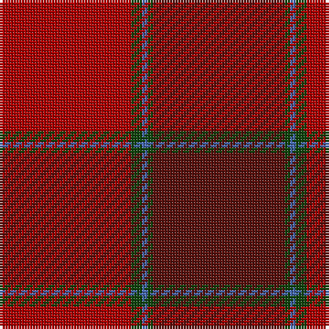

**Bands:** [RGBGB](/stripes/rgbgb/) · **Stripes:** [R DG B DG DR](/stripes/stripes5/) R DG B DG DR

This was sourced from weddslist.  It is a [5 band tartan](/bands/bands5/).

Original link http://www.weddslist.com/cgi-bin/tartans/pg.pl?source=tinsel

## Also known as

This cloth is also recorded under:

- MacNab WI1

## Attestations

This cloth appears in 2 source records; the oldest owns this page.

- undated — MacNab WI 1 (weddslist, [record](http://www.weddslist.com/cgi-bin/tartans/pg.pl?source=tinsel))
- undated — MacNab WI1 (weddslist, [record](http://www.weddslist.com/cgi-bin/tartans/pg.pl?source=x))

## Register references

External register numbers recorded for this tartan.

- Scottish Register of Tartans: [1166](https://www.tartanregister.gov.uk/tartanDetails.aspx?ref=1166)
- Scottish Register of Tartans: [1510](https://www.tartanregister.gov.uk/tartanDetails.aspx?ref=1510)
- Scottish Register of Tartans: [1758](https://www.tartanregister.gov.uk/tartanDetails.aspx?ref=1758)
- Scottish Register of Tartans: [2307](https://www.tartanregister.gov.uk/tartanDetails.aspx?ref=2307)
- Scottish Register of Tartans: [2349](https://www.tartanregister.gov.uk/tartanDetails.aspx?ref=2349)
- Scottish Register of Tartans: [2540](https://www.tartanregister.gov.uk/tartanDetails.aspx?ref=2540)
- Scottish Register of Tartans: [2582](https://www.tartanregister.gov.uk/tartanDetails.aspx?ref=2582)
- Scottish Register of Tartans: [2585](https://www.tartanregister.gov.uk/tartanDetails.aspx?ref=2585)
- Scottish Register of Tartans: [2625](https://www.tartanregister.gov.uk/tartanDetails.aspx?ref=2625)
- Scottish Register of Tartans: [2730](https://www.tartanregister.gov.uk/tartanDetails.aspx?ref=2730)
- Scottish Register of Tartans: [2862](https://www.tartanregister.gov.uk/tartanDetails.aspx?ref=2862)
- Scottish Register of Tartans: [3072](https://www.tartanregister.gov.uk/tartanDetails.aspx?ref=3072)
- Scottish Register of Tartans: [3555](https://www.tartanregister.gov.uk/tartanDetails.aspx?ref=3555)
- Scottish Register of Tartans: [4925](https://www.tartanregister.gov.uk/tartanDetails.aspx?ref=4925)
- Scottish Register of Tartans: [696](https://www.tartanregister.gov.uk/tartanDetails.aspx?ref=696)
- Scottish Register of Tartans: [697](https://www.tartanregister.gov.uk/tartanDetails.aspx?ref=697)
- Scottish Register of Tartans: [982](https://www.tartanregister.gov.uk/tartanDetails.aspx?ref=982)
- Scottish Tartans Authority (ITI): 1277
- Scottish Tartans Authority (ITI): 1429
- Scottish Tartans Authority (ITI): 218
- Scottish Tartans Authority (ITI): 977
- Scottish Tartans World Register: 1042
- Scottish Tartans World Register: 127
- Scottish Tartans World Register: 1277
- Scottish Tartans World Register: 1399
- Scottish Tartans World Register: 1429
- Scottish Tartans World Register: 1593
- Scottish Tartans World Register: 218
- Scottish Tartans World Register: 2218
- Scottish Tartans World Register: 3061
- Scottish Tartans World Register: 441
- Scottish Tartans World Register: 737
- Scottish Tartans World Register: 858
- Scottish Tartans World Register: 864
- Scottish Tartans World Register: 873
- Scottish Tartans World Register: 897
- Scottish Tartans World Register: 977
- Scottish Tartans World Register: 978

## Thread count
DR/48 DG4 B2 DG2 DRa/48

## Palette
Each colour and its ΔE from the base-6 reference it is a variant of.

| Colour | Shade | Base | ΔE (OKLab) |
|---|---|---|---|
| B | <code style="background-color:#4367AE;">#4367AE</code> `#4367AE` | B <code style="background-color:#2A418A;">#2A418A</code> | 0.12 |
| DG | <code style="background-color:#11450D;">#11450D</code> `#11450D` | G <code style="background-color:#006100;">#006100</code> | 0.09 |
| DR | <code style="background-color:#AA0000;">#AA0000</code> `#AA0000` | R <code style="background-color:#CC0000;">#CC0000</code> | 0.07 |
| DRa | <code style="background-color:#59110D;">#59110D</code> `#59110D` | B <code style="background-color:#2A418A;">#2A418A</code> | 0.22 |

# Sample pattern

## Nearest tartans

The nearest existing variants by ΔTartan distance.

1. [MacNab 4](/setts/s5/r24g2t1g1r24~x2/) — ΔT 1.60
1. [Cetoloni](/setts/s6/db2r22dy11y2dy11db2~x2/) — ΔT 1.79
1. [Isaia](/setts/s7/o80dr8o4k4y4k45do8/) — ΔT 1.87
1. [MacNab (Smith)](/setts/s5/r24g2t1g1m24~x4/) — ΔT 1.87
1. [Cetoloni Family Tartan Tartan Number: 2049. Earliest known date: November 1991 The Cetoloni tartan was designed with the colours of the Border Hills, 'the sky at its best, the rooftop skyline of Siena and the golden sun of Tuscany'. Franco Cetoloni of Liddlevale was born in Badia Roti Bucine in Arezzo, Italy. Jayne was a designer at Pringle's knitwear in Hawick. Red is Sienna red. See products available Copyright © Blair Urquhart, Comrie, 2015](/setts/s6/db2o22dy11ly2dy11db2~x2/) — ΔT 1.98
1. [Wasko (Personal)](/setts/s7/r8lr2o30dg12o3dg12o3~x2/) — ΔT 2.04
1. [MacNab - 1800 (Portrait)](/setts/s5/r96g3lb3g6r95/) — ΔT 2.05
1. [Cypress](/setts/s6/do2m2do17o17o2o2~x4/) — ΔT 2.07
1. [Rose VS](/setts/s9/dg4r32n9dr6n2dr3n2dr12lr3~x2/) — ΔT 2.12
1. [Rose VS](/setts/s9/dg4r32n9dr6n2dr3n2dr12lr3/) — ΔT 2.12

## Neighbour map

Every grey dot is one of 14299 variants placed by the first two principal components of the ΔTartan feature space (44% of its variance). Red is this tartan; blue dots are its nearest — click one to open its page.

<svg viewBox="0 0 640 380" role="img" style="max-width:100%;height:auto;border:1px solid #e0e0e0;border-radius:4px;display:block" xmlns="http://www.w3.org/2000/svg"><image href="/nn/cloud.v1.png" width="640" height="380"/><a href="/setts/s5/r24g2t1g1r24~x2/"><circle cx="472.6" cy="220.0" r="4" fill="#3465a4"><title>MacNab 4</title></circle></a><a href="/setts/s6/db2r22dy11y2dy11db2~x2/"><circle cx="354.2" cy="233.1" r="4" fill="#3465a4"><title>Cetoloni</title></circle></a><a href="/setts/s7/o80dr8o4k4y4k45do8/"><circle cx="444.7" cy="189.7" r="4" fill="#3465a4"><title>Isaia</title></circle></a><a href="/setts/s5/r24g2t1g1m24~x4/"><circle cx="474.6" cy="218.4" r="4" fill="#3465a4"><title>MacNab (Smith)</title></circle></a><a href="/setts/s6/db2o22dy11ly2dy11db2~x2/"><circle cx="357.6" cy="242.8" r="4" fill="#3465a4"><title>Cetoloni Family Tartan Tartan Number: 2049. Earliest known date: November 1991 The Cetoloni tartan was designed with the colours of the Border Hills, 'the sky at its best, the rooftop skyline of Siena and the golden sun of Tuscany'. Franco Cetoloni of Liddlevale was born in Badia Roti Bucine in Arezzo, Italy. Jayne was a designer at Pringle's knitwear in Hawick. Red is Sienna red. See products available Copyright © Blair Urquhart, Comrie, 2015</title></circle></a><a href="/setts/s7/r8lr2o30dg12o3dg12o3~x2/"><circle cx="385.7" cy="226.2" r="4" fill="#3465a4"><title>Wasko (Personal)</title></circle></a><a href="/setts/s5/r96g3lb3g6r95/"><circle cx="466.3" cy="183.6" r="4" fill="#3465a4"><title>MacNab - 1800 (Portrait)</title></circle></a><a href="/setts/s6/do2m2do17o17o2o2~x4/"><circle cx="379.1" cy="251.0" r="4" fill="#3465a4"><title>Cypress</title></circle></a><a href="/setts/s9/dg4r32n9dr6n2dr3n2dr12lr3~x2/"><circle cx="330.3" cy="171.1" r="4" fill="#3465a4"><title>Rose VS</title></circle></a><a href="/setts/s9/dg4r32n9dr6n2dr3n2dr12lr3/"><circle cx="330.3" cy="171.1" r="4" fill="#3465a4"><title>Rose VS</title></circle></a><circle cx="448.1" cy="214.6" r="5" fill="#c00000"/></svg>

ID: /setts/s5/dr24dg1b1dg2r24~x2/
