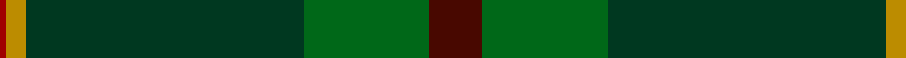

**Bands:** [BGGYR](/stripes/bggyr/) · **Stripes:** [DR G DG LO R](/stripes/stripes5/) DR G DG LO R

This was sourced from tartans-authority.  It is a [5 band tartan](/bands/bands5/).

Original link http://www.tartansauthority.com/tartan-ferret/display/10542/

## Thread count
DR/2 DY6 DG84 G38 DRa/16

## Palette
Each colour and its ΔE from the base-6 reference it is a variant of.

| Colour | Shade | Base | ΔE (OKLab) |
|---|---|---|---|
| DG | <code style="background-color:#003820;">#003820</code> `#003820` | G <code style="background-color:#006100;">#006100</code> | 0.15 |
| DR | <code style="background-color:#A00000;">#A00000</code> `#A00000` | R <code style="background-color:#CC0000;">#CC0000</code> | 0.09 |
| DRa | <code style="background-color:#480800;">#480800</code> `#480800` | B <code style="background-color:#2A418A;">#2A418A</code> | 0.24 |
| DY | <code style="background-color:#BC8C00;">#BC8C00</code> `#BC8C00` | Y <code style="background-color:#F2BF00;">#F2BF00</code> | 0.16 |
| G | <code style="background-color:#006818;">#006818</code> `#006818` | G <code style="background-color:#006100;">#006100</code> | 0.02 |

# Sample pattern

## Nearest tartans

The nearest existing variants by ΔTartan distance.

1. [MacWilliam Hunting](/setts/s6/dy2dg44k10r1db16r1~x2/) — ΔT 1.53
1. [Holehouse, Dag (Personal)](/setts/s5/g22dy40n8k9o1~x2/) — ΔT 1.55
1. [Green Swamp Youth Campers](/setts/s6/k8r2k13ly2dg48db6~x2/) — ΔT 1.62
1. [Exabyte](/setts/s5/lb3g47db4n34r3~x2/) — ΔT 1.82
1. [Unidentified, Toy Bear](/setts/s8/dg47ly2dg5ly2dg4k15db19r2~x2/) — ΔT 1.91
1. [McGeorge (Personal)](/setts/s6/lo4r2dg40dg39dg3r4~x2/) — ΔT 1.95
1. [Green Rover, The](/setts/s7/dy10k2y5k2dg46ly2k2~x2/) — ΔT 1.97
1. [Java Saint Andrew Society Hunting](/setts/s7/dt50g26k9g4lb2r2g10~x2/) — ΔT 1.99
1. [US Army Regimental Tartan Tartan Number: 6307. Earliest known date: 2004 The Army was the only arm of the U.S. Forces not to have its own tartan. The colours were chosen to represent the uniforms - black for the beret, khaki for the summer uniform, light green for the original sniper and now part of the summer uniform, dark blue for the original dress uniform, olive for the combat uniform and gold for the cavalry. See products available Copyright © Blair Urquhart, Comrie, 2015](/setts/s6/dt12k17y4dg51ly3g4~x2/) — ΔT 2.00
1. [Grenauld](/setts/s10/dg36k52lo2k8dg8dy8lo2dy6dg36r1~x2/) — ΔT 2.02

## Neighbour map

Every grey dot is one of 14313 variants placed by the first two principal components of the ΔTartan feature space (44% of its variance). Red is this tartan; blue dots are its nearest — click one to open its page.

<svg viewBox="0 0 640 380" role="img" style="max-width:100%;height:auto;border:1px solid #e0e0e0;border-radius:4px;display:block" xmlns="http://www.w3.org/2000/svg"><image href="/nn/cloud.v1.png" width="640" height="380"/><a href="/setts/s6/dy2dg44k10r1db16r1~x2/"><circle cx="428.2" cy="155.3" r="4" fill="#3465a4"><title>MacWilliam Hunting</title></circle></a><a href="/setts/s5/g22dy40n8k9o1~x2/"><circle cx="398.0" cy="211.7" r="4" fill="#3465a4"><title>Holehouse, Dag (Personal)</title></circle></a><a href="/setts/s6/k8r2k13ly2dg48db6~x2/"><circle cx="438.3" cy="192.6" r="4" fill="#3465a4"><title>Green Swamp Youth Campers</title></circle></a><a href="/setts/s5/lb3g47db4n34r3~x2/"><circle cx="380.7" cy="225.9" r="4" fill="#3465a4"><title>Exabyte</title></circle></a><a href="/setts/s8/dg47ly2dg5ly2dg4k15db19r2~x2/"><circle cx="391.9" cy="172.1" r="4" fill="#3465a4"><title>Unidentified, Toy Bear</title></circle></a><a href="/setts/s6/lo4r2dg40dg39dg3r4~x2/"><circle cx="367.8" cy="210.3" r="4" fill="#3465a4"><title>McGeorge (Personal)</title></circle></a><a href="/setts/s7/dy10k2y5k2dg46ly2k2~x2/"><circle cx="509.6" cy="187.4" r="4" fill="#3465a4"><title>Green Rover, The</title></circle></a><a href="/setts/s7/dt50g26k9g4lb2r2g10~x2/"><circle cx="354.5" cy="181.0" r="4" fill="#3465a4"><title>Java Saint Andrew Society Hunting</title></circle></a><a href="/setts/s6/dt12k17y4dg51ly3g4~x2/"><circle cx="351.6" cy="191.3" r="4" fill="#3465a4"><title>US Army Regimental Tartan Tartan Number: 6307. Earliest known date: 2004 The Army was the only arm of the U.S. Forces not to have its own tartan. The colours were chosen to represent the uniforms - black for the beret, khaki for the summer uniform, light green for the original sniper and now part of the summer uniform, dark blue for the original dress uniform, olive for the combat uniform and gold for the cavalry. See products available Copyright © Blair Urquhart, Comrie, 2015</title></circle></a><a href="/setts/s10/dg36k52lo2k8dg8dy8lo2dy6dg36r1~x2/"><circle cx="432.3" cy="170.3" r="4" fill="#3465a4"><title>Grenauld</title></circle></a><circle cx="439.8" cy="196.6" r="5" fill="#c00000"/></svg>

ID: /setts/s5/dr8g19dg42lo3r1~x2/
