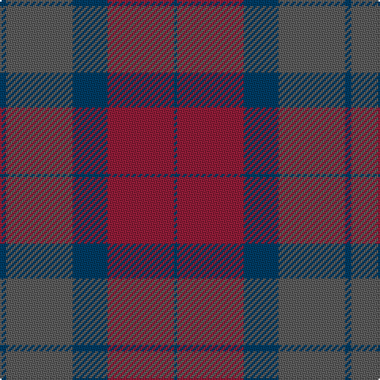

**Bands:** [BRBBB](/stripes/brbbb/) · **Stripes:** [DT R DT N DT](/stripes/stripes5/) DT R DT N DT

This was sourced from tartans-authority.  It is a [5 band tartan](/bands/bands5/).

Original link http://www.tartansauthority.com/tartan-ferret/display/8145/

## Thread count
DB/4 N42 DB22 DR42 DB/2

## Palette
Each colour and its ΔE from the base-6 reference it is a variant of.

| Colour | Shade | Base | ΔE (OKLab) |
|---|---|---|---|
| DB | <code style="background-color:#003C64;">#003C64</code> `#003C64` | B <code style="background-color:#2A418A;">#2A418A</code> | 0.08 |
| DR | <code style="background-color:#901C38;">#901C38</code> `#901C38` | R <code style="background-color:#CC0000;">#CC0000</code> | 0.13 |
| N | <code style="background-color:#5C5C5C;">#5C5C5C</code> `#5C5C5C` | B <code style="background-color:#2A418A;">#2A418A</code> | 0.15 |

# Sample pattern

## Nearest tartans

The nearest existing variants by ΔTartan distance.

1. [Aisteach](/setts/s7/dp32dg16o14k4o6dp7k2~x2/) — ΔT 1.82
1. [Harmony 6](/setts/s5/dg2dp10dy15dg10dp2~x4/) — ΔT 1.95
1. [Dempster Family Tartan Tartan Number: 2219. Earliest known date: 2001 Designed by Claire Donaldson of the House of Edgar. See products available Copyright © Blair Urquhart, Comrie, 2015](/setts/s7/dt4dg2dr16dr10dg10dt32n3~x2/) — ΔT 1.98
1. [Madder](/setts/s7/dg28r4dp27r27dg28r5dp2~x2/) — ΔT 2.02
1. [Granite City (Silver Granite) Fashion Tartan Tartan Number: 7459. Earliest known date: pre 2007 Produced for Mike King of Philip King Tailoring Ltd, Aberdeen. Previously recorded by the STA as 'Granite City'. Thought to have been produced for Mike King of Aberdeen. . It is believed that Lochcarron of Scotland have now (Jan 2008) trademarked the word ‘Granite’ when used in connection with tartans. See products available Copyright © Blair Urquhart, Comrie, 2015](/setts/s7/k3y3k3y21dy21k3y1~x2/) — ΔT 2.03
1. [Brave for Men (Fashion)](/setts/s8/k5dy5k5dy34n33k6n5o2/) — ΔT 2.10
1. [Unamed, Riding cloak 1745](/setts/s5/r1o8r2db8t1~x2/) — ΔT 2.13
1. [Klymson (Personal)](/setts/s4/n70lo16b3o45/) — ΔT 2.21
1. [Dunans Rising](/setts/s5/g35y25m15t2t21~x2/) — ΔT 2.21
1. [Granite City (Fashion)](/setts/s8/k3n3k3n21n21k3n3lr1~x2/) — ΔT 2.24

## Neighbour map

Every grey dot is one of 14299 variants placed by the first two principal components of the ΔTartan feature space (44% of its variance). Red is this tartan; blue dots are its nearest — click one to open its page.

<svg viewBox="0 0 640 380" role="img" style="max-width:100%;height:auto;border:1px solid #e0e0e0;border-radius:4px;display:block" xmlns="http://www.w3.org/2000/svg"><image href="/nn/cloud.v1.png" width="640" height="380"/><a href="/setts/s7/dp32dg16o14k4o6dp7k2~x2/"><circle cx="351.8" cy="235.5" r="4" fill="#3465a4"><title>Aisteach</title></circle></a><a href="/setts/s5/dg2dp10dy15dg10dp2~x4/"><circle cx="304.7" cy="309.3" r="4" fill="#3465a4"><title>Harmony 6</title></circle></a><a href="/setts/s7/dt4dg2dr16dr10dg10dt32n3~x2/"><circle cx="383.9" cy="251.1" r="4" fill="#3465a4"><title>Dempster Family Tartan Tartan Number: 2219. Earliest known date: 2001 Designed by Claire Donaldson of the House of Edgar. See products available Copyright © Blair Urquhart, Comrie, 2015</title></circle></a><a href="/setts/s7/dg28r4dp27r27dg28r5dp2~x2/"><circle cx="353.4" cy="270.9" r="4" fill="#3465a4"><title>Madder</title></circle></a><a href="/setts/s7/k3y3k3y21dy21k3y1~x2/"><circle cx="396.2" cy="224.2" r="4" fill="#3465a4"><title>Granite City (Silver Granite) Fashion Tartan Tartan Number: 7459. Earliest known date: pre 2007 Produced for Mike King of Philip King Tailoring Ltd, Aberdeen. Previously recorded by the STA as 'Granite City'. Thought to have been produced for Mike King of Aberdeen. . It is believed that Lochcarron of Scotland have now (Jan 2008) trademarked the word ‘Granite’ when used in connection with tartans. See products available Copyright © Blair Urquhart, Comrie, 2015</title></circle></a><a href="/setts/s8/k5dy5k5dy34n33k6n5o2/"><circle cx="356.4" cy="215.8" r="4" fill="#3465a4"><title>Brave for Men (Fashion)</title></circle></a><a href="/setts/s5/r1o8r2db8t1~x2/"><circle cx="299.5" cy="263.6" r="4" fill="#3465a4"><title>Unamed, Riding cloak 1745</title></circle></a><a href="/setts/s4/n70lo16b3o45/"><circle cx="420.5" cy="246.0" r="4" fill="#3465a4"><title>Klymson (Personal)</title></circle></a><a href="/setts/s5/g35y25m15t2t21~x2/"><circle cx="263.2" cy="271.6" r="4" fill="#3465a4"><title>Dunans Rising</title></circle></a><a href="/setts/s8/k3n3k3n21n21k3n3lr1~x2/"><circle cx="395.2" cy="224.8" r="4" fill="#3465a4"><title>Granite City (Fashion)</title></circle></a><circle cx="374.4" cy="268.1" r="5" fill="#c00000"/></svg>

ID: /setts/s5/dt2n21dt11r21dt1~x2/
