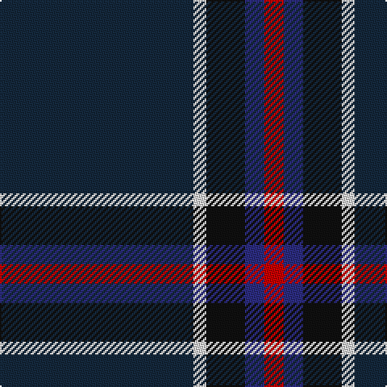

In pattern [BWKBR](/stripes/bwkbr/).

This was sourced from tartans-authority.  It is a [5 stripe tartan](/stripes/stripes5/).

Original link http://www.tartansauthority.com/tartan-ferret/display/2307/

## Thread count
DN/120 LN8 K24 DB12 R/12

## Palette
Each colour and the base-6 reference it is a variant of.

| Colour | Shade | Base |
|---|---|---|
| DB | <code style="background-color:#2C2C80;">#2C2C80</code> `oklch(35.0% 0.138 276.6)` <small>#2C2C80</small> | B <code style="background-color:#2A418A;">#2A418A</code> |
| DN | <code style="background-color:#14283C;">#14283C</code> `oklch(27.1% 0.046 249.9)` <small>#14283C</small> | B <code style="background-color:#2A418A;">#2A418A</code> |
| K | <code style="background-color:#101010;">#101010</code> `oklch(17.3% 0.000 89.9)` <small>#101010</small> | K <code style="background-color:#000000;">#000000</code> |
| LN | <code style="background-color:#E0E0E0;">#E0E0E0</code> `oklch(90.7% 0.000 89.9)` <small>#E0E0E0</small> | W <code style="background-color:#F7F7F7;">#F7F7F7</code> |
| R | <code style="background-color:#C80000;">#C80000</code> `oklch(52.3% 0.215 29.2)` <small>#C80000</small> | R <code style="background-color:#CC0000;">#CC0000</code> |

# Sample pattern

## Nearest tartans

The nearest existing variants by ΔTartan distance, with this tartan at the top so the swatches line up against it.

ΔTartan

Tartan

Sett

—

<a href="/ttd/edit/#slug=dt30w2k6db3r3~x4">Edinburgh Crystal (Corporate)</a> <a class="nn-out" href="/setts/s5/dt30w2k6db3r3~x4/" title="open its dictionary page">↗</a>

0.49

<a href="/ttd/edit/#slug=dt30lb2k6db3r3~x4">Edinburgh Crystal</a> <a class="nn-out" href="/setts/s5/dt30lb2k6db3r3~x4/" title="open its dictionary page">↗</a>

1.46

<a href="/ttd/edit/#slug=m11dr5dg5k40ly3~x2">MacShimsi Personal Tartan Tartan Number: 7318. Earliest known date: 2007 Designed for the MacShimsi Clan in Dundee See products available Copyright © Blair Urquhart, Comrie, 2015</a> <a class="nn-out" href="/setts/s5/m11dr5dg5k40ly3~x2/" title="open its dictionary page">↗</a>

1.49

<a href="/ttd/edit/#slug=k62o24lo5dg3~x2">Meaux, Luc G (Personal)</a> <a class="nn-out" href="/setts/s4/k62o24lo5dg3~x2/" title="open its dictionary page">↗</a>

1.55

<a href="/ttd/edit/#slug=dt27k5dp2n1dp1w1dp5~x4">Caledonian Mist</a> <a class="nn-out" href="/setts/s7/dt27k5dp2n1dp1w1dp5~x4/" title="open its dictionary page">↗</a>

1.57

<a href="/ttd/edit/#slug=k42n2k2n17db8lo4~x2">Connecticut State Police Pipe Band</a> <a class="nn-out" href="/setts/s6/k42n2k2n17db8lo4~x2/" title="open its dictionary page">↗</a>

1.57

<a href="/ttd/edit/#slug=dp3dt42k2dg17dt9dp3w2~x2">Barrance, Paul and Kelly (Personal)</a> <a class="nn-out" href="/setts/s7/dp3dt42k2dg17dt9dp3w2~x2/" title="open its dictionary page">↗</a>

1.61

<a href="/ttd/edit/#slug=r12lo6k88db45k6db6ly6">City of Rome Pipe Band (Corporate)</a> <a class="nn-out" href="/setts/s7/r12lo6k88db45k6db6ly6/" title="open its dictionary page">↗</a>

1.62

<a href="/ttd/edit/#slug=k32b2k6b2k13n30w2~x2">Mountain Rescue Association Honor Guard</a> <a class="nn-out" href="/setts/s7/k32b2k6b2k13n30w2~x2/" title="open its dictionary page">↗</a>

1.63

<a href="/ttd/edit/#slug=dg1db2db5db11ly1~x4">Open Championship, The</a> <a class="nn-out" href="/setts/s5/dg1db2db5db11ly1~x4/" title="open its dictionary page">↗</a>

1.65

<a href="/ttd/edit/#slug=dt62r24lo5dg3~x2">Meaux (Personal)</a> <a class="nn-out" href="/setts/s4/dt62r24lo5dg3~x2/" title="open its dictionary page">↗</a>

## Neighbour map

Every grey dot is one of 14299 variants placed by the first two principal components of the ΔTartan feature space (44% of its variance). Red is this tartan; blue dots are its nearest — click one to open its page.

<svg viewBox="0 0 640 380" role="img" style="max-width:100%;height:auto;border:1px solid #e0e0e0;border-radius:4px;display:block" xmlns="http://www.w3.org/2000/svg"><image href="/nn/cloud.v1.png" width="640" height="380"/><a href="/setts/s5/dt30lb2k6db3r3~x4/"><circle cx="444.1" cy="200.3" r="4" fill="#3465a4"><title>Edinburgh Crystal</title></circle></a><a href="/setts/s5/m11dr5dg5k40ly3~x2/"><circle cx="366.4" cy="191.4" r="4" fill="#3465a4"><title>MacShimsi Personal Tartan Tartan Number: 7318. Earliest known date: 2007 Designed for the MacShimsi Clan in Dundee See products available Copyright © Blair Urquhart, Comrie, 2015</title></circle></a><a href="/setts/s4/k62o24lo5dg3~x2/"><circle cx="450.0" cy="215.3" r="4" fill="#3465a4"><title>Meaux, Luc G (Personal)</title></circle></a><a href="/setts/s7/dt27k5dp2n1dp1w1dp5~x4/"><circle cx="431.3" cy="139.8" r="4" fill="#3465a4"><title>Caledonian Mist</title></circle></a><a href="/setts/s6/k42n2k2n17db8lo4~x2/"><circle cx="388.3" cy="187.1" r="4" fill="#3465a4"><title>Connecticut State Police Pipe Band</title></circle></a><a href="/setts/s7/dp3dt42k2dg17dt9dp3w2~x2/"><circle cx="450.6" cy="186.0" r="4" fill="#3465a4"><title>Barrance, Paul and Kelly (Personal)</title></circle></a><a href="/setts/s7/r12lo6k88db45k6db6ly6/"><circle cx="336.7" cy="167.2" r="4" fill="#3465a4"><title>City of Rome Pipe Band (Corporate)</title></circle></a><a href="/setts/s7/k32b2k6b2k13n30w2~x2/"><circle cx="377.2" cy="202.6" r="4" fill="#3465a4"><title>Mountain Rescue Association Honor Guard</title></circle></a><a href="/setts/s5/dg1db2db5db11ly1~x4/"><circle cx="424.4" cy="248.8" r="4" fill="#3465a4"><title>Open Championship, The</title></circle></a><a href="/setts/s4/dt62r24lo5dg3~x2/"><circle cx="471.6" cy="226.0" r="4" fill="#3465a4"><title>Meaux (Personal)</title></circle></a><circle cx="430.0" cy="192.9" r="5" fill="#c00000"/></svg>

ID: /setts/s5/dt30w2k6db3r3~x4/
