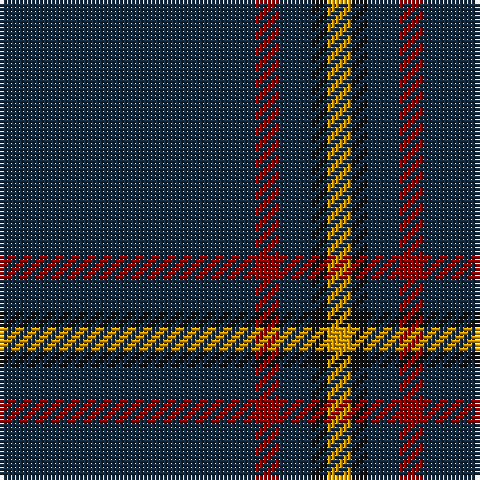

In pattern [BRBKY](/stripes/brbky/).

This was sourced from register-of-tartans.  It is a [5 stripe tartan](/stripes/stripes5/).

Original link https://www.tartanregister.gov.uk/tartanDetails.aspx?ref=2592

## Also known as

This cloth is also recorded under:

- MacLaine of Lochbuie Hunting

## Attestations

This cloth appears in 2 source records; the oldest owns this page.

- 01/01/2002 — MacLaine of Lochbuie Hunting (register-of-tartans, [record](https://www.tartanregister.gov.uk/tartanDetails.aspx?ref=2592))
- pre 2002 — MacLaine of Lochbuie Htg (Clan) (tartans-authority, [record](http://www.tartansauthority.com/tartan-ferret/display/491/))

## Register references

External register numbers recorded for this tartan.

- Scottish Register of Tartans: [2592](https://www.tartanregister.gov.uk/tartanDetails.aspx?ref=2592)
- Scottish Tartans Authority (ITI): 491
- Scottish Tartans World Register: 491

## Thread count
DN/64 DR6 DN8 K4 DY/6

## Palette
Each colour and the base-6 reference it is a variant of.

| Colour | Shade | Base |
|---|---|---|
| DN | <code style="background-color:#14283C;">#14283C</code> `oklch(27.1% 0.046 249.9)` <small>#14283C</small> | B <code style="background-color:#2A418A;">#2A418A</code> |
| DR | <code style="background-color:#880000;">#880000</code> `oklch(39.4% 0.162 29.2)` <small>#880000</small> | R <code style="background-color:#CC0000;">#CC0000</code> |
| DY | <code style="background-color:#D09800;">#D09800</code> `oklch(71.4% 0.147 82.1)` <small>#D09800</small> | Y <code style="background-color:#F2BF00;">#F2BF00</code> |
| K | <code style="background-color:#101010;">#101010</code> `oklch(17.3% 0.000 89.9)` <small>#101010</small> | K <code style="background-color:#000000;">#000000</code> |

# Sample pattern

## Nearest tartans

The nearest existing variants by ΔTartan distance, with this tartan at the top so the swatches line up against it.

ΔTartan

Tartan

Sett

—

<a href="/ttd/edit/#slug=dt32r3dt4k2lo3~x2">MacLaine of Lochbuie Hunting</a> <a class="nn-out" href="/setts/s5/dt32r3dt4k2lo3~x2/" title="open its dictionary page">↗</a>

1.11

<a href="/ttd/edit/#slug=db1r1k12g1~x4">MacNathair Sgianach</a> <a class="nn-out" href="/setts/s4/db1r1k12g1~x4/" title="open its dictionary page">↗</a>

1.31

<a href="/ttd/edit/#slug=dt74m9dt4r5dt4m9dt37db9~x2">Rikaco Vintage</a> <a class="nn-out" href="/setts/s8/dt74m9dt4r5dt4m9dt37db9~x2/" title="open its dictionary page">↗</a>

1.57

<a href="/ttd/edit/#slug=k10n2k2n8k40r4k5r2~x2">Laird Abdullah (Personal)</a> <a class="nn-out" href="/setts/s8/k10n2k2n8k40r4k5r2~x2/" title="open its dictionary page">↗</a>

1.60

<a href="/ttd/edit/#slug=k40dg15k10r2k10lo2k10~x2">Langhein, Alex (Personal)</a> <a class="nn-out" href="/setts/s7/k40dg15k10r2k10lo2k10~x2/" title="open its dictionary page">↗</a>

1.79

<a href="/ttd/edit/#slug=k72w3k11db9">Dunnotar (School)</a> <a class="nn-out" href="/setts/s4/k72w3k11db9/" title="open its dictionary page">↗</a>

1.80

<a href="/ttd/edit/#slug=dt68t7dt16k16lo4~x2">Burnetts &amp; Struth</a> <a class="nn-out" href="/setts/s5/dt68t7dt16k16lo4~x2/" title="open its dictionary page">↗</a>

1.83

<a href="/ttd/edit/#slug=k21dp2o1k1o1dp2k6db2o1~x4">Clan Inebriated</a> <a class="nn-out" href="/setts/s9/k21dp2o1k1o1dp2k6db2o1~x4/" title="open its dictionary page">↗</a>

1.83

<a href="/ttd/edit/#slug=k40dg15k10r2k10lo2k10lo2~x2">Langhein, Alex (Personal)</a> <a class="nn-out" href="/setts/s8/k40dg15k10r2k10lo2k10lo2~x2/" title="open its dictionary page">↗</a>

1.84

<a href="/ttd/edit/#slug=k24dg3r3k24r2k2r2">Unidentified #45</a> <a class="nn-out" href="/setts/s7/k24dg3r3k24r2k2r2/" title="open its dictionary page">↗</a>

1.88

<a href="/ttd/edit/#slug=dt40dg3dp4dt28lo2lr2dt7~x2">Pisniak (Personal)</a> <a class="nn-out" href="/setts/s7/dt40dg3dp4dt28lo2lr2dt7~x2/" title="open its dictionary page">↗</a>

## Neighbour map

Every grey dot is one of 14299 variants placed by the first two principal components of the ΔTartan feature space (44% of its variance). Red is this tartan; blue dots are its nearest — click one to open its page.

<svg viewBox="0 0 640 380" role="img" style="max-width:100%;height:auto;border:1px solid #e0e0e0;border-radius:4px;display:block" xmlns="http://www.w3.org/2000/svg"><image href="/nn/cloud.v1.png" width="640" height="380"/><a href="/setts/s4/db1r1k12g1~x4/"><circle cx="567.4" cy="237.6" r="4" fill="#3465a4"><title>MacNathair Sgianach</title></circle></a><a href="/setts/s8/dt74m9dt4r5dt4m9dt37db9~x2/"><circle cx="539.5" cy="182.6" r="4" fill="#3465a4"><title>Rikaco Vintage</title></circle></a><a href="/setts/s8/k10n2k2n8k40r4k5r2~x2/"><circle cx="538.5" cy="174.0" r="4" fill="#3465a4"><title>Laird Abdullah (Personal)</title></circle></a><a href="/setts/s7/k40dg15k10r2k10lo2k10~x2/"><circle cx="548.2" cy="220.3" r="4" fill="#3465a4"><title>Langhein, Alex (Personal)</title></circle></a><a href="/setts/s4/k72w3k11db9/"><circle cx="626.0" cy="233.0" r="4" fill="#3465a4"><title>Dunnotar (School)</title></circle></a><a href="/setts/s5/dt68t7dt16k16lo4~x2/"><circle cx="551.2" cy="244.7" r="4" fill="#3465a4"><title>Burnetts &amp; Struth</title></circle></a><a href="/setts/s9/k21dp2o1k1o1dp2k6db2o1~x4/"><circle cx="530.4" cy="161.5" r="4" fill="#3465a4"><title>Clan Inebriated</title></circle></a><a href="/setts/s8/k40dg15k10r2k10lo2k10lo2~x2/"><circle cx="544.5" cy="212.9" r="4" fill="#3465a4"><title>Langhein, Alex (Personal)</title></circle></a><a href="/setts/s7/k24dg3r3k24r2k2r2/"><circle cx="578.3" cy="225.2" r="4" fill="#3465a4"><title>Unidentified #45</title></circle></a><a href="/setts/s7/dt40dg3dp4dt28lo2lr2dt7~x2/"><circle cx="626.0" cy="204.4" r="4" fill="#3465a4"><title>Pisniak (Personal)</title></circle></a><circle cx="585.6" cy="212.7" r="5" fill="#c00000"/></svg>

ID: /setts/s5/dt32r3dt4k2lo3~x2/
