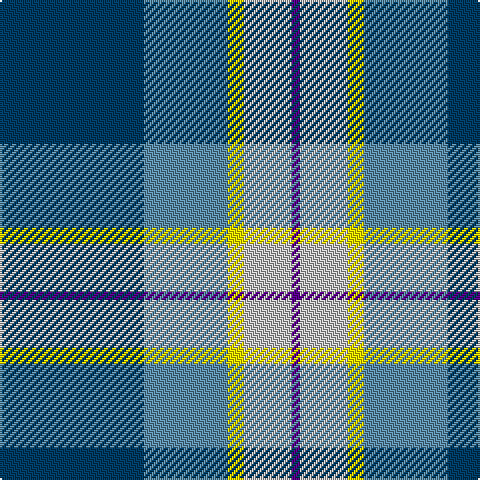

**Bands:** [BBYWB](/stripes/bbywb/) · **Stripes:** [DT T LY LB DP](/stripes/stripes5/) DT T LY LB DP

This was sourced from register-of-tartans.  It is a [5 band tartan](/bands/bands5/).

Original link https://www.tartanregister.gov.uk/tartanDetails.aspx?ref=11546

## Register references

External register numbers recorded for this tartan.

- Scottish Register of Tartans: [11546](https://www.tartanregister.gov.uk/tartanDetails.aspx?ref=11546)

## Thread count
DB/72 B42 Y8 N24 P/4

## Palette
Each colour and its ΔE from the base-6 reference it is a variant of.

| Colour | Shade | Base | ΔE (OKLab) |
|---|---|---|---|
| B | <code style="background-color:#5C8CA8;">#5C8CA8</code> `#5C8CA8` | B <code style="background-color:#2A418A;">#2A418A</code> | 0.23 |
| DB | <code style="background-color:#003C64;">#003C64</code> `#003C64` | B <code style="background-color:#2A418A;">#2A418A</code> | 0.08 |
| N | <code style="background-color:#C0C0C0;">#C0C0C0</code> `#C0C0C0` | W <code style="background-color:#F7F7F7;">#F7F7F7</code> | 0.17 |
| P | <code style="background-color:#5A008C;">#5A008C</code> `#5A008C` | B <code style="background-color:#2A418A;">#2A418A</code> | 0.13 |
| Y | <code style="background-color:#FFE600;">#FFE600</code> `#FFE600` | Y <code style="background-color:#F2BF00;">#F2BF00</code> | 0.10 |

# Sample pattern

## Nearest tartans

The nearest existing variants by ΔTartan distance.

1. [Afternoon Tea / Earl Grey](/setts/s6/r15t98dt72ly25dt8w15/) — ΔT 0.98
1. [Eeraerts, Laurent (Personal)](/setts/s6/w3b12db1g15m3w1~x4/) — ΔT 1.01
1. [Centennial-King George Lodge No.171](/setts/s5/ly2dg36b30w7r2~x2/) — ΔT 1.02
1. [Afternoon Tea / Mint Tea](/setts/s6/ly15dt8b25dt72lg98w15/) — ΔT 1.13
1. [Manx Laxey (Blue)](/setts/s6/t4dg16ly2dp7t28w4~x2/) — ΔT 1.17
1. [Afternoon Tea / Earl Grey](/setts/s6/r15t98db72ly25db8w15/) — ΔT 1.22
1. [Jamieson, Robert (Personal)](/setts/s5/lb6lo6b21dt32r3~x2/) — ΔT 1.22
1. [Manx Laxey](/setts/s6/b4g16ly2p7b28w4~x2/) — ΔT 1.23
1. [Herriot (New Zealand) (Name)](/setts/s6/w15ly2dt5lr3t40dt10/) — ΔT 1.29
1. [Rothesay & Caithness Fencibles (Mil)](/setts/s5/b32k10g15k2ly4~x2/) — ΔT 1.30

## Neighbour map

Every grey dot is one of 14313 variants placed by the first two principal components of the ΔTartan feature space (44% of its variance). Red is this tartan; blue dots are its nearest — click one to open its page.

<svg viewBox="0 0 640 380" role="img" style="max-width:100%;height:auto;border:1px solid #e0e0e0;border-radius:4px;display:block" xmlns="http://www.w3.org/2000/svg"><image href="/nn/cloud.v1.png" width="640" height="380"/><a href="/setts/s6/r15t98dt72ly25dt8w15/"><circle cx="208.4" cy="186.1" r="4" fill="#3465a4"><title>Afternoon Tea / Earl Grey</title></circle></a><a href="/setts/s6/w3b12db1g15m3w1~x4/"><circle cx="205.1" cy="164.8" r="4" fill="#3465a4"><title>Eeraerts, Laurent (Personal)</title></circle></a><a href="/setts/s5/ly2dg36b30w7r2~x2/"><circle cx="255.9" cy="173.6" r="4" fill="#3465a4"><title>Centennial-King George Lodge No.171</title></circle></a><a href="/setts/s6/ly15dt8b25dt72lg98w15/"><circle cx="193.2" cy="181.5" r="4" fill="#3465a4"><title>Afternoon Tea / Mint Tea</title></circle></a><a href="/setts/s6/t4dg16ly2dp7t28w4~x2/"><circle cx="274.0" cy="181.7" r="4" fill="#3465a4"><title>Manx Laxey (Blue)</title></circle></a><a href="/setts/s6/r15t98db72ly25db8w15/"><circle cx="186.1" cy="168.3" r="4" fill="#3465a4"><title>Afternoon Tea / Earl Grey</title></circle></a><a href="/setts/s5/lb6lo6b21dt32r3~x2/"><circle cx="241.1" cy="213.9" r="4" fill="#3465a4"><title>Jamieson, Robert (Personal)</title></circle></a><a href="/setts/s6/b4g16ly2p7b28w4~x2/"><circle cx="272.4" cy="175.6" r="4" fill="#3465a4"><title>Manx Laxey</title></circle></a><a href="/setts/s6/w15ly2dt5lr3t40dt10/"><circle cx="295.2" cy="152.9" r="4" fill="#3465a4"><title>Herriot (New Zealand) (Name)</title></circle></a><a href="/setts/s5/b32k10g15k2ly4~x2/"><circle cx="277.0" cy="208.6" r="4" fill="#3465a4"><title>Rothesay &amp; Caithness Fencibles (Mil)</title></circle></a><circle cx="240.4" cy="179.9" r="5" fill="#c00000"/></svg>

ID: /setts/s5/dt36t21ly4lb12dp2~x2/
