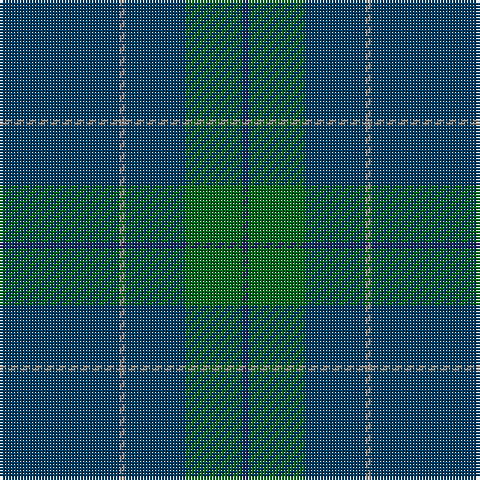

In pattern [BGBRB](/stripes/bgbrb/).

This was sourced from tartans-authority.  It is a [5 stripe tartan](/stripes/stripes5/).

Original link http://www.tartansauthority.com/tartan-ferret/display/5765/

## Thread count
DBa/40 N2 DBa20 G19 DB/2

## Palette
Each colour and its ΔE from the base-6 reference it is a variant of.

| Colour | Shade | Base | ΔE (OKLab) |
|---|---|---|---|
| DB | <code style="background-color:#202060;">#202060</code> `#202060` | B <code style="background-color:#2A418A;">#2A418A</code> | 0.11 |
| DBa | <code style="background-color:#003C64;">#003C64</code> `#003C64` | B <code style="background-color:#2A418A;">#2A418A</code> | 0.08 |
| G | <code style="background-color:#006818;">#006818</code> `#006818` | G <code style="background-color:#006100;">#006100</code> | 0.02 |
| N | <code style="background-color:#888888;">#888888</code> `#888888` | R <code style="background-color:#CC0000;">#CC0000</code> | 0.24 |
| Na | <code style="background-color:#888888;">#888888</code> `#888888` | R <code style="background-color:#CC0000;">#CC0000</code> | 0.24 |
| R | <code style="background-color:#C80000;">#C80000</code> `#C80000` | R <code style="background-color:#CC0000;">#CC0000</code> | 0.01 |

# Sample pattern

## Nearest tartans

The nearest existing variants by ΔTartan distance.

1. [Miramichi](/setts/s5/dg31lo1dg18db18r1~x2/) — ΔT 1.31
1. [Burnett's & Struth (Corporate)](/setts/s5/dt68b7dt16k16lo4~x2/) — ΔT 1.42
1. [Burnetts & Struth](/setts/s5/dt68t7dt16k16lo4~x2/) — ΔT 1.66
1. [Elliot](/setts/s6/db9dy12db44dy12db9r3~x2/) — ΔT 2.06
1. [Unidentified #44](/setts/s7/db13k3db20dy70db20dy30w3~x2/) — ΔT 2.08
1. [Williams (New York) (Personal)](/setts/s5/k30dt6k6dt41t2~x2/) — ΔT 2.13
1. [Kalkofen (Name)](/setts/s6/k40dg15k10r2k10lo2~x2/) — ΔT 2.23
1. [Aberdeen Mither Kirk (St Nicholas)](/setts/s9/dt58o3y16r3lo2y7dt29r3o2~x2/) — ΔT 2.30
1. [Heslop, William D (Name)](/setts/s4/n44dg12dt1r6~x2/) — ΔT 2.34
1. [McGovern (2016)](/setts/s5/dt62o4dy10dy3dg21~x2/) — ΔT 2.34

## Neighbour map

Every grey dot is one of 14299 variants placed by the first two principal components of the ΔTartan feature space (44% of its variance). Red is this tartan; blue dots are its nearest — click one to open its page.

<svg viewBox="0 0 640 380" role="img" style="max-width:100%;height:auto;border:1px solid #e0e0e0;border-radius:4px;display:block" xmlns="http://www.w3.org/2000/svg"><image href="/nn/cloud.v1.png" width="640" height="380"/><a href="/setts/s5/dg31lo1dg18db18r1~x2/"><circle cx="537.5" cy="244.9" r="4" fill="#3465a4"><title>Miramichi</title></circle></a><a href="/setts/s5/dt68b7dt16k16lo4~x2/"><circle cx="548.1" cy="240.6" r="4" fill="#3465a4"><title>Burnett's &amp; Struth (Corporate)</title></circle></a><a href="/setts/s5/dt68t7dt16k16lo4~x2/"><circle cx="551.2" cy="244.7" r="4" fill="#3465a4"><title>Burnetts &amp; Struth</title></circle></a><a href="/setts/s6/db9dy12db44dy12db9r3~x2/"><circle cx="532.3" cy="267.3" r="4" fill="#3465a4"><title>Elliot</title></circle></a><a href="/setts/s7/db13k3db20dy70db20dy30w3~x2/"><circle cx="481.8" cy="221.0" r="4" fill="#3465a4"><title>Unidentified #44</title></circle></a><a href="/setts/s5/k30dt6k6dt41t2~x2/"><circle cx="474.0" cy="270.6" r="4" fill="#3465a4"><title>Williams (New York) (Personal)</title></circle></a><a href="/setts/s6/k40dg15k10r2k10lo2~x2/"><circle cx="566.4" cy="243.2" r="4" fill="#3465a4"><title>Kalkofen (Name)</title></circle></a><a href="/setts/s9/dt58o3y16r3lo2y7dt29r3o2~x2/"><circle cx="515.6" cy="165.1" r="4" fill="#3465a4"><title>Aberdeen Mither Kirk (St Nicholas)</title></circle></a><a href="/setts/s4/n44dg12dt1r6~x2/"><circle cx="586.0" cy="226.3" r="4" fill="#3465a4"><title>Heslop, William D (Name)</title></circle></a><a href="/setts/s5/dt62o4dy10dy3dg21~x2/"><circle cx="471.9" cy="233.2" r="4" fill="#3465a4"><title>McGovern (2016)</title></circle></a><circle cx="542.6" cy="267.5" r="5" fill="#c00000"/></svg>

ID: /setts/s5/dt40o2dt20g19db2/
