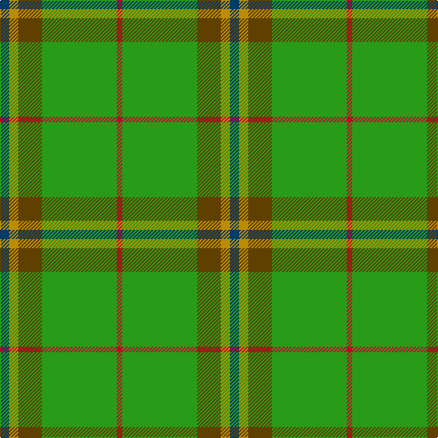

**Bands:** [BYGGR](/stripes/byggr/) · **Stripes:** [DT LO DY G R](/stripes/stripes5/) DT LO DY G R

This was sourced from tartans-authority.  It is a [5 band tartan](/bands/bands5/).

Original link http://www.tartansauthority.com/tartan-ferret/display/10311/

## Thread count
DB/10 DY10 T26 G82 R/6

## Palette
Each colour and its ΔE from the base-6 reference it is a variant of.

| Colour | Shade | Base | ΔE (OKLab) |
|---|---|---|---|
| DB | <code style="background-color:#003C64;">#003C64</code> `#003C64` | B <code style="background-color:#2A418A;">#2A418A</code> | 0.08 |
| DY | <code style="background-color:#BC8C00;">#BC8C00</code> `#BC8C00` | Y <code style="background-color:#F2BF00;">#F2BF00</code> | 0.16 |
| G | <code style="background-color:#289C18;">#289C18</code> `#289C18` | G <code style="background-color:#006100;">#006100</code> | 0.19 |
| R | <code style="background-color:#C8002C;">#C8002C</code> `#C8002C` | R <code style="background-color:#CC0000;">#CC0000</code> | 0.03 |
| T | <code style="background-color:#604000;">#604000</code> `#604000` | G <code style="background-color:#006100;">#006100</code> | 0.14 |

# Sample pattern

## Nearest tartans

The nearest existing variants by ΔTartan distance.

1. [Clare (Prince George) (Personal)](/setts/s5/dp5lo5dy13g41r3~x2/) — ΔT 1.14
1. [Tulloch Homes](/setts/s7/g6g14r9dt7r9g54ly6/) — ΔT 1.41
1. [Rams Timeless](/setts/s10/g12lo6lo16g10w6g8g12g70lo9g7/) — ΔT 1.47
1. [Colonial Marine (Aliens Legacy)](/setts/s4/g56dy13ly13w5~x2/) — ΔT 1.55
1. [Crieff, and Strathearn](/setts/s7/g55p7r24g12db4ly3db4~x2/) — ΔT 1.58
1. [Rams Timeless](/setts/s10/g12y6lo16g10w6g8g12g70y9g7/) — ΔT 1.58
1. [Oxford University](/setts/s4/db9dg16g56ly4~x2/) — ΔT 1.66
1. [O'Neill (Name)](/setts/s8/w6g5r5g45k4lo24k4g5~x2/) — ΔT 1.66
1. [MacKintosh, hunting](/setts/s7/db1r3g11r2db5g11ly1~x2/) — ΔT 1.68
1. [St Johns County Sheriff Office (Cor)](/setts/s5/r17db7lo8g58k6~x2/) — ΔT 1.72

## Neighbour map

Every grey dot is one of 14313 variants placed by the first two principal components of the ΔTartan feature space (44% of its variance). Red is this tartan; blue dots are its nearest — click one to open its page.

<svg viewBox="0 0 640 380" role="img" style="max-width:100%;height:auto;border:1px solid #e0e0e0;border-radius:4px;display:block" xmlns="http://www.w3.org/2000/svg"><image href="/nn/cloud.v1.png" width="640" height="380"/><a href="/setts/s5/dp5lo5dy13g41r3~x2/"><circle cx="365.7" cy="190.8" r="4" fill="#3465a4"><title>Clare (Prince George) (Personal)</title></circle></a><a href="/setts/s7/g6g14r9dt7r9g54ly6/"><circle cx="357.3" cy="192.3" r="4" fill="#3465a4"><title>Tulloch Homes</title></circle></a><a href="/setts/s10/g12lo6lo16g10w6g8g12g70lo9g7/"><circle cx="340.4" cy="166.0" r="4" fill="#3465a4"><title>Rams Timeless</title></circle></a><a href="/setts/s4/g56dy13ly13w5~x2/"><circle cx="365.0" cy="224.8" r="4" fill="#3465a4"><title>Colonial Marine (Aliens Legacy)</title></circle></a><a href="/setts/s7/g55p7r24g12db4ly3db4~x2/"><circle cx="359.0" cy="154.9" r="4" fill="#3465a4"><title>Crieff, and Strathearn</title></circle></a><a href="/setts/s10/g12y6lo16g10w6g8g12g70y9g7/"><circle cx="353.9" cy="174.8" r="4" fill="#3465a4"><title>Rams Timeless</title></circle></a><a href="/setts/s4/db9dg16g56ly4~x2/"><circle cx="385.0" cy="221.1" r="4" fill="#3465a4"><title>Oxford University</title></circle></a><a href="/setts/s8/w6g5r5g45k4lo24k4g5~x2/"><circle cx="299.8" cy="167.3" r="4" fill="#3465a4"><title>O'Neill (Name)</title></circle></a><a href="/setts/s7/db1r3g11r2db5g11ly1~x2/"><circle cx="365.5" cy="217.6" r="4" fill="#3465a4"><title>MacKintosh, hunting</title></circle></a><a href="/setts/s5/r17db7lo8g58k6~x2/"><circle cx="325.8" cy="200.3" r="4" fill="#3465a4"><title>St Johns County Sheriff Office (Cor)</title></circle></a><circle cx="360.4" cy="196.8" r="5" fill="#c00000"/></svg>

ID: /setts/s5/dt5lo5dy13g41r3~x2/
