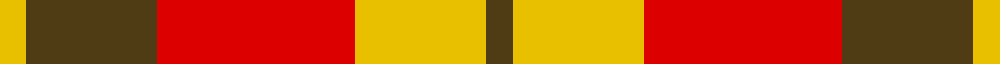
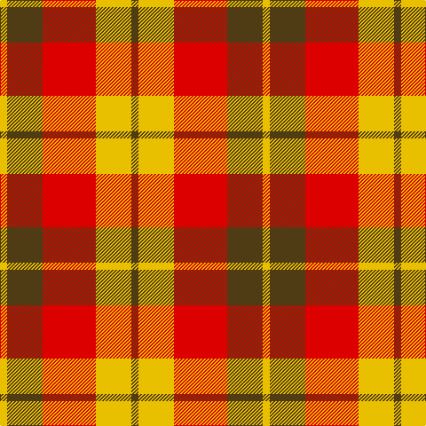

In pattern [GYRGY](/stripes/gyrgy/).

This was sourced from register-of-tartans.  It is a [5 stripe tartan](/stripes/stripes5/).

Original link https://www.tartanregister.gov.uk/tartanDetails.aspx?ref=1613

## Register references

External register numbers recorded for this tartan.

- Scottish Register of Tartans: [1613](https://www.tartanregister.gov.uk/tartanDetails.aspx?ref=1613)
- Scottish Tartans World Register: 1754

## Thread count
Y/8 T40 R60 Y40 T/8

## Palette
Each colour and the base-6 reference it is a variant of.

| Colour | Shade | Base |
|---|---|---|
| R | <code style="background-color:#DC0000;">#DC0000</code> `oklch(56.2% 0.230 29.2)` <small>#DC0000</small> | R <code style="background-color:#CC0000;">#CC0000</code> |
| T | <code style="background-color:#503C14;">#503C14</code> `oklch(37.0% 0.062 81.8)` <small>#503C14</small> | G <code style="background-color:#006100;">#006100</code> |
| Y | <code style="background-color:#E8C000;">#E8C000</code> `oklch(81.9% 0.168 93.7)` <small>#E8C000</small> | Y <code style="background-color:#F2BF00;">#F2BF00</code> |

# Sample pattern

## Nearest tartans

The nearest existing variants by ΔTartan distance.

1. [Harmony, 9](/setts/s5/o2ly10r15o10ly2~x4/) — ΔT 0.90
1. [Kozlosky, Kilt](/setts/s6/ly42r15r28ly12r6r20/) — ΔT 1.35
1. [Manx Mannin Plaid](/setts/s4/w1r5dy5ly1~x4/) — ΔT 1.40
1. [Kozlosky (Personal)](/setts/s6/ly21r8r14ly6r3r10~x2/) — ΔT 1.51
1. [Buchele Check (Fashion?)](/setts/s6/r4ly1r3ly1ly8ly2~x4/) — ΔT 1.64
1. [Al-Maktoum](/setts/s6/w11r32g12r5g12r5~x2/) — ΔT 1.73
1. [Glassary #2](/setts/s8/db4r1ly12r2ly2r12ly1db4~x4/) — ΔT 1.77
1. [St. Andrews (Queens University) (Cor](/setts/s8/dy11db1dy11w10db1r11db1r11~x2/) — ΔT 1.78
1. [MacNab, Variant](/setts/s6/r1r7r4g7r1g1~x4/) — ΔT 1.82
1. [Manhattan Ethnic](/setts/s7/o72dr30o18lr62y10dr7lr32/) — ΔT 1.90

## Neighbour map

Every grey dot is one of 14299 variants placed by the first two principal components of the ΔTartan feature space (44% of its variance). Red is this tartan; blue dots are its nearest — click one to open its page.

<svg viewBox="0 0 640 380" role="img" style="max-width:100%;height:auto;border:1px solid #e0e0e0;border-radius:4px;display:block" xmlns="http://www.w3.org/2000/svg"><image href="/nn/cloud.v1.png" width="640" height="380"/><a href="/setts/s5/o2ly10r15o10ly2~x4/"><circle cx="233.6" cy="245.9" r="4" fill="#3465a4"><title>Harmony, 9</title></circle></a><a href="/setts/s6/ly42r15r28ly12r6r20/"><circle cx="248.3" cy="241.8" r="4" fill="#3465a4"><title>Kozlosky, Kilt</title></circle></a><a href="/setts/s4/w1r5dy5ly1~x4/"><circle cx="210.4" cy="246.9" r="4" fill="#3465a4"><title>Manx Mannin Plaid</title></circle></a><a href="/setts/s6/ly21r8r14ly6r3r10~x2/"><circle cx="249.9" cy="245.8" r="4" fill="#3465a4"><title>Kozlosky (Personal)</title></circle></a><a href="/setts/s6/r4ly1r3ly1ly8ly2~x4/"><circle cx="260.5" cy="216.1" r="4" fill="#3465a4"><title>Buchele Check (Fashion?)</title></circle></a><a href="/setts/s6/w11r32g12r5g12r5~x2/"><circle cx="275.9" cy="228.0" r="4" fill="#3465a4"><title>Al-Maktoum</title></circle></a><a href="/setts/s8/db4r1ly12r2ly2r12ly1db4~x4/"><circle cx="235.8" cy="169.8" r="4" fill="#3465a4"><title>Glassary #2</title></circle></a><a href="/setts/s8/dy11db1dy11w10db1r11db1r11~x2/"><circle cx="200.6" cy="190.2" r="4" fill="#3465a4"><title>St. Andrews (Queens University) (Cor</title></circle></a><a href="/setts/s6/r1r7r4g7r1g1~x4/"><circle cx="251.9" cy="248.2" r="4" fill="#3465a4"><title>MacNab, Variant</title></circle></a><a href="/setts/s7/o72dr30o18lr62y10dr7lr32/"><circle cx="227.1" cy="203.8" r="4" fill="#3465a4"><title>Manhattan Ethnic</title></circle></a><circle cx="211.7" cy="235.2" r="5" fill="#c00000"/></svg>

ID: /setts/s5/dy2ly10r15dy10ly2~x4/
