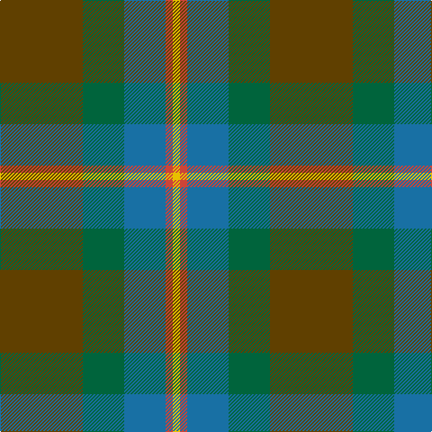

In pattern [GGBRY](/stripes/ggbry/).

This was sourced from tartans-authority.  It is a [5 stripe tartan](/stripes/stripes5/).

Original link http://www.tartansauthority.com/tartan-ferret/display/3102/

## Attestations

This cloth appears in 2 source records; the oldest owns this page.

- 2002 — McMoosie Htg (Fashion) (tartans-authority, [record](http://www.tartansauthority.com/tartan-ferret/display/3102/))
- undated — McMoosie Htg (register-of-tartans, [record](https://www.tartanregister.gov.uk/tartanDetails.aspx?ref=4859))

## Register references

External register numbers recorded for this tartan.

- Scottish Register of Tartans: [4859](https://www.tartanregister.gov.uk/tartanDetails.aspx?ref=4859)
- Scottish Tartans Authority (ITI): 3102

## Thread count
T/92 G46 B46 R8 Y/8

## Palette
Each colour and the base-6 reference it is a variant of.

| Colour | Shade | Base |
|---|---|---|
| B | <code style="background-color:#1870A4;">#1870A4</code> `oklch(52.2% 0.113 241.2)` <small>#1870A4</small> | B <code style="background-color:#2A418A;">#2A418A</code> |
| G | <code style="background-color:#00643C;">#00643C</code> `oklch(44.3% 0.104 157.7)` <small>#00643C</small> | G <code style="background-color:#006100;">#006100</code> |
| R | <code style="background-color:#CC4438;">#CC4438</code> `oklch(57.7% 0.174 28.7)` <small>#CC4438</small> | R <code style="background-color:#CC0000;">#CC0000</code> |
| T | <code style="background-color:#604000;">#604000</code> `oklch(39.8% 0.083 76.8)` <small>#604000</small> | G <code style="background-color:#006100;">#006100</code> |
| Y | <code style="background-color:#E8C000;">#E8C000</code> `oklch(81.9% 0.168 93.7)` <small>#E8C000</small> | Y <code style="background-color:#F2BF00;">#F2BF00</code> |

# Sample pattern

## Nearest tartans

The nearest existing variants by ΔTartan distance.

1. [Montrose (1983)](/setts/s6/dg6ly3dg26k10n30lb3~x2/) — ΔT 1.03
1. [Dallard Personal Tartan Tartan Number: 7424. Earliest known date: 2007 The material was going towards a kilt for my wedding in June 2008. See products available Copyright © Blair Urquhart, Comrie, 2015](/setts/s5/dt37dg37o8k3dp5~x2/) — ΔT 1.24
1. [Symington](/setts/s5/lo5y33dg33r6w2~x2/) — ΔT 1.26
1. [Hesco](/setts/s7/dp3n24n10n2g11n8w3~x2/) — ΔT 1.30
1. [Rotary Corporate Tartan Tartan Number: 2187. Earliest known date: 1995 The tartan was designed by K. Lumsden of the Scottish Tartans Society in conjuntion with the Rotary Club of Glasgow. It was decided to use as a base the City of Glasgow Tartan; the colours being brightened and the gold and the deep blue of the Rotary Wheel added. The actual shades are specific Rotary colours. The tartan is currently available only from Geoffrey (Tailor) Highland Crafts, The Royal Mile, Edinburgh. See products available Copyright © Blair Urquhart, Comrie, 2015](/setts/s7/y19r3t19r11y19ly2db4~x2/) — ΔT 1.39
1. [Styrian (Fashion)](/setts/s5/g8n19dg29o16r4~x2/) — ΔT 1.41
1. [Ancient Universal (Fashion?)](/setts/s8/y12dg2y2dg2y2dy8y8dy1~x2/) — ΔT 1.41
1. [Reidy Wedding](/setts/s7/g31dg7lo3dg14g8db18dp5~x2/) — ΔT 1.42
1. [Bailies of Bennachie Corporate Tartan Tartan Number: 3628. Earliest known date: 2002 The Bailes of Bennachie were founded in 1973 as caretakers of the mountain in Aberdeenshire, with the aim of 'preserving the amenity of the hill'. The tartan was produced on the occasion of the 25th anniversary to help create funds to continue their task. The colours reflect the autumn shades on the hill. See products available Copyright © Blair Urquhart, Comrie, 2015](/setts/s7/y27dr2y4o15db26k2db6~x2/) — ΔT 1.48
1. [Bennachie (Whisky)](/setts/s7/dt14k5dp5k5dt14dg32r4~x2/) — ΔT 1.51

## Neighbour map

Every grey dot is one of 14299 variants placed by the first two principal components of the ΔTartan feature space (44% of its variance). Red is this tartan; blue dots are its nearest — click one to open its page.

<svg viewBox="0 0 640 380" role="img" style="max-width:100%;height:auto;border:1px solid #e0e0e0;border-radius:4px;display:block" xmlns="http://www.w3.org/2000/svg"><image href="/nn/cloud.v1.png" width="640" height="380"/><a href="/setts/s6/dg6ly3dg26k10n30lb3~x2/"><circle cx="254.3" cy="228.2" r="4" fill="#3465a4"><title>Montrose (1983)</title></circle></a><a href="/setts/s5/dt37dg37o8k3dp5~x2/"><circle cx="287.7" cy="237.0" r="4" fill="#3465a4"><title>Dallard Personal Tartan Tartan Number: 7424. Earliest known date: 2007 The material was going towards a kilt for my wedding in June 2008. See products available Copyright © Blair Urquhart, Comrie, 2015</title></circle></a><a href="/setts/s5/lo5y33dg33r6w2~x2/"><circle cx="305.9" cy="219.0" r="4" fill="#3465a4"><title>Symington</title></circle></a><a href="/setts/s7/dp3n24n10n2g11n8w3~x2/"><circle cx="324.2" cy="217.5" r="4" fill="#3465a4"><title>Hesco</title></circle></a><a href="/setts/s7/y19r3t19r11y19ly2db4~x2/"><circle cx="265.4" cy="225.3" r="4" fill="#3465a4"><title>Rotary Corporate Tartan Tartan Number: 2187. Earliest known date: 1995 The tartan was designed by K. Lumsden of the Scottish Tartans Society in conjuntion with the Rotary Club of Glasgow. It was decided to use as a base the City of Glasgow Tartan; the colours being brightened and the gold and the deep blue of the Rotary Wheel added. The actual shades are specific Rotary colours. The tartan is currently available only from Geoffrey (Tailor) Highland Crafts, The Royal Mile, Edinburgh. See products available Copyright © Blair Urquhart, Comrie, 2015</title></circle></a><a href="/setts/s5/g8n19dg29o16r4~x2/"><circle cx="194.8" cy="273.2" r="4" fill="#3465a4"><title>Styrian (Fashion)</title></circle></a><a href="/setts/s8/y12dg2y2dg2y2dy8y8dy1~x2/"><circle cx="283.5" cy="227.2" r="4" fill="#3465a4"><title>Ancient Universal (Fashion?)</title></circle></a><a href="/setts/s7/g31dg7lo3dg14g8db18dp5~x2/"><circle cx="245.7" cy="231.1" r="4" fill="#3465a4"><title>Reidy Wedding</title></circle></a><a href="/setts/s7/y27dr2y4o15db26k2db6~x2/"><circle cx="261.3" cy="207.1" r="4" fill="#3465a4"><title>Bailies of Bennachie Corporate Tartan Tartan Number: 3628. Earliest known date: 2002 The Bailes of Bennachie were founded in 1973 as caretakers of the mountain in Aberdeenshire, with the aim of 'preserving the amenity of the hill'. The tartan was produced on the occasion of the 25th anniversary to help create funds to continue their task. The colours reflect the autumn shades on the hill. See products available Copyright © Blair Urquhart, Comrie, 2015</title></circle></a><a href="/setts/s7/dt14k5dp5k5dt14dg32r4~x2/"><circle cx="252.6" cy="242.9" r="4" fill="#3465a4"><title>Bennachie (Whisky)</title></circle></a><circle cx="283.5" cy="238.9" r="5" fill="#c00000"/></svg>

ID: /setts/s5/dy46g23b23r4ly4~x2/
