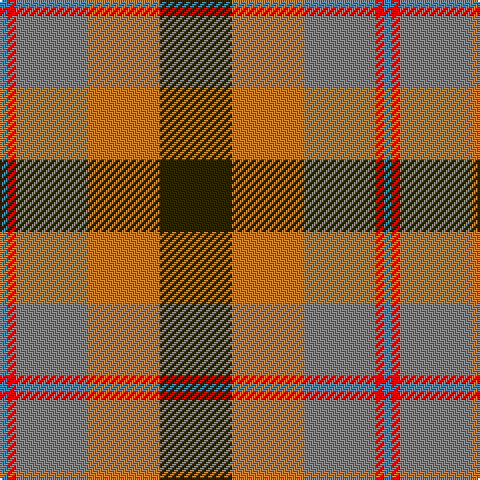

**Bands:** [BRGRG](/stripes/brgrg/) · **Stripes:** [T R Y O DY](/stripes/stripes5/) T R Y O DY

This was sourced from register-of-tartans.  It is a [5 band tartan](/bands/bands5/).

Original link https://www.tartanregister.gov.uk/tartanDetails.aspx?ref=1882

## Register references

External register numbers recorded for this tartan.

- Scottish Register of Tartans: [1882](https://www.tartanregister.gov.uk/tartanDetails.aspx?ref=1882)
- Scottish Tartans World Register: 2014

## Thread count
B/4 R4 N36 DO36 K/36

## Palette
Each colour and its ΔE from the base-6 reference it is a variant of.

| Colour | Shade | Base | ΔE (OKLab) |
|---|---|---|---|
| B | <code style="background-color:#3C82AF;">#3C82AF</code> `#3C82AF` | B <code style="background-color:#2A418A;">#2A418A</code> | 0.19 |
| DO | <code style="background-color:#BE7832;">#BE7832</code> `#BE7832` | R <code style="background-color:#CC0000;">#CC0000</code> | 0.17 |
| K | <code style="background-color:#2A2303;">#2A2303</code> `#2A2303` | G <code style="background-color:#006100;">#006100</code> | 0.21 |
| N | <code style="background-color:#808080;">#808080</code> `#808080` | G <code style="background-color:#006100;">#006100</code> | 0.23 |
| R | <code style="background-color:#DC0000;">#DC0000</code> `#DC0000` | R <code style="background-color:#CC0000;">#CC0000</code> | 0.03 |

# Sample pattern

## Nearest tartans

The nearest existing variants by ΔTartan distance.

1. [Thompson (J.C.'s Fancy) (Personal)](/setts/s6/r2lo8db2y4k4y1~x6/) — ΔT 1.05
1. [McEachem (Name)](/setts/s6/n7w1r6dt10g10w1~x4/) — ΔT 1.25
1. [Thompson's Fancy Personal Tartan Tartan Number: 286. Earliest known date: pre 2003 Designed for his own use. See products available Copyright © Blair Urquhart, Comrie, 2015](/setts/s6/r2dy8db2t4k4t1~x6/) — ΔT 1.28
1. [Logan](/setts/s7/db9r3ly1r3g9r3ly1~x2/) — ΔT 1.30
1. [Canine All Dogs (Fashion)](/setts/s6/r10db6g24db24r6ly3/) — ΔT 1.32
1. [Rothesay](/setts/s7/g4n12lo2k10y10lo3y2~x2/) — ΔT 1.32
1. [Pople (Name)](/setts/s5/k1r9n8y8w1~x2/) — ΔT 1.34
1. [Caledonian Brewery (Corporate)](/setts/s7/lb4dg13g6r16lb2r2g2~x2/) — ΔT 1.34
1. [Strathblane (Fashion)](/setts/s5/dy12k4w2o6r3~x2/) — ΔT 1.38
1. [McHale (Personal)](/setts/s6/y15k10n30o11w3y5~x2/) — ΔT 1.40

## Neighbour map

Every grey dot is one of 14313 variants placed by the first two principal components of the ΔTartan feature space (44% of its variance). Red is this tartan; blue dots are its nearest — click one to open its page.

<svg viewBox="0 0 640 380" role="img" style="max-width:100%;height:auto;border:1px solid #e0e0e0;border-radius:4px;display:block" xmlns="http://www.w3.org/2000/svg"><image href="/nn/cloud.v1.png" width="640" height="380"/><a href="/setts/s6/r2lo8db2y4k4y1~x6/"><circle cx="144.0" cy="211.9" r="4" fill="#3465a4"><title>Thompson (J.C.'s Fancy) (Personal)</title></circle></a><a href="/setts/s6/n7w1r6dt10g10w1~x4/"><circle cx="130.7" cy="222.3" r="4" fill="#3465a4"><title>McEachem (Name)</title></circle></a><a href="/setts/s6/r2dy8db2t4k4t1~x6/"><circle cx="163.2" cy="225.2" r="4" fill="#3465a4"><title>Thompson's Fancy Personal Tartan Tartan Number: 286. Earliest known date: pre 2003 Designed for his own use. See products available Copyright © Blair Urquhart, Comrie, 2015</title></circle></a><a href="/setts/s7/db9r3ly1r3g9r3ly1~x2/"><circle cx="167.0" cy="207.0" r="4" fill="#3465a4"><title>Logan</title></circle></a><a href="/setts/s6/r10db6g24db24r6ly3/"><circle cx="142.1" cy="214.0" r="4" fill="#3465a4"><title>Canine All Dogs (Fashion)</title></circle></a><a href="/setts/s7/g4n12lo2k10y10lo3y2~x2/"><circle cx="104.7" cy="228.6" r="4" fill="#3465a4"><title>Rothesay</title></circle></a><a href="/setts/s5/k1r9n8y8w1~x2/"><circle cx="201.0" cy="236.5" r="4" fill="#3465a4"><title>Pople (Name)</title></circle></a><a href="/setts/s7/lb4dg13g6r16lb2r2g2~x2/"><circle cx="185.5" cy="197.1" r="4" fill="#3465a4"><title>Caledonian Brewery (Corporate)</title></circle></a><a href="/setts/s5/dy12k4w2o6r3~x2/"><circle cx="173.6" cy="229.7" r="4" fill="#3465a4"><title>Strathblane (Fashion)</title></circle></a><a href="/setts/s6/y15k10n30o11w3y5~x2/"><circle cx="200.7" cy="217.9" r="4" fill="#3465a4"><title>McHale (Personal)</title></circle></a><circle cx="162.8" cy="221.3" r="5" fill="#c00000"/></svg>

ID: /setts/s5/dy9o9y9r1t1~x4/
