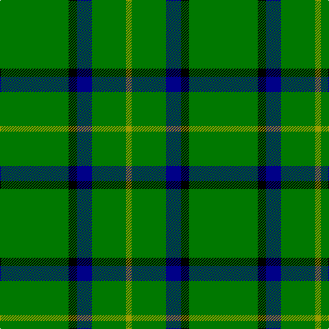

In pattern [GKBGY](/patterns/gkbgy/).

This was sourced from register-of-tartans.  It is a [5 stripes tartan](/stripes/stripes5/).

Original link https://www.tartanregister.gov.uk/tartanDetails.aspx?ref=1392

## Thread count
G/100 K12 DB22 G50 LG/8

## Palette
Each colour and its ΔE from the base-6 reference it is a variant of.

| Colour | Shade | Base | ΔE (OKLab) |
|---|---|---|---|
| DB | <code style="background-color:#000088;">#000088</code> `#000088` | B <code style="background-color:#2C4084;">#2C4084</code> | 0.14 |
| G | <code style="background-color:#007800;">#007800</code> `#007800` | G <code style="background-color:#006400;">#006400</code> | 0.06 |
| K | <code style="background-color:#000000;">#000000</code> `#000000` | K <code style="background-color:#000000;">#000000</code> | 0.00 |
| LG | <code style="background-color:#9C9C00;">#9C9C00</code> `#9C9C00` | Y <code style="background-color:#E8C000;">#E8C000</code> | 0.16 |

# Sample pattern

ID: /setts/s5/g100k12b22g50y8-b000088-g007800-k000000-y9c9c00/
