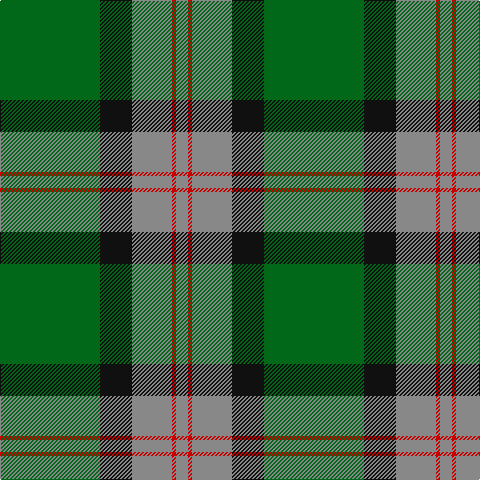

In pattern [GKRRR](/patterns/gkrrr/).

This was sourced from house-of-tartan.  It is a [5 stripes tartan](/stripes/stripes5/).

Original link http://www.house-of-tartan.scotland.net/house/TartanViewjs.asp?colr=Def&tnam=811

## Thread count
G/100 K32 N40 R4 N/12

## Palette
Each colour and its ΔE from the base-6 reference it is a variant of.

| Colour | Shade | Base | ΔE (OKLab) |
|---|---|---|---|
| G | <code style="background-color:#006818;">#006818</code> `#006818` | G <code style="background-color:#006100;">#006100</code> | 0.02 |
| K | <code style="background-color:#101010;">#101010</code> `#101010` | K <code style="background-color:#000000;">#000000</code> | 0.17 |
| N | <code style="background-color:#888888;">#888888</code> `#888888` | R <code style="background-color:#CC0000;">#CC0000</code> | 0.24 |
| R | <code style="background-color:#C80000;">#C80000</code> `#C80000` | R <code style="background-color:#CC0000;">#CC0000</code> | 0.01 |

# Sample pattern

## Nearest tartans

The nearest existing variants by ΔTartan distance.

1. [Herbage of Laggan (Personal)](/setts/s5/g136k44r56ra6r24-g006818-k101010-r888888-ra880000/) — ΔT 0.31
1. [Gracie](/setts/s5/g94r6g12b70y6-b304080-g008000-rc00000-yf0c000/) — ΔT 1.18
1. [Moran (Name)](/setts/s6/g110k34r18k22y4k8-g006818-k101010-rc8002c-ye8c000/) — ΔT 1.22
1. [MacArthur-Fox Htg (Personal)](/setts/s6/r6g60k24g2k32y4-g006818-k101010-r880000-yd09800/) — ΔT 1.28
1. [Herbage](/setts/s5/g100k32ga40r4ga12-g008000-ga808080-k000000-rc00000/) — ΔT 1.30
1. [Oliphant](/setts/s6/b8k8b48g64w2g4-b304080-g008000-k000000-we0e0e0/) — ΔT 1.34
1. [Moran Family Tartan Tartan Number: 675. Earliest known date: 1986 The designers requested that the threadcount be Restricted. See products available Copyright © Blair Urquhart, Comrie, 2015](/setts/s6/g110k34r18k22y4b8-b202060-g006818-k101010-rc8002c-ye8c000/) — ΔT 1.39
1. [Robert Byers Family - Dooballagh, Ireland](/setts/s4/k10g80b40y6-b1c1c50-g006818-k101010-ye8c000/) — ΔT 1.41
1. [Irving of Bonshaw](/setts/s5/g108b56k8b8y8-b304080-g008000-k000030-yf0c000/) — ΔT 1.42
1. [Byers (Name)](/setts/s4/k10g80b40y6-b202060-g006818-k101010-yfccc00/) — ΔT 1.42

## Neighbour map

Every grey dot is one of 15726 variants placed by the first two principal components of the ΔTartan feature space (44% of its variance). Red is this tartan; blue dots are its nearest — click one to open its page.

<svg viewBox="0 0 640 380" role="img" style="max-width:100%;height:auto;border:1px solid #e0e0e0;border-radius:4px;display:block" xmlns="http://www.w3.org/2000/svg"><image href="/nn/cloud.v1.png" width="640" height="380"/><a href="/setts/s5/g136k44r56ra6r24-g006818-k101010-r888888-ra880000/"><circle cx="319.5" cy="202.9" r="4" fill="#3465a4"><title>Herbage of Laggan (Personal)</title></circle></a><a href="/setts/s5/g94r6g12b70y6-b304080-g008000-rc00000-yf0c000/"><circle cx="361.9" cy="208.8" r="4" fill="#3465a4"><title>Gracie</title></circle></a><a href="/setts/s6/g110k34r18k22y4k8-g006818-k101010-rc8002c-ye8c000/"><circle cx="367.0" cy="168.2" r="4" fill="#3465a4"><title>Moran (Name)</title></circle></a><a href="/setts/s6/r6g60k24g2k32y4-g006818-k101010-r880000-yd09800/"><circle cx="344.9" cy="180.9" r="4" fill="#3465a4"><title>MacArthur-Fox Htg (Personal)</title></circle></a><a href="/setts/s5/g100k32ga40r4ga12-g008000-ga808080-k000000-rc00000/"><circle cx="299.2" cy="180.4" r="4" fill="#3465a4"><title>Herbage</title></circle></a><a href="/setts/s6/b8k8b48g64w2g4-b304080-g008000-k000000-we0e0e0/"><circle cx="346.3" cy="162.7" r="4" fill="#3465a4"><title>Oliphant</title></circle></a><a href="/setts/s6/g110k34r18k22y4b8-b202060-g006818-k101010-rc8002c-ye8c000/"><circle cx="341.8" cy="152.6" r="4" fill="#3465a4"><title>Moran Family Tartan Tartan Number: 675. Earliest known date: 1986 The designers requested that the threadcount be Restricted. See products available Copyright © Blair Urquhart, Comrie, 2015</title></circle></a><a href="/setts/s4/k10g80b40y6-b1c1c50-g006818-k101010-ye8c000/"><circle cx="351.5" cy="233.8" r="4" fill="#3465a4"><title>Robert Byers Family - Dooballagh, Ireland</title></circle></a><a href="/setts/s5/g108b56k8b8y8-b304080-g008000-k000030-yf0c000/"><circle cx="350.8" cy="205.9" r="4" fill="#3465a4"><title>Irving of Bonshaw</title></circle></a><a href="/setts/s4/k10g80b40y6-b202060-g006818-k101010-yfccc00/"><circle cx="348.0" cy="232.0" r="4" fill="#3465a4"><title>Byers (Name)</title></circle></a><circle cx="336.8" cy="195.0" r="5" fill="#c00000"/></svg>

ID: /setts/s5/g100k32r40ra4r12-g006818-k101010-r888888-rac80000/
