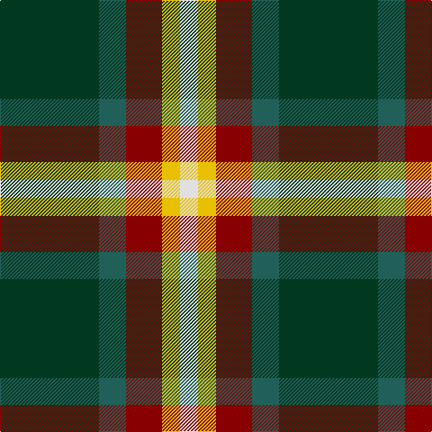

In pattern [GGRYW](/patterns/ggryw/).

This was sourced from register-of-tartans.  It is a [5 stripes tartan](/stripes/stripes5/).

Original link https://www.tartanregister.gov.uk/tartanDetails.aspx?ref=3333

## Attestations

This cloth appears in 3 source records; the oldest owns this page.

- 01/01/2005 — Phinn (Personal) (register-of-tartans, [record](https://www.tartanregister.gov.uk/tartanDetails.aspx?ref=3333))
- 2005 — Phinn (Personal) (tartans-authority, [record](http://www.tartansauthority.com/tartan-ferret/display/7104/))
- undated — Phinn Personal Tartan Tartan Number: 7104. Earliest known date: 2005 Anthony Thomson designed this tartan to make a silk stole in 2005. He returned in 2007 to have a kilt made up in heavyweight wool. See products available Copyright © Blair Urquhart, Comrie, 2015 (house-of-tartan, [record](http://www.house-of-tartan.scotland.net/house/TartanViewjs.asp?colr=Def&tnam=7104))

## Register references

External register numbers recorded for this tartan.

- Scottish Register of Tartans: [3333](https://www.tartanregister.gov.uk/tartanDetails.aspx?ref=3333)
- Scottish Tartans Authority (ITI): 7104

## Thread count
DG/110 G30 DR40 Y20 LN/20

## Palette
Each colour and its ΔE from the base-6 reference it is a variant of.

| Colour | Shade | Base | ΔE (OKLab) |
|---|---|---|---|
| DG | <code style="background-color:#003820;">#003820</code> `#003820` | G <code style="background-color:#006100;">#006100</code> | 0.15 |
| DR | <code style="background-color:#880000;">#880000</code> `#880000` | R <code style="background-color:#CC0000;">#CC0000</code> | 0.15 |
| G | <code style="background-color:#206058;">#206058</code> `#206058` | G <code style="background-color:#006100;">#006100</code> | 0.11 |
| LN | <code style="background-color:#E0E0E0;">#E0E0E0</code> `#E0E0E0` | W <code style="background-color:#F7F7F7;">#F7F7F7</code> | 0.07 |
| Y | <code style="background-color:#E8C000;">#E8C000</code> `#E8C000` | Y <code style="background-color:#F2BF00;">#F2BF00</code> | 0.02 |

# Sample pattern

## Nearest tartans

The nearest existing variants by ΔTartan distance.

1. [ChuMac (Personal)](/setts/s5/g15y3r3b8w2~b440044-g006818-rc80000-wfcfcfc-ye8c000~x6/) — ΔT 0.71
1. [ChuMac (Personal)](/setts/s5/g15y3r3b8w2~b543060-g006430-re01c18-we8e8e8-yf0c400~x6/) — ΔT 0.80
1. [Wellington, No 122](/setts/s5/k4b3ba11g14y2~b5480b0-ba800080-g008000-k000000-yf0c000~x2/) — ΔT 1.13
1. [Wilson's, No 193](/setts/s5/g6k1r1b2r2~b5480b0-g008000-k000000-rc00000~x4/) — ΔT 1.14
1. [Lindley-Highfield Name Tartan Tartan Number: 10002. Earliest known date: 13 February 2009 'Lindley-Highfield of Ballumbie Castle' is a tartan of the family of the Lindley-Highfields of Ballumbie Castle, sometime Barons of Cartsburn. The colours of this particular tartan are taken from the armorial bearings of the Head of the Family of Lindley-Highfield of Ballumbie Castle. See products available Copyright © Blair Urquhart, Comrie, 2015](/setts/s7/g7b3w1y2g1k2b1~b800080-g006400-k000000-wffffff-y32cd32~x8/) — ΔT 1.16
1. [Lindley-Highfield (Name)](/setts/s7/g7b3w1ga2g1r2b1~b780078-g003820-ga289c18-re87878-we0e0e0~x8/) — ΔT 1.17
1. [Wilson's, No 183](/setts/s6/k2b1ba6g6r1g1~b5480b0-ba800080-g008000-k000000-rc00000~x4/) — ΔT 1.22
1. [Dundhuin Hunting (Personal)](/setts/s5/g62ga17y12b8r8~b5f749c-g23321b-ga649848-r905966-yf8e38c~x2/) — ΔT 1.25
1. [Wellington, No 229](/setts/s5/k4b3ba11g14w2~b5480b0-ba800080-g008000-k000000-we0e0e0~x2/) — ΔT 1.27
1. [Lindley-Highfield of Ballumbie Castle](/setts/s7/g7b3w1y2g1wa2b1~b800080-g006400-wffffff-wadda0dd-y32cd32~x8/) — ΔT 1.30

## Neighbour map

Every grey dot is one of 15726 variants placed by the first two principal components of the ΔTartan feature space (44% of its variance). Red is this tartan; blue dots are its nearest — click one to open its page.

<svg viewBox="0 0 640 380" role="img" style="max-width:100%;height:auto;border:1px solid #e0e0e0;border-radius:4px;display:block" xmlns="http://www.w3.org/2000/svg"><image href="/nn/cloud.v1.png" width="640" height="380"/><a href="/setts/s5/g15y3r3b8w2~b440044-g006818-rc80000-wfcfcfc-ye8c000~x6/"><circle cx="190.1" cy="205.5" r="4" fill="#3465a4"><title>ChuMac (Personal)</title></circle></a><a href="/setts/s5/g15y3r3b8w2~b543060-g006430-re01c18-we8e8e8-yf0c400~x6/"><circle cx="203.6" cy="210.8" r="4" fill="#3465a4"><title>ChuMac (Personal)</title></circle></a><a href="/setts/s5/k4b3ba11g14y2~b5480b0-ba800080-g008000-k000000-yf0c000~x2/"><circle cx="145.0" cy="214.9" r="4" fill="#3465a4"><title>Wellington, No 122</title></circle></a><a href="/setts/s5/g6k1r1b2r2~b5480b0-g008000-k000000-rc00000~x4/"><circle cx="222.9" cy="238.0" r="4" fill="#3465a4"><title>Wilson's, No 193</title></circle></a><a href="/setts/s7/g7b3w1y2g1k2b1~b800080-g006400-k000000-wffffff-y32cd32~x8/"><circle cx="159.9" cy="190.8" r="4" fill="#3465a4"><title>Lindley-Highfield Name Tartan Tartan Number: 10002. Earliest known date: 13 February 2009 'Lindley-Highfield of Ballumbie Castle' is a tartan of the family of the Lindley-Highfields of Ballumbie Castle, sometime Barons of Cartsburn. The colours of this particular tartan are taken from the armorial bearings of the Head of the Family of Lindley-Highfield of Ballumbie Castle. See products available Copyright © Blair Urquhart, Comrie, 2015</title></circle></a><a href="/setts/s7/g7b3w1ga2g1r2b1~b780078-g003820-ga289c18-re87878-we0e0e0~x8/"><circle cx="182.9" cy="194.4" r="4" fill="#3465a4"><title>Lindley-Highfield (Name)</title></circle></a><a href="/setts/s6/k2b1ba6g6r1g1~b5480b0-ba800080-g008000-k000000-rc00000~x4/"><circle cx="158.7" cy="206.4" r="4" fill="#3465a4"><title>Wilson's, No 183</title></circle></a><a href="/setts/s5/g62ga17y12b8r8~b5f749c-g23321b-ga649848-r905966-yf8e38c~x2/"><circle cx="267.0" cy="201.2" r="4" fill="#3465a4"><title>Dundhuin Hunting (Personal)</title></circle></a><a href="/setts/s5/k4b3ba11g14w2~b5480b0-ba800080-g008000-k000000-we0e0e0~x2/"><circle cx="142.9" cy="214.3" r="4" fill="#3465a4"><title>Wellington, No 229</title></circle></a><a href="/setts/s7/g7b3w1y2g1wa2b1~b800080-g006400-wffffff-wadda0dd-y32cd32~x8/"><circle cx="167.7" cy="188.3" r="4" fill="#3465a4"><title>Lindley-Highfield of Ballumbie Castle</title></circle></a><circle cx="189.1" cy="224.6" r="5" fill="#c00000"/></svg>

ID: /setts/s5/g11ga3r4y2w2~g003820-ga206058-r880000-we0e0e0-ye8c000~x10/
