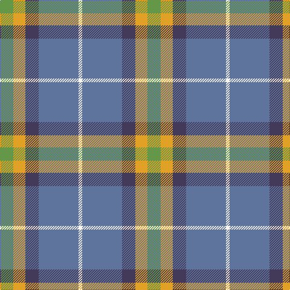

This page is one **sett** — a single exact thread-count. It belongs to the [tartan](/tartans/g11lo10dp11t33w3/)
(the same proportion at any scale), whose colour order is pattern [GYBBW](/stripes/gybbw/).

Sourced from house-of-tartan.  It is a [5 stripe tartan](/stripes/stripes5/).

Original link http://www.house-of-tartan.scotland.net/house/TartanViewjs.asp?colr=Def&tnam=10653

## Also known as

This cloth is also recorded under:

- Sterling, Rob (Persona

## Thread count
LG/22 Y20 N22 B66 W/6

## Palette

Palette: <strong>Tartan Register</strong> <small style="color:#888">(3 of 5 colours)</small>
<table><thead><tr><th>Colour</th><th>Threads</th><th>Shade</th><th>Base</th><th>OKLCh</th></tr></thead><tbody><tr><td>LG/</td><td style="text-align:right;font-variant-numeric:tabular-nums">22</td><td><code style="background-color:#649848;">#649848</code> <small style="color:#888">#649848</small></td><td>G <code style="background-color:#006100;">#006100</code></td><td><small style="color:#888">oklch(62.4% 0.125 135.7)</small></td></tr><tr><td>Y</td><td style="text-align:right;font-variant-numeric:tabular-nums">20</td><td><code style="background-color:#E0A126;">#E0A126</code> <small style="color:#888">#E0A126</small></td><td>Y <code style="background-color:#F2BF00;">#F2BF00</code></td><td><small style="color:#888">oklch(75.1% 0.146 78.3)</small></td></tr><tr><td>N</td><td style="text-align:right;font-variant-numeric:tabular-nums">22</td><td><code style="background-color:#433A5A;">#433A5A</code> <small style="color:#888">#433A5A</small></td><td>B <code style="background-color:#2A418A;">#2A418A</code></td><td><small style="color:#888">oklch(37.2% 0.055 296.6)</small></td></tr><tr><td>B</td><td style="text-align:right;font-variant-numeric:tabular-nums">66</td><td><code style="background-color:#5F749C;">#5F749C</code> <small style="color:#888">#5F749C</small></td><td>B <code style="background-color:#2A418A;">#2A418A</code></td><td><small style="color:#888">oklch(55.8% 0.067 262.9)</small></td></tr><tr><td>W/</td><td style="text-align:right;font-variant-numeric:tabular-nums">6</td><td><code style="background-color:#F9F5EF;">#F9F5EF</code> <small style="color:#888">#F9F5EF</small></td><td>W <code style="background-color:#F7F7F7;">#F7F7F7</code></td><td><small style="color:#888">oklch(97.2% 0.009 78.3)</small></td></tr></tbody></table>

# Sample pattern

## Nearest tartans

The nearest existing variants by ΔTartan distance, with this tartan at the top so the swatches line up against it.

ΔTartan

Tartan

Sett

—

<a href="/ttd/edit/#slug=g11lo10dp11t33w3~x2">Sterling, Rob (Florida) (Persona Name Tartan Tartan Number: 10653. Earliest known date: 10/07/2012 Designed by Rob Sterling, St. Petersburg, Florida, for use by his family and associates. See products available Copyright © Blair Urquhart, Comrie, 2015</a> <a class="nn-out" href="/setts/s5/g11lo10dp11t33w3~x2/" title="open its dictionary page">↗</a>

0.71

<a href="/ttd/edit/#slug=g11lo10dp11b33w3~x2">Sterling, Rob (Florida) (Personal)</a> <a class="nn-out" href="/setts/s5/g11lo10dp11b33w3~x2/" title="open its dictionary page">↗</a>

0.96

<a href="/ttd/edit/#slug=r3n20k2n20o20lb20r3~x2">Brodie Silver</a> <a class="nn-out" href="/setts/s7/r3n20k2n20o20lb20r3~x2/" title="open its dictionary page">↗</a>

0.98

<a href="/ttd/edit/#slug=r3n20ly2n20y20lb20r3~x2">Brodie, Silver</a> <a class="nn-out" href="/setts/s7/r3n20ly2n20y20lb20r3~x2/" title="open its dictionary page">↗</a>

1.13

<a href="/ttd/edit/#slug=r3n20ly2n20o20lb20r3~x2">Brodie Silver Clan Tartan Tartan Number: 1630. Earliest known date: c.1940-50 Probably a trade design based on Hunting Brodie, that has appeared in the last forty years. It is sometimes referred to as muted Brodie. (P.E. MacDonald, STS 1984) See products available Copyright © Blair Urquhart, Comrie, 2015</a> <a class="nn-out" href="/setts/s7/r3n20ly2n20o20lb20r3~x2/" title="open its dictionary page">↗</a>

1.21

<a href="/ttd/edit/#slug=g11lo10dt11b33w3~x2">Sterling (Name)</a> <a class="nn-out" href="/setts/s5/g11lo10dt11b33w3~x2/" title="open its dictionary page">↗</a>

1.23

<a href="/ttd/edit/#slug=y15k10n30o11w3y5~x2">McHale (Personal)</a> <a class="nn-out" href="/setts/s6/y15k10n30o11w3y5~x2/" title="open its dictionary page">↗</a>

1.28

<a href="/ttd/edit/#slug=ly15r9t30w3db4~x2">S.I.D.E. (Corporate)</a> <a class="nn-out" href="/setts/s5/ly15r9t30w3db4~x2/" title="open its dictionary page">↗</a>

1.29

<a href="/ttd/edit/#slug=db30ly3dy11ly3y33r6~x2">Balfour</a> <a class="nn-out" href="/setts/s6/db30ly3dy11ly3y33r6~x2/" title="open its dictionary page">↗</a>

1.30

<a href="/ttd/edit/#slug=db9w4g36t36r4~x2">Alvis of Lee (Personal)</a> <a class="nn-out" href="/setts/s5/db9w4g36t36r4~x2/" title="open its dictionary page">↗</a>

1.30

<a href="/ttd/edit/#slug=t4dg16ly2dp7t28w4~x2">Manx Laxey (Blue)</a> <a class="nn-out" href="/setts/s6/t4dg16ly2dp7t28w4~x2/" title="open its dictionary page">↗</a>

## Neighbour map

Every grey dot is one of 14299 variants placed by the first two principal components of the ΔTartan feature space (44% of its variance). Red is this tartan; blue dots are its nearest — click one to open its page.

<svg viewBox="0 0 640 380" role="img" style="max-width:100%;height:auto;border:1px solid #e0e0e0;border-radius:4px;display:block" xmlns="http://www.w3.org/2000/svg"><image href="/nn/cloud.v1.png" width="640" height="380"/><a href="/setts/s5/g11lo10dp11b33w3~x2/"><circle cx="229.5" cy="213.6" r="4" fill="#3465a4"><title>Sterling, Rob (Florida) (Personal)</title></circle></a><a href="/setts/s7/r3n20k2n20o20lb20r3~x2/"><circle cx="220.1" cy="207.2" r="4" fill="#3465a4"><title>Brodie Silver</title></circle></a><a href="/setts/s7/r3n20ly2n20y20lb20r3~x2/"><circle cx="221.5" cy="207.7" r="4" fill="#3465a4"><title>Brodie, Silver</title></circle></a><a href="/setts/s7/r3n20ly2n20o20lb20r3~x2/"><circle cx="236.6" cy="214.8" r="4" fill="#3465a4"><title>Brodie Silver Clan Tartan Tartan Number: 1630. Earliest known date: c.1940-50 Probably a trade design based on Hunting Brodie, that has appeared in the last forty years. It is sometimes referred to as muted Brodie. (P.E. MacDonald, STS 1984) See products available Copyright © Blair Urquhart, Comrie, 2015</title></circle></a><a href="/setts/s5/g11lo10dt11b33w3~x2/"><circle cx="229.0" cy="218.8" r="4" fill="#3465a4"><title>Sterling (Name)</title></circle></a><a href="/setts/s6/y15k10n30o11w3y5~x2/"><circle cx="200.7" cy="218.0" r="4" fill="#3465a4"><title>McHale (Personal)</title></circle></a><a href="/setts/s5/ly15r9t30w3db4~x2/"><circle cx="230.9" cy="192.9" r="4" fill="#3465a4"><title>S.I.D.E. (Corporate)</title></circle></a><a href="/setts/s6/db30ly3dy11ly3y33r6~x2/"><circle cx="214.3" cy="196.8" r="4" fill="#3465a4"><title>Balfour</title></circle></a><a href="/setts/s5/db9w4g36t36r4~x2/"><circle cx="221.4" cy="220.1" r="4" fill="#3465a4"><title>Alvis of Lee (Personal)</title></circle></a><a href="/setts/s6/t4dg16ly2dp7t28w4~x2/"><circle cx="273.9" cy="181.6" r="4" fill="#3465a4"><title>Manx Laxey (Blue)</title></circle></a><circle cx="242.7" cy="214.8" r="5" fill="#c00000"/></svg>

ID: /setts/s5/g11lo10dp11t33w3~x2/
